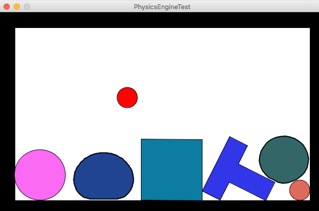
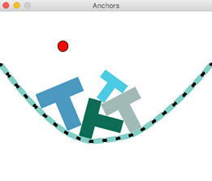
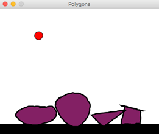
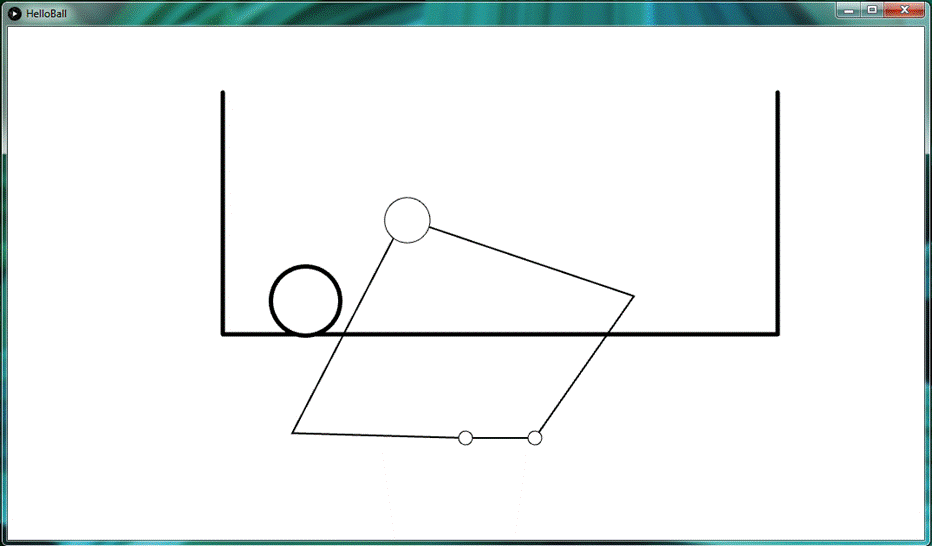

# Example-Projects
## Haply Example Projects

A more detailed walkthrough of the example projects is under development. Haply devices use the hAPI as an interface between the computer and the haptic device. We've elected to use Processing as the entry point into these haptic simulations because we want to get people jump started quickly making virtual environments within minutes of setting up their devices. 

Make sure when initializing the device that the correct usb port ("COM#" for windows and 'dev...' for a Mac) is selected, otherwise the simulation will throw an error. details on this can be found in the [Software-Setup](https://github.com/HaplyHaptics/Software-Setup#processing-sketch). 

## Examples using hAPI Fisica Engine 

To just jump right in and test out some demos of the Haply device. We'd recommend first testing the simulation using the hAPI Fisica library. We adapted the Fisica Library written by Ricard Marxer so that it uses real world units (CGS) rather than pixels to describe the physics interactions between the device and the virtual environment as well as adding haptic elements to couple the device to the virtual world. 

In order to use these files download all the files enclosed in the branch (or just download the branch), and run the .PDE file in the file path. Make sure to have the correct processing libraries installed as shown in [Software-Setup](https://github.com/HaplyHaptics/Software-Setup#processing-sketch). 

[PhysicsEngineTest](/hAPI%20Fisica/PhysicsEngineTest) Is a good place to get started. It drops a set of objects into the virtual scene that are already haptically enabled. Explore the code changing the parameters as you see fit to try out different environmental objects. 

[Anchors](/hAPI%20Fisica/Anchors) You can play with spring objects along a virtual bridge. By clicking on the window, for a PC, or touching the screen, for a tablet, you can drop new objects into the scene.  

[Polygons](/hAPI%20Fisica/Polygons) This one is fun, you can practice drawing objects with your mouse on the screen. Depending on what you draw the sizes and masses of the objects will change size and shape. You can slide the objects off the platform to reset the screen. 

## Custom Physics (without hAPI Fisica)

This is a more low level exploration of the device. If you're interested in learning how to program your own physics and virtual environments into your simulation we recommend checking out the examples that don't use the hAPI Fisica engine right off the bat. Explore: 

To run these simulations download the branch (or all of the enclosed files), ensure all files are in the same folder, and run the PDE file enclosed.

[HelloWall](/without%20hAPI%20Fisica/HelloWall) to understand how we can program a simple virtual wall using the hAPI to control the robot while the graphics and physics simulation are carried out in processing. 

[Gravity](/without%20hAPI%20Fisica/Gravity) allows you to have fun implementing some fun graphics into your scene in a simple demo where an asteroid bombards an alien ship in outer space

[HelloBall](/without%20hAPI%20Fisica/HelloBall) expands upon HelloWall by allowing users to program dynamic objects into their virtual worlds. A ball will bounce around the screen letting developers understand a bit behind the details involved in dynamic simulation. 

Along the same [filepath](/without%20hAPI%20Fisica) as the above examples, you'll find to other demos with similar environments. Give them a try!

