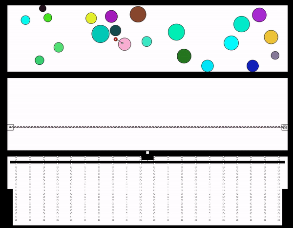

# Processing Demos

__This set of examples run using the new Haply hAPI. The documentaion for this is currently under development, but features a similar user interface to the previous hAPI. Flash the new version of the firmware, found [here](/Haply_Arduino_Firmware/), onto your Haply Dev Board to get these examples started.__

## Focusing on Tool Development

The Haply Firmware Package abstracts the sending and recieving of data shown in previoius lessons. In these lessons, we'll be turning our attention to using the hAPI with Processing to create tools with seamless haptic integration.

For each demo shown we'll talk broadly about the aspects of the hAPI to be shown, and then get into some nitty gritty of how it was implimented. A key takeaway with these demos won't necessarily be the exact code (although it will be shown), but how the hAPI tools can be implimented in other tools you can develop on your own!

__THE MOST IMPORTANT LINK IN THIS LESSON__ is right here: https://haplyhaptics.github.io/hAPI_Fisica/annotated.html
In it you'll find all the documentation needed to use the hAPI, and it will be referenced as the _hAPI documentation_ in the lessons to come. It is recommended to bookmark this link whenever you are working on a tool with the hAPI.

See the folder "Example Files" for the code files and project structure. Download the relevant folder, and open .pde files to start the project.

## Demos Order

Although each demo functions fine as a standalone example of the hAPI tools, there is a slight buildup of knowledge throughout the three demos. For this reason, if you are relatively new to the Haply environment you may want to go in this order -

1. [Maze](/01_Maze.md) -

    Focuses on: How to draw shapes, writing text, sensors, viscosity, buoyancy
    
    

2. [Drag n Drop](/02_Drag_n_Drop.md) -

    Focuses on: Breadboard button implimentation, moving objects, multiple object management, joint formation
    
    

3. [Physics](/03_Physics.md) -

    Focuses on: 2D Object arrays,  other joints, expanded button usage, constructing waves
    
    
        
## Onward!

Again, the key takeaway from these demos will be the tools in the hAPI suite. If the lines of the code which revolve around setting up the firmware start to bog down your understanding of these demos, ignore them for now and take a look at some of the earlier lessons.
