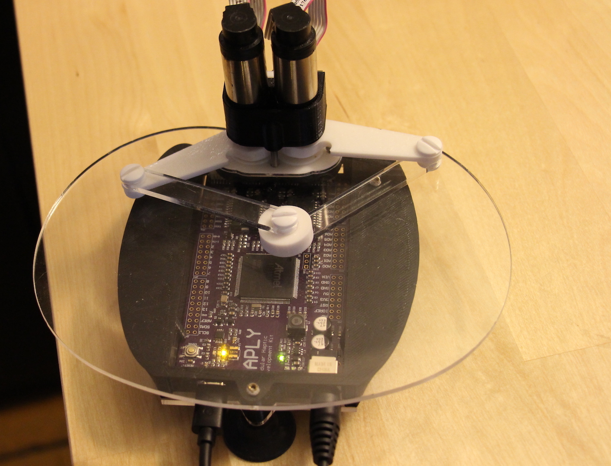
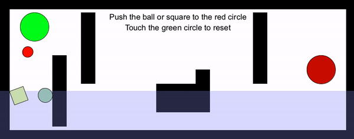

# A-maze-ment

## What is Covered in this Lesson?
In this lesson, we'll be using a maze demo to exhibit the following tools from the hAPI:

1. How to Draw Shapes
2. Writing text
3. Sensors
4. Viscosity
5. Buoyancy

## Setup

As all we'll be doing is moving around and colliding with objects, we'll be using the standard Haplet as seen in the picture below



## Code

See below for the entirety of the code. Snippets of this code will be copied and pasted into later sections of this lesson, but here it is in case you'd like to see the whole thing. An animation of what it looks like is shown below too!

```javascript
/* library imports *****************************************************************************************************/ 
import processing.serial.*;
import com.dhchoi.CountdownTimer;
import com.dhchoi.CountdownTimerService;

/* Device block definitions ********************************************************************************************/
Device            widgetOne;
byte              widgetOneID                     = 5;
Board             haplyBoard;
Mechanisms        pantograph;
boolean           rendering_force                 = false;
int               CW = 1;
int               CCW = 0;

/* Simulation Speed Parameters ****************************************************************************************/
final long        SIMULATION_PERIOD          = 1; //ms
final long        HOUR_IN_MILLIS             = 36000000;
CountdownTimer    haptic_timer;
float             dt                        = SIMULATION_PERIOD/1000.0; 

/* generic data for a 2DOF device */
/* joint space */
PVector           angles                    = new PVector(0, 0);
PVector           torques                   = new PVector(0, 0);

/* task space */
PVector           pos_ee                    = new PVector(0, 0);
PVector           f_ee                      = new PVector(0, 0); 

/* Flicker timer */
float             timer_last                = 0.0;
boolean           barriers_up               = true;

/* Screen and world setup parameters */
float pixelsPerCentimeter = 40.0;

/* World boundaries */
FWorld world;
float worldWidth = 25.0;  
float worldHeight = 10.0; 

float edgeTopLeftX = 0.0; 
float edgeTopLeftY = 0.0; 
float edgeBottomRightX = worldWidth; 
float edgeBottomRightY = worldHeight;

/* Initialization of virtual tool */
HVirtualCoupling s;

/* define maze blocks */
FBox b1;
FBox b2;
FBox b3;
FBox b4;
FBox b5;
FBox l1;

/* define start and stop button */
FCircle c1;
FCircle c2;

/* define game ball */
FCircle g2;
FBox    g1;

/* define game start */
boolean gameStart = false;

PFont f;

void setup(){
    size(1000, 400);

    // Board and Device
    haplyBoard = new Board(this, Serial.list()[1], 0);

    pantograph = new Pantagraph();

    widgetOne = new Device(widgetOneID, haplyBoard);

    widgetOne.set_mechanism(pantograph);

    widgetOne.add_actuator(1, CW, 1);
    widgetOne.add_actuator(2, CCW, 2);

    widgetOne.add_encoder(1, CW, 180, 13824, 1);
    widgetOne.add_encoder(2, CCW, 0, 13824, 2);

    widgetOne.device_set_parameters();

    hAPI_Fisica.init(this); 
    hAPI_Fisica.setScale(pixelsPerCentimeter); 
    world = new FWorld();

    // Set Barriers
    b1 = new FBox(1.0, 5.0);
    b1.setPosition(edgeTopLeftX+worldWidth/4.0-2, edgeTopLeftY+worldHeight/2+1.5); 
    b1.setFill(0);
    b1.setNoStroke();
    b1.setStaticBody(true);
    world.add(b1);

    b2 = new FBox(1.0, 5.0);
    b2.setPosition(edgeTopLeftX+worldWidth/4.0, edgeTopLeftY+worldHeight/2-1.5); 
    b2.setFill(0);
    b2.setNoStroke();
    b2.setStaticBody(true);
    world.add(b2);

    b3 = new FBox(1.0, 3.0);
    b3.setPosition(edgeTopLeftX+worldWidth/4.0+8, edgeTopLeftY+worldHeight/2+1.5); 
    b3.setFill(0);
    b3.setNoStroke();
    b3.setStaticBody(true);
    world.add(b3);

    b4 = new FBox(1.0, 5.0);
    b4.setPosition(edgeTopLeftX+worldWidth/4.0+12, edgeTopLeftY+worldHeight/2-1.5); 
    b4.setFill(0);
    b4.setNoStroke();
    b4.setStaticBody(true);
    world.add(b4);

    b5 = new FBox(3.0, 2.0);
    b5.setPosition(edgeTopLeftX+worldWidth/2.0, edgeTopLeftY+worldHeight/2.0+2);
    b5.setFill(0);
    b5.setNoStroke();
    b5.setStaticBody(true);
    world.add(b5);

    // Set Viscous Layer
    l1 = new FBox(27,4);
    l1.setPosition(24.5/2,8.5);
    l1.setFill(150,150,255,80);
    l1.setDensity(17);
    l1.setSensor(true);
    l1.setNoStroke();
    l1.setStatic(true);
    l1.setName("Water");
    world.add(l1);

    // Start Button
    c1 = new FCircle(2.0); // diameter is 2
    c1.setPosition(edgeTopLeftX+2.5, edgeTopLeftY+worldHeight/2.0-3);
    c1.setFill(0, 255, 0);
    c1.setSensor(true);
    c1.setStaticBody(true);
    world.add(c1);

    // Finish Button
    c2 = new FCircle(2.0);
    c2.setPosition(worldWidth-2.5, edgeTopLeftY+worldHeight/2.0);
    c2.setFill(200,0,0);
    c2.setStaticBody(true);
    c2.setSensor(true);
    world.add(c2);

    // Game Ball
    g1 = new FBox(1, 1);
    g1.setPosition(2, 4);
    g1.setDensity(12);
    g1.setFill(random(255),random(255),random(255));
    g1.setName("Widget");
    world.add(g1);

    g2 = new FCircle(1);
    g2.setPosition(3, 4);
    g2.setDensity(12);
    g2.setFill(random(255),random(255),random(255));
    g2.setName("Widget");
    world.add(g2);

    // Setup the Virtual Coupling Contact Rendering Technique
    s = new HVirtualCoupling((0.75)); 
    s.h_avatar.setDensity(7); 
    s.h_avatar.setFill(255,0,0); 
    s.h_avatar.setSensor(true);
    s.init(world, edgeTopLeftX+worldWidth/2, edgeTopLeftY+2); 

    // World Setup
    world.setGravity((0.0), (300.0)); //1000 cm/(s^2)
    world.setEdges((edgeTopLeftX), (edgeTopLeftY), (edgeBottomRightX), (edgeBottomRightY)); 
    world.setEdgesRestitution(.4);
    world.setEdgesFriction(0.5);

    world.draw();

    haptic_timer = CountdownTimerService.getNewCountdownTimer(this).configure(SIMULATION_PERIOD, HOUR_IN_MILLIS).start();

    frameRate(60); 
    f = createFont("Arial", 16, true);
}


void draw(){
    background(255);
    textFont(f, 22);
    //fill(0, 102, 153);

    if(gameStart){
        fill(0, 0, 0);
        textAlign(CENTER);
        text("Push the ball or square to the red circle", width/2, 60);
        textAlign(CENTER);
        text("Touch the green circle to reset", width/2, 90);

        b1.setFill(0, 0, 0);
        b2.setFill(0, 0, 0);
        b3.setFill(0, 0, 0);
        b4.setFill(0, 0, 0);
        b5.setFill(0, 0, 0);

    }
    else{
        fill(128, 128, 128);
        textAlign(CENTER);
        text("Touch the green circle to start the maze", width/2, 60);

        b1.setFill(255, 255, 255);
        b2.setFill(255, 255, 255);
        b3.setFill(255, 255, 255);
        b4.setFill(255, 255, 255);
        b5.setFill(255, 255, 255);
    }

    world.draw();
}


void onTickEvent(CountdownTimer t, long timeLeftUntilFinish){

    rendering_force = true;
    if (haplyBoard.data_available()){
        /* GET END-EFFECTOR STATE (TASK SPACE) */

        widgetOne.device_read_data();

        angles.set(widgetOne.get_device_angles()); 
        pos_ee.set(widgetOne.get_device_position(angles.array()));
        pos_ee.set(pos_ee.copy().mult(200));  
    }

    s.setToolPosition(edgeTopLeftX+worldWidth/2-(pos_ee).x+2, edgeTopLeftY+(pos_ee).y-7); 
    s.updateCouplingForce();
    f_ee.set(-s.getVCforceX(), s.getVCforceY());
    f_ee.div(15000); //
    torques.set(widgetOne.set_device_torques(f_ee.array()));
    widgetOne.device_write_torques();


    if (s.h_avatar.isTouchingBody(c1)){
        gameStart = true;
        g1.setPosition(2,8);
        g2.setPosition(3,8);
        s.h_avatar.setSensor(false);
    }

    if(g1.isTouchingBody(c2) || g2.isTouchingBody(c2)){
        gameStart = false;
        s.h_avatar.setSensor(true);
    }

    // Viscous layer codes
    if (s.h_avatar.isTouchingBody(l1)){
        s.h_avatar.setDamping(150);
    }
    else{
        s.h_avatar.setDamping(40); 
    }

    if(gameStart && g1.isTouchingBody(l1)){
        g1.setDamping(20);
    }

    if(gameStart && g2.isTouchingBody(l1)){
        g2.setDamping(20);
    }

    // Bouyancy of fluid on avatar and gameball
    if (g1.isTouchingBody(l1)){
        float b_s;
        float bm_d = g1.getY()-l1.getY()+l1.getHeight()/2; // vertical distance between middle of ball and top of water

        if (bm_d + g1.getWidth()/2 >= g1.getWidth()) { //if whole ball or more is submerged
            b_s = g1.getWidth(); // amount of ball submerged is ball size
        }
        else { //if ball is partially submerged
            b_s = bm_d + g1.getWidth()/2; // amount of ball submerged is vertical distance between middle of ball and top of water + half of ball size
        }

        g1.addForce(0,l1.getDensity()*sq(b_s)*300*-1); // 300 is gravity force

    }


    if (g2.isTouchingBody(l1)){
        float b_s;
        float bm_d = g2.getY()-l1.getY()+l1.getHeight()/2; // vertical distance between middle of ball and top of water

        if (bm_d + g2.getSize()/2 >= g2.getSize()) { //if whole ball or more is submerged
            b_s = g2.getSize(); // amount of ball submerged is ball size
        }
        else { //if ball is partially submerged
            b_s = bm_d + g2.getSize()/2; // amount of ball submerged is vertical distance between middle of ball and top of water + half of ball size
        }

        g2.addForce(0,l1.getDensity()*sq(b_s)*300*-1); // 300 is gravity force

    }

    world.step(1.0f/1000.0f);

    rendering_force = false;

}

/*
//Uncomment this section to see an alternate way to apply forces in the environment!
void contactPersisted(FContact contact){
    float size;
    float b_s;
    float bm_d;

    if(contact.contains("Water", "Widget")){
        size = 2*sqrt(contact.getBody2().getMass()/contact.getBody2().getDensity()/3.1415);

        if(bm_d + size/2 >= size){
            b_s = size;
        }
        else{
            b_s = bm_d + size/2;
        }

        contact.getBody2().addForce(0, contact.getBody1().getDensity()*sq(b_s)*300*-1);
        contact.getBody2().setDamping(20);
    }

}


void contactEnded(FContact contact){
    if(contact.contains("Water", "Widget")){
        contact.getBody2().setDamping(0);
    }
}
*/

/* Timer control event functions **************************************************************************************/

/**
* haptic timer reset
*/
void onFinishEvent(CountdownTimer t)
{
    println("Resetting timer...");
    haptic_timer.reset();
    haptic_timer = CountdownTimerService.getNewCountdownTimer(this).configure(SIMULATION_PERIOD, HOUR_IN_MILLIS).start();
}
```

Here's a (partial) animation of what this code does! The maze is a little too difficult to be done within the timespan of a reasonably sized gif... you'll have to run the code yourself to see for yourself :stuck_out_tongue:



## How to Draw Objects

We'll start off our lesson by discussing something used a whole lot in processing: drawing objects. We'll focus on drawing one of the maze barriers.

There are two steps to drawing an object, first is defining of the object so that it is allocated space in memory. That looks like this:
```javascript
FBox b1;
```
Here, we simply say the object type __(FBox)__, and give it any arbitrary name. In this case, it was called __b1__. Keep in mind this generally is done __OUTSIDE__ of the looping functions like __setup()__ or __draw()__. This can be done inside the __setup()__ function as all we are doing is allocating memory space, however simplest practice is generally to keep it outside of a function.

The second step is the actual drawing of the object, which looks like this:
``` javascript
b1 = new FBox(1.0, 5.0);
b1.setPosition(edgeTopLeftX+worldWidth/4.0-2, edgeTopLeftY+worldHeight/2+1.5);
b1.setFill(0);
b1.setNoStroke();
b1.setStaticBody(true);
world.add(b1); //<>//
```
Because we want this object to be drawn once and for all at the beginning of our simulations, this code is in our __setup()__ loop. The first line shown creates the object and the final line draws it in the world. Information as to what each method does can be found in the hAPI documentation. Needless to say that as a maze wall, using the object type __FBox__ defined in this way fits our needs quite well.

One best practices shown here is in the __setPosition()__ method. There are numerous ways to set a position, however since we have defined our world dimensions earlier in the code it is best to reference position of shapes compared to the size of the world. See below for how we set our world height and width, notice how it relates to the way we defined our object's position.
```javascript
/* World boundaries */
FWorld world;
float worldWidth = 25.0;  
float worldHeight = 10.0; 

float edgeTopLeftX = 0.0; 
float edgeTopLeftY = 0.0; 
float edgeBottomRightX = worldWidth; 
float edgeBottomRightY = worldHeight;
```
As a note, calling methods is done though the syntax __object.method()__; in the case above our object was __b1__, and an example method would be __.setFill(0)__,  which paints the object black.

## Let's Talk About Text, Baby
We're using text in this demo to tell the user how to move in our environment. Placing text strategically can clear up instructions in any confusing or ambiguous parts of your demos; in this segment we'll talk a bit about how to create text in simulations. Although fonts have similarities to other objects we use, syntactically they are a little bit different. To clear a spot in memory for our font, we'll call the class __Pfont__ before our __setup()__ function.
``` Javascript
PFont f;
```

In our __setup()__ function we'll define __f__ using  __createFont()__. We'll be changing the font size later, but for now we'll say we're using the font Arial at a fontsize of 16, so we'll call __createFont()__ as follows. Note that the final argument, __true__, smooths out the text with antialiasing.
``` Javascript
f = createFont("Arial", 16, true);
```

Now that we've fully defined our text, let's make use of it by doing some writing. Since we'll be changing the text throughout the demo but there is no direct haptic response associated with the text, so we'll put the code in __draw()__. The entirety of the code looks like this - 

```javascript
textFont(f, 22);
//fill(0, 102, 153);

if(gameStart){
    fill(0, 0, 0);
    textAlign(CENTER);
    text("Push the ball or square to the red circle", width/2, 60);
    textAlign(CENTER);
    text("Touch the green circle to reset", width/2, 90);

    b1.setFill(0, 0, 0);
    b2.setFill(0, 0, 0);
    b3.setFill(0, 0, 0);
    b4.setFill(0, 0, 0);
    b5.setFill(0, 0, 0);
}

else{
    fill(128, 128, 128);
    textAlign(CENTER);
    text("Touch the green circle to start the maze", width/2, 60);

    b1.setFill(255, 255, 255);
    b2.setFill(255, 255, 255);
    b3.setFill(255, 255, 255);
    b4.setFill(255, 255, 255);
    b5.setFill(255, 255, 255);
}
```

The first thing we do here is set the font that will be referenced with the text related functions we'll call later. This is important if we were to use multiple fonts. Notice that here we change the font size to 22. If we didn't include the second argument our fontsize would default to 16, as we set it when we used __createFont()__. 
``` Javascript
textFont(f,22)
```
For the next bit of code i'll be referencing the lines below, which will trigger if the boolean variable __gameStart__ is not true. So look in the __else__ statement bit of the code. I'll talk a bit about the other instance wherein we write text, but the two lines function identically.
``` Javascript
fill(128, 128, 128);
textAlign(CENTER);
text("Touch the green circle to start the maze", width/2, 60);

b1.setFill(255, 255, 255);
b2.setFill(255, 255, 255);
b3.setFill(255, 255, 255);
b4.setFill(255, 255, 255);
b5.setFill(255, 255, 255);
```
The first thing here we do is invoke __fill()__, which changes the color of the next shapes drawn. In this context it will make our text halfway in between completely white and completely black (256/2 = 128). Next, __textAlign()__ will align our text in the center. __textAlign()__ does have some nuances regarding the use of a second argument (e.g. textAlign(Center, Center), so I'd recommend checking out the online documentation for further information. In the next line we use __text()__ to write the character string, as well as to define the x and y coordinates of the text. This interacts in some funky ways with __textAlign()__; I'd recommend messing with the values to gain some intuition as to how to place text in the position you'd like.

The final part of these code doesn't really relate to text, it's role is to take all of the barriers of the maze and make them white and therefore blend in with the background. This makes it seem like there is no maze, which is our start scenario.

In the event that __gameStart__ is true, the following code will run. Take note how it functions identically to the code just shown, just with different text with a different fill, and the maze barriers turned black. This set of code also functions as a sort of a game starting trigger, dependant on the value of __gameStart__.
``` Javascript
fill(0, 0, 0);
textAlign(CENTER);
text("Push the ball or square to the red circle", width/2, 60);
textAlign(CENTER);
text("Touch the green circle to reset", width/2, 90);

b1.setFill(0, 0, 0);
b2.setFill(0, 0, 0);
b3.setFill(0, 0, 0);
b4.setFill(0, 0, 0);
b5.setFill(0, 0, 0);
```

## Sensors Gonna Sense
You may have noticed that at the beginning of the simulation the avatar (the object you control) has no collision detection. As the text we wrote in the last section suggests, this property of the avatar changes upon collision with the large green circle. In order to implement this, we make use of a common concept in simulations and games: Sensors.

Below are a couple of code snippets from different locations in the code. The first is when we create our avatar in __setup()__, and the second is the code which triggers the game start in __OnTickEvent()__.

``` Javascript
// Setup the Virtual Coupling Contact Rendering Technique
s = new HVirtualCoupling((0.75)); 
s.h_avatar.setDensity(7); 
s.h_avatar.setFill(255,0,0); 
s.h_avatar.setSensor(true);
s.init(world, edgeTopLeftX+worldWidth/2, edgeTopLeftY+2); 

/* SECOND LINE OF CODE */

if (s.h_avatar.isTouchingBody(c1)){
    gameStart = true;
    g1.setPosition(2,8);
    g2.setPosition(3,8);
    s.h_avatar.setSensor(false);
}
```

In the first line of code, when we called __s.h_avatar.setSensor(true);__, we defined the avatar (which is named __s.h_avatar__) at startup as a sensor. This makes it, well, a sensor! The avatar will not have a collision response to hitting another object, but we will still be able to receive information regard what it touches.

That brings us to the second bit of code where we call __isTouchingBody()__ to give us information on what our avatar is touching. __isTouchingBody()__ will return true or false, meaning that we can use it to conditionally trigger events. In this case, we use it to begin our game as well as to change our avatar into a non-sensor. This is just one of many applications of sensors, in fact you'll notice that just below our game start code we utilize similar code to call our end game condition as well!

```javascript
if(g1.isTouchingBody(c2) || g2.isTouchingBody(c2)){
    gameStart = false;
    s.h_avatar.setSensor(true);
}
```

## Viscosity

In the lessons regarding basic walls we talked a bit about the "dashpot" component of a wall system, which serves to dampen the feedback from the virtual spring which is our wall. We can use this outside of walls to create a dampening effect on the movement of our avatar. The effect of the dampening can be very subtle and can serve to stabilize the avatars movement, or we can ramp it up to make it feel like we are moving through a fluidic medium. This can be implimented by calling the __setDamping()__ method on the __s.h_avatar__ in the __setup()__ function; in our case we'd like to use it universally, for stability, _as well_ as when moving through the object __l1__ at the bottom of our scene to simulate movement through a fluid. The code used is relatively straightforward, you'll notice we use __isTouchingBody__ as well -

```javascript
// Viscous layer codes
if (s.h_avatar.isTouchingBody(l1)){
    s.h_avatar.setDamping(150);
}
else{
    s.h_avatar.setDamping(40); 
}

if(gameStart && g1.isTouchingBody(l1)){
    g1.setDamping(20);
}

if(gameStart && g2.isTouchingBody(l1)){
    g2.setDamping(20);
}
```
Because our __else__ statement creates the dampening affect (of 40) universally, we don't need to include dampening when we create __s.h_avatar__ for the first time. 

As a note, this implimentation of dampening requires the __l1__ object to be a sensor to prevent collision. Because the __isTouchingBody()__ method will apply so long as the avatar is touching or inside of __l1__, the dampening on the avatar will change as we'd like it to.

It can be seen that we've applied dampening to our game objects, __g1__ and __g2__. These objects and the avatar are the only moving objects in our scene, so with this code we're encapsulated dampening to all objects which can interact with our dampener object __l1__. Try messing around the dampening values in this code, note how it effects the haptic response on the movement of both objects!

You'll notice at the bottom of our code we wrote some commented out code with an alternate way to apply forces in the environment. This applies to both viscosity and bouyancy forces, so I thought it was fitting to write this between the two sections regarding viscosity and buoyancy. See below for the code - 
```Javascript
//Uncomment this section to see an alternate way to apply forces in the environment!
void contactPersisted(FContact contact){
    float size;
    float b_s;
    float bm_d;

    if(contact.contains("Water", "Widget")){
        size = 2*sqrt(contact.getBody2().getMass()/contact.getBody2().getDensity()/3.1415);

        if(bm_d + size/2 >= size){
            b_s = size;
        }
        else{
            b_s = bm_d + size/2;
        }

        contact.getBody2().addForce(0, contact.getBody1().getDensity()*sq(b_s)*300*-1);
        contact.getBody2().setDamping(20);
    }

}


void contactEnded(FContact contact){
    if(contact.contains("Water", "Widget")){
        contact.getBody2().setDamping(0);
    }
}
```
The main difference between this code and the uncommented code is the use of __contactPersisted()__ and __contactEnded()__ in place of __isTouchingBody()__. __isTouchingBody()__ outputs a true or false which can be used as a trigger, while __contactPersisted()__ and __contactEnded()__ are separate functions called when a contact occurs or ends between two objects. In using either of these functions, you'll notice that the argument __contact__ is used, which represents the contact between two objects. Within the functions in order to trigger the forces we'd like, we check to see if the contact is between two objects of a certain name. The code below is of the creation of the objects we expect to collide, you'll notice the use of __setName()__ and how it correlates to the objects we'd like involve in the imparting of forces.
``` Javascript
// Set Viscous Layer
l1 = new FBox(27,4);
l1.setPosition(24.5/2,8.5);
l1.setFill(150,150,255,80);
l1.setDensity(17);
l1.setSensor(true);
l1.setNoStroke();
l1.setStatic(true);
l1.setName("Water");
world.add(l1);

// Game Ball
g1 = new FBox(1, 1);
g1.setPosition(2, 4);
g1.setDensity(12);
g1.setFill(random(255),random(255),random(255));
g1.setName("Widget");
world.add(g1);

g2 = new FCircle(1);
g2.setPosition(3, 4);
g2.setDensity(12);
g2.setFill(random(255),random(255),random(255));
g2.setName("Widget");
world.add(g2);
```
In using this code it may be worthy to rethink how we assign names to the avatar as well as if we want the avatar to be a sensor at creation; the inclusion of this code is more so you can see how it could work in this environment. Keep in mind that for coding in general there are many ways to acheive a given result, the art in coding comes from eloquently and clearly implimenting the correct code.

## Buoyancy

We mentioned our game objects __g1__ and __g2__ in previous sections, we can see that we'd like our game ball to rest on the surface of our dampening layer much like it would upon a liquid in the real world. This requires implimentation of a physical phenoma: bouyancy.

Bouyancy is the force resultant from the displacment of fluid by an object. With a bit of mathematics we can determine the force we need to apply to our game ball so that it rests on the surface of our liquid: 

__Density of Liquid * Area of Displaced Fluid * Gravity__

We've already set the density of our liquid and the force of gravity, so our challenge is to determine the area of displaced fluid. This will be equal to the area of the shape submerged in the fluid, so we'll need to look at how deep into the fluid layer __g1__ or __g2__ are in __l1__. This will give us a height, so we'll take advantage of approximation by squaring this value to approximate the area of the object submerged.

The displaced fluid can be thought of as a function of the depth of our ball into the fluid. It is encouraged to try to derive this relationship on your own, but see below for the resultant code -
```javascript
// Bouyancy of fluid on avatar and gameball
if (g1.isTouchingBody(l1)){
    float b_s;
    float bm_d = g1.getY()-l1.getY()+l1.getHeight()/2; // vertical distance between middle of ball and top of water

    if (bm_d + g1.getWidth()/2 >= g1.getWidth()) { //if whole ball or more is submerged
        b_s = g1.getWidth(); // amount of ball submerged is ball size
    }
    else { //if ball is partially submerged
        b_s = bm_d + g1.getWidth()/2; // amount of ball submerged is vertical distance between middle of ball and top of water + half of ball size
    }

    g1.addForce(0,l1.getDensity()*sq(b_s)*300*-1); // 300 is gravity force

}
```
The use of bouyancy in simulations can come in handy in many ways, you'll find it can dramatically increase the realism of a scene. Apart from this, it is important to understand how knowledge of underlying physical equations can be used and modified to create a realistic environment.
