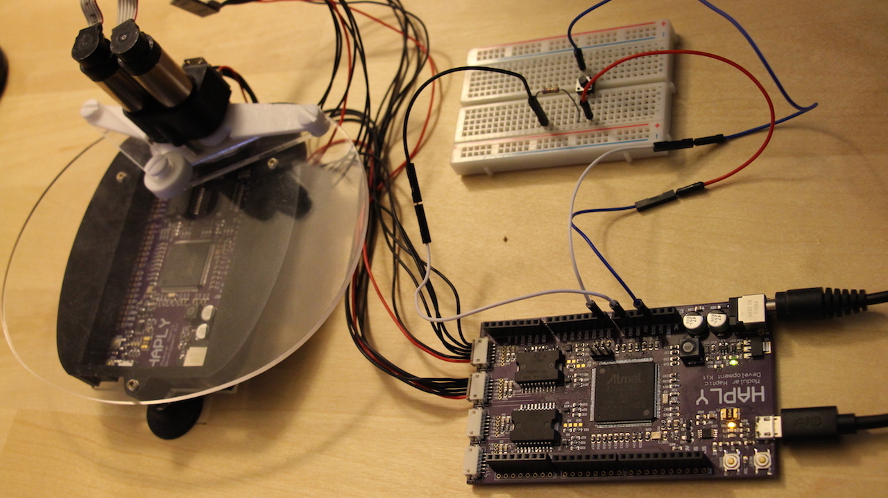
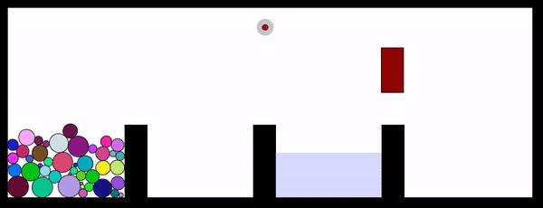

# Drag n and Drop n

## What Will be Covered
For this lesson, we'll be focusing our attention on the following topics-

1. Breadboard Button Implimentation
2. Joints
3. Creating Multiple Objects
4. Moving Objects

## Setup
As you may notice from the previous section, we'll be adding a button to our setup. We don't ship buttons with the Haply Kit, but you can find the appropriate type of button from any electronics supplier.  See the picture below for the layout.



In case it isn't clear, the power is linked from the 3.3V pin on the Haply board to the upper half of the button on the breadboard. On the lower half the output splits, first to the AD0 pin while the other side goes through a resistor followed by the GND pin. See the following link for more details - https://www.arduino.cc/en/Tutorial/Button

## Code

The scene we'll be examining is a kind of drag and drop game; balls will be constructed on one side of the scene, while on the other a block moves up and down. In the middle a fluid layer is present, it functions similarly to the maze game but we'll code it differently. Once the avatar is in range of a ball, it can be picked up and dropped (or thrown) by pressing and releasing the button. There is no outright goal of the game, the moving block can be seen either as a goalie or a target. Either way, behind the block is a bin wherein the ball can be thrown. See the code below, followed by a gif of the scene in action!

```javascript
import processing.serial.*;
import com.dhchoi.CountdownTimer;
import com.dhchoi.CountdownTimerService;

/* Device block definitions ********************************************************************************************/
Device            widgetOne;
byte              widgetOneID                     = 5;
Board             haplyBoard;
Mechanisms        pantograph;
boolean           rendering_force                 = false;
int               CW = 1;
int               CCW = 0;

/* Simulation Speed Parameters ****************************************************************************************/
final long        SIMULATION_PERIOD          = 1; //ms
final long        HOUR_IN_MILLIS             = 36000000;
CountdownTimer    haptic_timer;
float             dt                        = SIMULATION_PERIOD/1000.0;

/* Sensor data */
float[]           sensorData;

/* generic data for a 2DOF device */
/* joint space */
PVector           angles                    = new PVector(0, 0);
PVector           torques                   = new PVector(0, 0);

/* task space */
PVector           pos_ee                    = new PVector(0, 0);
PVector           f_ee                      = new PVector(0, 0); 

/* Screen and world setup parameters */ 
float pixelsPerCentimeter= 40.0; 

/* World boundaries */ 
FWorld world;
float worldWidth = 25.0; 
float worldHeight = 10.0; 

float edgeTopLeftX = 0.0; 
float edgeTopLeftY = 0.0; 
float edgeBottomRightX = worldWidth; 
float edgeBottomRightY = worldHeight; 

/* list of contacts with avatar */
ArrayList <FContact> touchingAvatar;

/* joints to be created for avatar */
boolean jointCreated = false;
FDistanceJoint d1;

/* Initialization of virtual tool */
HVirtualCoupling s;
FCircle h1; // grab radius

/* define region seperators  */
FBox b1;
FBox b2;
FBox b3;

/* define water trap */
FBox f1;

/* define goalie variables */
FBox g1;
FPrismaticJoint p1;
boolean upOrDown = false;
float gTime;
float gTimeLast;
float gTimeLimit = 1500;

/* define beads */
int beads = 45;
FCircle bead; //This can be in setup too!

/* define linkage state */
boolean canLink = false;


void setup(){
    size(1000, 400);

    /* Board and Device setup */
    haplyBoard = new Board(this, Serial.list()[1], 0);

    pantograph = new Pantagraph();

    widgetOne = new Device(widgetOneID, haplyBoard);

    widgetOne.set_mechanism(pantograph);

    widgetOne.add_actuator(1, CW, 1);
    widgetOne.add_actuator(2, CCW, 2);

    widgetOne.add_encoder(1, CW, 180, 13824, 1);
    widgetOne.add_encoder(2, CCW, 0, 13824, 2);

    widgetOne.add_analog_sensor("A0");

    widgetOne.device_set_parameters();


    /* World paramters initialization */
    hAPI_Fisica.init(this);
    hAPI_Fisica.setScale(pixelsPerCentimeter); 
    world = new FWorld();


    /* Barrier for beads */
    b1 = new FBox(1, 8);
    b1.setPosition(6.5, 10);
    b1.setFill(0, 0, 0);
    b1.setStatic(true);
    world.add(b1);


    /* Barrier for container */
    b2 = new FBox(1, 8);
    b2.setPosition(18, 10);
    //b2.setDensity(0);
    b2.setFill(0, 0, 0);
    b2.setStatic(true);
    world.add(b2);

    /* Barrier for water */
    b3 = new FBox(1,8);
    b3.setPosition(12.25, 10);
    b3.setFill(0, 0, 0);
    b3.setStatic(true);
    world.add(b3);


    /* Water Bucket */
    f1 = new FBox(4.75, 2);
    f1.setPosition(15.125, 8.25);
    f1.setFill(150, 150, 255, 80);
    f1.setDensity(50);
    f1.setSensor(true);
    f1.setNoStroke();
    f1.setStatic(true);
    f1.setName("Water");
    world.add(f1);


    /* Goalie definition */
    g1 = new FBox(1, 2);
    g1.setFill(150, 0, 0);
    g1.setPosition(18, 1.5);
    g1.setDensity(40);
    world.add(g1);
    p1 = new FPrismaticJoint(g1, b2);
    p1.setNoStroke();
    world.add(p1);


    /* create beads pile */
    float size, x, y, r, g, b;

    for(int i = 0; i < beads; i++){
        size = random(0.1, 1);
        r = random(0, 256);
        g = random(0, 256);
        b = random(0, 256);
        x = random(1.5, 5);
        y = random(4, 9);

        bead = new FCircle(size);
        bead.setPosition(x, y);
        bead.setFill(r, g, b);
        bead.setFriction(20);
        bead.setDensity(40*size);
        bead.setHaptic(true);
        bead.setName("FCircle");
        world.add(bead);
    }


    /* Haptic Tool Initialization   */
    s= new HVirtualCoupling((0.25)); 
    s.h_avatar.setDensity(7);
    s.h_avatar.setFill(255,0,0); 
    s.init(world, edgeTopLeftX+worldWidth/2, edgeTopLeftY+2);

    h1 = new FCircle(0.75);
    h1.setDensity(0);
    h1.setNoStroke();
    h1.setSensor(true);
    h1.setFill(0, 0, 0, 50);
    h1.setPosition(3, 3);
    world.add(h1);


    /*world Setup*/ 
    world.setGravity((0.0), (300.0)); //1000 cm/(s^2)
    world.setEdges((edgeTopLeftX), (edgeTopLeftY), (edgeBottomRightX), (edgeBottomRightY)); 
    world.setEdgesRestitution(.4);
    world.setEdgesFriction(0.5);

    world.draw();

    haptic_timer = CountdownTimerService.getNewCountdownTimer(this).configure(SIMULATION_PERIOD, HOUR_IN_MILLIS).start(); 

    frameRate(60); 

}


void draw(){
    background(255);

    gTime = millis();
    if (gTime - gTimeLast > gTimeLimit){
        if (abs(g1.getVelocityY())      <5){
            upOrDown =! upOrDown;
            gTimeLast = gTime;
        }
    }
    if(upOrDown == false){
        g1.setVelocity(0,5);
    }
    else{
        g1.setVelocity(0,-5);
    }

    world.draw();
}


void onTickEvent(CountdownTimer t, long timeLeftUntilFinish){

    rendering_force = true;

    if(haplyBoard.data_available()){
        /* GET END-EFFECTOR STATE (TASK SPACE) */
        widgetOne.device_read_data();

        angles.set(widgetOne.get_device_angles()); 
        pos_ee.set(widgetOne.get_device_position(angles.array()));
        pos_ee.set(pos_ee.copy().mult(200));
    }

    s.setToolPosition(edgeTopLeftX+worldWidth/2-(pos_ee).x+2, edgeTopLeftY+(pos_ee).y-7); 
    s.updateCouplingForce();
    f_ee.set(-s.getVCforceX(), s.getVCforceY());

    f_ee.div(15000); //
    torques.set(widgetOne.set_device_torques(f_ee.array()));
    widgetOne.device_write_torques();

    h1.setPosition(s.h_avatar.getX(), s.h_avatar.getY());

    joint_Formation();

    world.step(dt);

    rendering_force = false;
}


void joint_Formation(){

    boolean touchingCircle = false;
    boolean buttonPressed = false;

    touchingAvatar = h1.getContacts();
    for(int i = 0; i < touchingAvatar.size(); i++){
        if((touchingAvatar.get(i).getBody1() != s.h_tool) && (touchingAvatar.get(i).getBody1().getName() == "FCircle")){
            touchingCircle = true;
        }
    }

    sensorData = widgetOne.get_sensor_data();
    if(sensorData[0] > 800){
        buttonPressed = true;
    }


    if(canLink && buttonPressed && touchingCircle){
        canLink = false;
        for(int i = 0; i < touchingAvatar.size(); i++){
            if((touchingAvatar.get(i).getBody1() != s.h_tool) && (touchingAvatar.get(i).getBody1().getName() == "FCircle")){
                if(!jointCreated){
                    d1 = new FDistanceJoint(s.h_avatar, touchingAvatar.get(i).getBody1());
                    d1.setDamping(10);
                    d1.setFrequency(80);
                    d1.setLength(3);
                    world.add(d1);
                    jointCreated = true;
                }
            }
        }
    }
    else if(buttonPressed && !touchingCircle){
        canLink = false;
    }
    else if(!buttonPressed && touchingCircle){
        canLink = true;
        if(jointCreated){
            world.remove(d1);
            jointCreated = false;
        }
    }
    else if(!buttonPressed && !touchingCircle){
        canLink = true;
        if(jointCreated){
            world.remove(d1);
            jointCreated = false;
        }
    }
}


void contactPersisted(FContact contact) {
    float size;
    float b_s;
    float bm_d;

    if(contact.contains("Water","FCircle")){
        size = 2*sqrt(contact.getBody2().getMass()/contact.getBody2().getDensity()/3.1415);    
        bm_d = contact.getBody2().getY()-contact.getBody1().getY()+f1.getHeight()/2; // vertical distance between middle of ball and top of water

        if (bm_d + size/2 >= size){ //if whole ball or more is submerged
            b_s = size; // amount of ball submerged is ball size
        }
        else { //if ball is partially submerged
            b_s = bm_d + size/2; // amount of ball submerged is vertical distance between middle of ball and top of water + half of ball size
        } 
        contact.getBody2().addForce(0,contact.getBody1().getDensity()*sq(b_s)*300*-1); // 300 is gravity force
        contact.getBody2().setDamping(10);
    }
}


void contactEnded(FContact contact) {
    if(contact.contains("Water", "FCircle")){
        contact.getBody2().setDamping(0);
    }
}


/**
* haptic timer reset
*/
void onFinishEvent(CountdownTimer t){
    println("Resetting timer...");
    haptic_timer.reset();
    haptic_timer = CountdownTimerService.getNewCountdownTimer(this).configure(SIMULATION_PERIOD, HOUR_IN_MILLIS).start();
} 
```



## Button, Buttoff

We showed in the setup section of this lesson how to set up the breadboard and Haply board to accomodate a button. In this section we'll focus on how a button can be accomodated on the software side of things. You may recall in previous lessons that we used the firmware (Arduino) to handle peripheries such as potentiometers and LEDs. Since we are coding here only in Processing, there is a different methodology that must be used. As a note perifery implimentation does not come natively with Processing, all code to do this comes from the hAPI.

To initialize the sensor, two lines of code must be added. The first comes before any of the loops, and creates an array into which we'll store the sensor data. You can initialize it like this -
```javascript
// data from Arduino
float[] sensorData;
```
The second line is in the __setup()__ loop, it tells Processing where to look for a sensor to read from -
``` javascript
widgetOne.add_analog_sensor("A0");
```

Note that the name of the sensor added here is  __"A0"__. This must concide with the pin we are using to input data, which in this case is __A0__.

In whichever function (__draw()__, __onTickEvent()__, ect) you want to use the sensor data, add the code below. It will store the data read by pin __A0__ into the float array __sensorData__. Depending on which function you use, it will effect the accessibility of  __sensorData__ as well as the rate at which the sensor data is measured. Note that the name of the float array can be anything, we went with __sensorData__ because it makes sense.
```javascript
sensorData = widgetOne.get_sensor_data();
```

Now let's look at how this is implimented when we want to actually use the data. Remember, the use of the button here is to pick up and drop a ball with the avatar, but as the button is a switch it can be used to trigger pretty much anything. The code below is taken from a function called inside __joint_Formation()__, which we use to create joints in our scene. The code may seem a little out of place at first, but this function will take us through to our next section on creating joints, where it will be explained more in depth.

```javascript
boolean buttonPressed = false;
.
.
.
sensorData = widgetOne.get_sensor_data();
if(sensorData[0] > 800){
    buttonPressed = true;
```

Pretty simple so far, right? In __joint_Formation()__ we first stored the data from the pin __A0__ in __sensorData__, then used an __if__ statement to change a boolean __buttonPressed__ to tell us if the button is pressed. As you can see this is one small part in the __joint_Formation()__ function, the next section will elaborate on the rest of it. As a note, because __joint_Formation()__ is called repetitively in __onTickEvent()__, everytime we run this function __buttonPressed__ is reset to __false__, so there is no need for an else statement to change __buttonPressed__ to false at the bottom of the above code.
  
## Let's Blow this Joint

So now lets jump into one of the most important part of this demo, the joints. Throughout this, keep in mind how versatile the concept of a joint is in the physical world; there are multiple types of joints in the hAPI, each with different functionality and implimentation.

As mentioned before, the first use of a joint in this demo is to allow the avatar to pick up and release a ball using a button. The type of joint we'll be using here is a distance joint, which functions similar to a spring. We'll start by first showing the necessary components to create this joint, then going into the function __joint_Formation()__ which we use to create the joint.

The first step to creating a joint is similar to that of creating any object; to allocate space in memory for it before running any loops. The allocation of memory for joints looks like this -

```javascript
/* joints to be created for avatar */
boolean jointCreated = false;
FDistanceJoint d1;
```

You'll note that we've created a distance joint and boolean to tell us whether or not the distance joint has been created. This will become important later.

To help us decide which ball to pick up we'll create an array list of each object that is in range of the avatar. This is done before any loops, and looks like this-

```javascript
/* list of contacts with avatar */
ArrayList <FContact> touchingAvatar;
```

The final component is going to serve as our definition of range for a joint to be created between the avatar and a ball. We initialized it in memory just below the initialization of the avatar -

```javascript
/* Initialization of virtual tool */
HVirtualCoupling s;
FCircle h1; // grab radius
```

We only want the distance joint to be created when the avatar comes in range of a ball and the button is pressed, so we can't create the joint in the __setup()__ loop. Instead we'll be creating the joint in a function called in the __onTickEvent__ loop. The grab range however, we'll create in setup. Notice the use of sensors here.

``` javascript
h1 = new FCircle(0.75);
h1.setDensity(0);
h1.setNoStroke();
h1.setSensor(true);
h1.setFill(0, 0, 0, 50);
h1.setPosition(3, 3);
world.add(h1);
```
So now lets delve into the function __joint_Formation()__, which we use to use the above tools to create the joint. I'll show the primary joint creation methodology so that you can impliment it in your code, but after I'll talk a bit about a special consideration we had to take in this demo. See below for the joint creation code - 

```javascript
boolean touchingCircle = false;
.
.
.
touchingAvatar = h1.getContacts();
for(int i = 0; i < touchingAvatar.size(); i++){
        if((touchingAvatar.get(i).getBody1() != s.h_tool) && (touchingAvatar.get(i).getBody1().getName() == "FCircle")){
            touchingCircle = true;
    }
}

.
.
.

if(canLink && buttonPressed && touchingCircle){
    canLink = false;
    for(int i = 0; i < touchingAvatar.size(); i++){
        if((touchingAvatar.get(i).getBody1() != s.h_tool) && (touchingAvatar.get(i).getBody1().getName() == "FCircle")){
            if(!jointCreated){
                d1 = new FDistanceJoint(s.h_avatar, touchingAvatar.get(i).getBody1());
                d1.setDamping(10);
                d1.setFrequency(80);
                d1.setLength(3);
                world.add(d1);
                jointCreated = true;
            }
        }
    }
}
```

Let's focus our attention on the __for__ loop in the first snippet for now. First we fill our __touchingAvatar__ array list with the contact list of objects touching our grab radius object __h1__. Then we iterate through the list, checking that we _aren't_ touching __s.h_tool__, which is a component of the avatar, and that we _are_ touching an object named __FCircle__. We'll get to this in later sections, but we named each ball __FCircle__, similar to a strategy we used in the Maze demo. If both of these conditions are true, we flip the boolean  __TouchingCircle__ to be true.

Now for the final snippet of code. Let's ignore the __canLink__ boolean for now, it relates to that special consideration I mentioned before. For now, just note that __canLink__, __buttonPressed__, and __touchingCircle__ all have to be true to run the following __for__ loop. In the __for__ loop, we iterate through __touchingAvatar__ again, checking for the same conditions as the previous time. If the conditions are met and __jointCreated__ is false, we create the joint! The last thing we do is change the boolean __jointCreated__ to __true__, so that the joint creation executes once. Weird stuff starts happening we you create joints rapidly at the same time.

A note here is that __touchingAvatar__ relates to the contact of a ball with __h1__, our grab range. But we create the joint between our avatar and the ball, __h1__ is not a part of the joint at all. I thought this was pretty neat, that we can use the touching of any object to trigger the creation of a joint between two other objects.

To begin talking about that special consideration, let's show the code to remove the joint. You can think of our joint system here as being in one of 4 (two to the power of two) states based on the combination of us being in range of a ball and having the button pressed. In any state where the button is pressed, we remove the joint. See below - 

```javascript
else if(!buttonPressed && touchingCircle){
    canLink = true;
    if(jointCreated){
        world.remove(d1);
        jointCreated = false;
    }
}

else if(!buttonPressed && !touchingCircle){
    canLink = true;
    if(jointCreated){
        world.remove(d1);
        jointCreated = false;
    }
}
```
Notice how in all states with __!buttonPressed__ we remove the joint if it was created, and change the boolean __jointCreated__ back to false. 

Our special consideration is as follows - We only want to pick up a ball in the action of pressing the button; if the button is pressed then we touch a ball we don't want to pick up the ball. You can think of this in relation to the physical world, like trying to pick up a grain of rice with a pair of closed tweezers. It shouldn't work. We want our demo to replicate this. The boolean __canLink__ makes this possible, as it adds a psuedo-state to our system which kind of represents if our tweezers are open or not. If the button is not pressed __canLink__ will be true; our tweezers are open. If the button is pressed and we are not touching a circle, __canLink__ becomes false as our tweezers become closed. Only when __canLink__ is true, we are pressing a button, and touching a circle can we pick up a ball. The first thing we do once all these conditions are met is to change __canLink__, effectively closing our tweezers just before picking up the ball. This use of states helps us to recreate the physical world in our demo. It is not always required in the use of joints, but as you can see here it adds realism to our demo.

## Grab Your Demo by the Balls

You may have noticed how many balls were created in this scene, all with random sizes and colours. Cool huh? We'll show one of the many ways to do this; we'll use a loop to create numerous balls.

Before getting into the __setup()__ constructor code, which creates the object, let's quickly take a look at the code needed outside of the loops. 
```javascript
/* define beads */
int beads = 45;
FCircle bead; //This can be in setup too!
```
This is pretty straightforward, we just use the __int beads__ as the number of balls we'd like to create. Then we allocate memory for our object, and note the comment as a reminder that this can be done is __setup()__ as well. However, we'll stick to our standard flow and keep it outside of the functions.  A key thing to think about here is that we have one spot in memory, __beads__, for 45 objects. Because of this, although all the balls will be created, we won't be able to reference an individual ball as easily as say for example the viscous fluid layer for which there is one spot in memory for one object. You may have picked up on how we get around this in previous sections, but we'll show it here explicitly nonetheless.

Lets get into the part of __setup()__ which creates the balls.
``` javascript
/* create beads pile */
float size, x, y, r, g, b;

for(int i = 0; i < beads; i++){
    size = random(0.1, 1);
    r = random(0, 256);
    g = random(0, 256);
    b = random(0, 256);
    x = random(1.5, 5);
    y = random(4, 9);

    bead = new FCircle(size);
    bead.setPosition(x, y);
    bead.setFill(r, g, b);
    bead.setFriction(20);
    bead.setDensity(40*size);
    bead.setHaptic(true);
    bead.setName("FCircle");
    world.add(bead);
}
```
Heavy use of the __random__ function in processing can be seen here. By bounding the randomized values to pertain to the color codes and x y coordinates we'd like, we can effectively create whole lot of objects within our intended space. Per the value of  __beads__ we'll end up creating 45 balls.

We had said earlier there was going to be an issue with referencing these objects, which we'll talk about now. Notice the use of __bead.setName("FCircle")__, which gives each ball a name __FCircle__. Now, this name can be anything but in this case we went with __FCircle__. Using a name allows us to check what object we're touching in other parts of our code. You can see this used when we create joints between our avatar and a ball; this way we won't end up creating a joint between our avatar and a wall or any other non-ball object. 


## Moving Objects

As said before the goal of this demo is left undetermined, however the moving block can be thought of as a goalie or a target. Although a little rudamentary, this creates a more gamified experience than simply the act of throwing balls around a scene. We'll refer to the object as a goalie, but feel free to think of it as a target. In order to impliment the goalie, we need to create the goalie object and define it's movement path. There are three sections to this, similar to other object creations. First, we need to create the goalie object in memory and define some movement related variables. The code looks like this -

```javascript
/* define goalie variables */
FBox g1;
FPrismaticJoint p1;
boolean upOrDown = false;
float gTime;
float gTimeLast;
float gTimeLimit = 1500;
```
Note the presence of a prismatic joint, we'll use it to restrict our goalie to move only up and down by connecting an end to the __FBox b2__. Once it is initialized and created in __setup()__, we don't need to worry about it anymore.

Following the memory allocation, we need to execute the creation of the objects. We create the joint and goalie objects in the same set of lines of the __setup()__ loop, as shown -

```javascript
/* Goalie definition */
g1 = new FBox(1, 2);
g1.setFill(150, 0, 0);
g1.setPosition(18, 1.5);
g1.setDensity(40);
world.add(g1);
p1 = new FPrismaticJoint(g1, b2);
p1.setNoStroke();
world.add(p1);
```
Note the __p1.setNoStroke()__ for the prismatic joint, this makes the beam of the joint invisible. 

Now that both objects are created, we need to form our movement conditions. Because there are no haptic associations with this movement, it can be done in the __draw()__ loop. The code used is shown below -
```javascript
gTime = millis();
if (gTime - gTimeLast > gTimeLimit){
    if (abs(g1.getVelocityY())      <5){
        upOrDown =! upOrDown;
        gTimeLast = gTime;
    }
}
if(upOrDown == false){
    g1.setVelocity(0,5);
}
else{
    g1.setVelocity(0,-5);
}

```
Note that when we created our __up_or_down__ boolean, we initialized it to have the value __false__. Because of this, the velocity will start as positive. However, you'll also notice that we created the goalie at a position where it cannot move up! Our  __if__ statements will trigger at the time interval set by __gTime__, and flip the value of __up_or_down__ when the goalie is moving below a speed of 5. So, after a few moments the goalie will begin to move down. 

This methodology of creating moving objects creates a somewhat unpredictable movement pattern. This may be shaky in other situations, but in the context of a goalie (or target) it can make whatever aesthetic you are going for a little bit more interesting.
