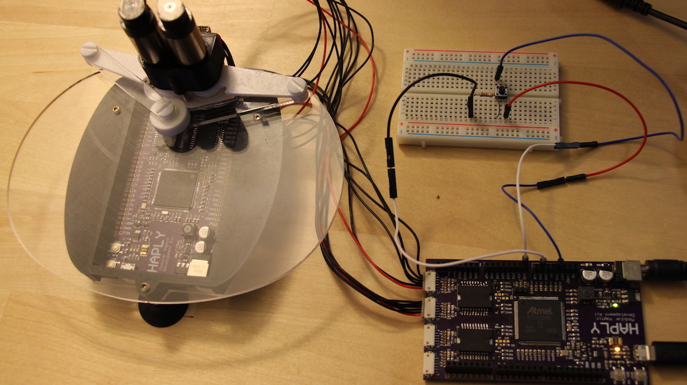

Processing Demos
================

**This set of examples run using the new Haply hAPI. The documentaion
for this is currently under development, but features a similar user
interface to the previous hAPI. Flash the new version of the firmware,
found [here](/Haply_Arduino_Firmware/), onto your Haply Dev Board to get
these examples started.**

Focusing on Tool Development
----------------------------

The Haply Firmware Package abstracts the sending and recieving of data
shown in previoius lessons. In these lessons, we'll be turning our
attention to using the hAPI with Processing to create tools with
seamless haptic integration.

For each demo shown we'll talk broadly about the aspects of the hAPI to
be shown, and then get into some nitty gritty of how it was implimented.
A key takeaway with these demos won't necessarily be the exact code
(although it will be shown), but how the hAPI tools can be implimented
in other tools you can develop on your own!

**THE MOST IMPORTANT LINK IN THIS LESSON** is right here:
https://haplyhaptics.github.io/hAPI\_Fisica/annotated.html In it you'll
find all the documentation needed to use the hAPI, and it will be
referenced as the *hAPI documentation* in the lessons to come. It is
recommended to bookmark this link whenever you are working on a tool
with the hAPI.

See the folder "Example Files" for the code files and project structure.
Download the relevant folder, and open .pde files to start the project.

Demos Order
-----------

Although each demo functions fine as a standalone example of the hAPI
tools, there is a slight buildup of knowledge throughout the three
demos. For this reason, if you are relatively new to the Haply
environment you may want to go in this order -

1.  [Maze](/01_Maze.md) -

    Focuses on: How to draw shapes, writing text, sensors, viscosity,
    buoyancy

    

2.  [Drag n Drop](/02_Drag_n_Drop.md) -

    Focuses on: Breadboard button implimentation, moving objects,
    multiple object management, joint formation

    

3.  [Physics](/03_Physics.md) -

    Focuses on: 2D Object arrays, other joints, expanded button usage,
    constructing waves

    

Onward!
-------

Again, the key takeaway from these demos will be the tools in the hAPI
suite. If the lines of the code which revolve around setting up the
firmware start to bog down your understanding of these demos, ignore
them for now and take a look at some of the earlier lessons.

A-maze-ment
===========

What is Covered in this Lesson?
-------------------------------

In this lesson, we'll be using a maze demo to exhibit the following
tools from the hAPI:

1.  How to Draw Shapes
2.  Writing text
3.  Sensors
4.  Viscosity
5.  Buoyancy

Setup
-----

As all we'll be doing is moving around and colliding with objects, we'll
be using the standard Haplet as seen in the picture below


Code
----

See below for the entirety of the code. Snippets of this code will be
copied and pasted into later sections of this lesson, but here it is in
case you'd like to see the whole thing. An animation of what it looks
like is shown below too!

``` Javascript
/* library imports *****************************************************************************************************/ 
import processing.serial.*;
import com.dhchoi.CountdownTimer;
import com.dhchoi.CountdownTimerService;

/* Device block definitions ********************************************************************************************/
Device            widgetOne;
byte              widgetOneID                     = 5;
Board             haplyBoard;
Mechanisms        pantograph;
boolean           rendering_force                 = false;
int               CW = 1;
int               CCW = 0;

/* Simulation Speed Parameters ****************************************************************************************/
final long        SIMULATION_PERIOD          = 1; //ms
final long        HOUR_IN_MILLIS             = 36000000;
CountdownTimer    haptic_timer;
float             dt                        = SIMULATION_PERIOD/1000.0; 

/* generic data for a 2DOF device */
/* joint space */
PVector           angles                    = new PVector(0, 0);
PVector           torques                   = new PVector(0, 0);

/* task space */
PVector           pos_ee                    = new PVector(0, 0);
PVector           f_ee                      = new PVector(0, 0); 

/* Flicker timer */
float             timer_last                = 0.0;
boolean           barriers_up               = true;

/* Screen and world setup parameters */
float pixelsPerCentimeter = 40.0;

/* World boundaries */
FWorld world;
float worldWidth = 25.0;  
float worldHeight = 10.0; 

float edgeTopLeftX = 0.0; 
float edgeTopLeftY = 0.0; 
float edgeBottomRightX = worldWidth; 
float edgeBottomRightY = worldHeight;

/* Initialization of virtual tool */
HVirtualCoupling s;

/* define maze blocks */
FBox b1;
FBox b2;
FBox b3;
FBox b4;
FBox b5;
FBox l1;

/* define start and stop button */
FCircle c1;
FCircle c2;

/* define game ball */
FCircle g2;
FBox    g1;

/* define game start */
boolean gameStart = false;

PFont f;

void setup(){
    size(1000, 400);

    // Board and Device
    haplyBoard = new Board(this, Serial.list()[1], 0);

    pantograph = new Pantagraph();

    widgetOne = new Device(widgetOneID, haplyBoard);

    widgetOne.set_mechanism(pantograph);

    widgetOne.add_actuator(1, CW, 1);
    widgetOne.add_actuator(2, CCW, 2);

    widgetOne.add_encoder(1, CW, 180, 13824, 1);
    widgetOne.add_encoder(2, CCW, 0, 13824, 2);

    widgetOne.device_set_parameters();

    hAPI_Fisica.init(this); 
    hAPI_Fisica.setScale(pixelsPerCentimeter); 
    world = new FWorld();

    // Set Barriers
    b1 = new FBox(1.0, 5.0);
    b1.setPosition(edgeTopLeftX+worldWidth/4.0-2, edgeTopLeftY+worldHeight/2+1.5); 
    b1.setFill(0);
    b1.setNoStroke();
    b1.setStaticBody(true);
    world.add(b1);

    b2 = new FBox(1.0, 5.0);
    b2.setPosition(edgeTopLeftX+worldWidth/4.0, edgeTopLeftY+worldHeight/2-1.5); 
    b2.setFill(0);
    b2.setNoStroke();
    b2.setStaticBody(true);
    world.add(b2);

    b3 = new FBox(1.0, 3.0);
    b3.setPosition(edgeTopLeftX+worldWidth/4.0+8, edgeTopLeftY+worldHeight/2+1.5); 
    b3.setFill(0);
    b3.setNoStroke();
    b3.setStaticBody(true);
    world.add(b3);

    b4 = new FBox(1.0, 5.0);
    b4.setPosition(edgeTopLeftX+worldWidth/4.0+12, edgeTopLeftY+worldHeight/2-1.5); 
    b4.setFill(0);
    b4.setNoStroke();
    b4.setStaticBody(true);
    world.add(b4);

    b5 = new FBox(3.0, 2.0);
    b5.setPosition(edgeTopLeftX+worldWidth/2.0, edgeTopLeftY+worldHeight/2.0+2);
    b5.setFill(0);
    b5.setNoStroke();
    b5.setStaticBody(true);
    world.add(b5);

    // Set Viscous Layer
    l1 = new FBox(27,4);
    l1.setPosition(24.5/2,8.5);
    l1.setFill(150,150,255,80);
    l1.setDensity(17);
    l1.setSensor(true);
    l1.setNoStroke();
    l1.setStatic(true);
    l1.setName("Water");
    world.add(l1);

    // Start Button
    c1 = new FCircle(2.0); // diameter is 2
    c1.setPosition(edgeTopLeftX+2.5, edgeTopLeftY+worldHeight/2.0-3);
    c1.setFill(0, 255, 0);
    c1.setSensor(true);
    c1.setStaticBody(true);
    world.add(c1);

    // Finish Button
    c2 = new FCircle(2.0);
    c2.setPosition(worldWidth-2.5, edgeTopLeftY+worldHeight/2.0);
    c2.setFill(200,0,0);
    c2.setStaticBody(true);
    c2.setSensor(true);
    world.add(c2);

    // Game Ball
    g1 = new FBox(1, 1);
    g1.setPosition(2, 4);
    g1.setDensity(12);
    g1.setFill(random(255),random(255),random(255));
    g1.setName("Widget");
    world.add(g1);

    g2 = new FCircle(1);
    g2.setPosition(3, 4);
    g2.setDensity(12);
    g2.setFill(random(255),random(255),random(255));
    g2.setName("Widget");
    world.add(g2);

    // Setup the Virtual Coupling Contact Rendering Technique
    s = new HVirtualCoupling((0.75)); 
    s.h_avatar.setDensity(7); 
    s.h_avatar.setFill(255,0,0); 
    s.h_avatar.setSensor(true);
    s.init(world, edgeTopLeftX+worldWidth/2, edgeTopLeftY+2); 

    // World Setup
    world.setGravity((0.0), (300.0)); //1000 cm/(s^2)
    world.setEdges((edgeTopLeftX), (edgeTopLeftY), (edgeBottomRightX), (edgeBottomRightY)); 
    world.setEdgesRestitution(.4);
    world.setEdgesFriction(0.5);

    world.draw();

    haptic_timer = CountdownTimerService.getNewCountdownTimer(this).configure(SIMULATION_PERIOD, HOUR_IN_MILLIS).start();

    frameRate(60); 
    f = createFont("Arial", 16, true);
}


void draw(){
    background(255);
    textFont(f, 22);
    //fill(0, 102, 153);

    if(gameStart){
        fill(0, 0, 0);
        textAlign(CENTER);
        text("Push the ball or square to the red circle", width/2, 60);
        textAlign(CENTER);
        text("Touch the green circle to reset", width/2, 90);

        b1.setFill(0, 0, 0);
        b2.setFill(0, 0, 0);
        b3.setFill(0, 0, 0);
        b4.setFill(0, 0, 0);
        b5.setFill(0, 0, 0);

    }
    else{
        fill(128, 128, 128);
        textAlign(CENTER);
        text("Touch the green circle to start the maze", width/2, 60);

        b1.setFill(255, 255, 255);
        b2.setFill(255, 255, 255);
        b3.setFill(255, 255, 255);
        b4.setFill(255, 255, 255);
        b5.setFill(255, 255, 255);
    }

    world.draw();
}


void onTickEvent(CountdownTimer t, long timeLeftUntilFinish){

    rendering_force = true;
    if (haplyBoard.data_available()){
        /* GET END-EFFECTOR STATE (TASK SPACE) */

        widgetOne.device_read_data();

        angles.set(widgetOne.get_device_angles()); 
        pos_ee.set(widgetOne.get_device_position(angles.array()));
        pos_ee.set(pos_ee.copy().mult(200));  
    }

    s.setToolPosition(edgeTopLeftX+worldWidth/2-(pos_ee).x+2, edgeTopLeftY+(pos_ee).y-7); 
    s.updateCouplingForce();
    f_ee.set(-s.getVCforceX(), s.getVCforceY());
    f_ee.div(15000); //
    torques.set(widgetOne.set_device_torques(f_ee.array()));
    widgetOne.device_write_torques();


    if (s.h_avatar.isTouchingBody(c1)){
        gameStart = true;
        g1.setPosition(2,8);
        g2.setPosition(3,8);
        s.h_avatar.setSensor(false);
    }

    if(g1.isTouchingBody(c2) || g2.isTouchingBody(c2)){
        gameStart = false;
        s.h_avatar.setSensor(true);
    }

    // Viscous layer codes
    if (s.h_avatar.isTouchingBody(l1)){
        s.h_avatar.setDamping(150);
    }
    else{
        s.h_avatar.setDamping(40); 
    }

    if(gameStart && g1.isTouchingBody(l1)){
        g1.setDamping(20);
    }

    if(gameStart && g2.isTouchingBody(l1)){
        g2.setDamping(20);
    }

    // Bouyancy of fluid on avatar and gameball
    if (g1.isTouchingBody(l1)){
        float b_s;
        float bm_d = g1.getY()-l1.getY()+l1.getHeight()/2; // vertical distance between middle of ball and top of water

        if (bm_d + g1.getWidth()/2 >= g1.getWidth()) { //if whole ball or more is submerged
            b_s = g1.getWidth(); // amount of ball submerged is ball size
        }
        else { //if ball is partially submerged
            b_s = bm_d + g1.getWidth()/2; // amount of ball submerged is vertical distance between middle of ball and top of water + half of ball size
        }

        g1.addForce(0,l1.getDensity()*sq(b_s)*300*-1); // 300 is gravity force

    }


    if (g2.isTouchingBody(l1)){
        float b_s;
        float bm_d = g2.getY()-l1.getY()+l1.getHeight()/2; // vertical distance between middle of ball and top of water

        if (bm_d + g2.getSize()/2 >= g2.getSize()) { //if whole ball or more is submerged
            b_s = g2.getSize(); // amount of ball submerged is ball size
        }
        else { //if ball is partially submerged
            b_s = bm_d + g2.getSize()/2; // amount of ball submerged is vertical distance between middle of ball and top of water + half of ball size
        }

        g2.addForce(0,l1.getDensity()*sq(b_s)*300*-1); // 300 is gravity force

    }

    world.step(1.0f/1000.0f);

    rendering_force = false;

}

/*
//Uncomment this section to see an alternate way to apply forces in the environment!
void contactPersisted(FContact contact){
    float size;
    float b_s;
    float bm_d;

    if(contact.contains("Water", "Widget")){
        size = 2*sqrt(contact.getBody2().getMass()/contact.getBody2().getDensity()/3.1415);

        if(bm_d + size/2 >= size){
            b_s = size;
        }
        else{
            b_s = bm_d + size/2;
        }

        contact.getBody2().addForce(0, contact.getBody1().getDensity()*sq(b_s)*300*-1);
        contact.getBody2().setDamping(20);
    }

}


void contactEnded(FContact contact){
    if(contact.contains("Water", "Widget")){
        contact.getBody2().setDamping(0);
    }
}
*/

/* Timer control event functions **************************************************************************************/

/**
* haptic timer reset
*/
void onFinishEvent(CountdownTimer t)
{
    println("Resetting timer...");
    haptic_timer.reset();
    haptic_timer = CountdownTimerService.getNewCountdownTimer(this).configure(SIMULATION_PERIOD, HOUR_IN_MILLIS).start();
}
```

Here's a (partial) animation of what this code does! The maze is a
little too difficult to be done within the timespan of a reasonably
sized gif... you'll have to run the code yourself to see for yourself
:stuck\_out\_tongue:


How to Draw Objects
-------------------

We'll start off our lesson by discussing something used a whole lot in
processing: drawing objects. We'll focus on drawing one of the maze
barriers.

There are two steps to drawing an object, first is defining of the
object so that it is allocated space in memory. That looks like this:

``` Javascript
FBox b1;
```

Here, we simply say the object type **(FBox)**, and give it any
arbitrary name. In this case, it was called **b1**. Keep in mind this
generally is done **OUTSIDE** of the looping functions like **setup()**
or **draw()**. This can be done inside the **setup()** function as all
we are doing is allocating memory space, however simplest practice is
generally to keep it outside of a function.

The second step is the actual drawing of the object, which looks like
this:

``` Javascript
b1 = new FBox(1.0, 5.0);
b1.setPosition(edgeTopLeftX+worldWidth/4.0-2, edgeTopLeftY+worldHeight/2+1.5);
b1.setFill(0);
b1.setNoStroke();
b1.setStaticBody(true);
world.add(b1); //<>//
```

Because we want this object to be drawn once and for all at the
beginning of our simulations, this code is in our **setup()** loop. The
first line shown creates the object and the final line draws it in the
world. Information as to what each method does can be found in the hAPI
documentation. Needless to say that as a maze wall, using the object
type **FBox** defined in this way fits our needs quite well.

One best practices shown here is in the **setPosition()** method. There
are numerous ways to set a position, however since we have defined our
world dimensions earlier in the code it is best to reference position of
shapes compared to the size of the world. See below for how we set our
world height and width, notice how it relates to the way we defined our
object's position.

``` Javascript
/* World boundaries */
FWorld world;
float worldWidth = 25.0;  
float worldHeight = 10.0; 

float edgeTopLeftX = 0.0; 
float edgeTopLeftY = 0.0; 
float edgeBottomRightX = worldWidth; 
float edgeBottomRightY = worldHeight;
```

As a note, calling methods is done though the syntax
**object.method()**; in the case above our object was **b1**, and an
example method would be **.setFill(0)**, which paints the object black.

Let's Talk About Text, Baby
---------------------------

We're using text in this demo to tell the user how to move in our
environment. Placing text strategically can clear up instructions in any
confusing or ambiguous parts of your demos; in this segment we'll talk a
bit about how to create text in simulations. Although fonts have
similarities to other objects we use, syntactically they are a little
bit different. To clear a spot in memory for our font, we'll call the
class **Pfont** before our **setup()** function.

``` Javascript
PFont f;
```

In our **setup()** function we'll define **f** using **createFont()**.
We'll be changing the font size later, but for now we'll say we're using
the font Arial at a fontsize of 16, so we'll call **createFont()** as
follows. Note that the final argument, **true**, smooths out the text
with antialiasing.

``` Javascript
f = createFont("Arial", 16, true);
```

Now that we've fully defined our text, let's make use of it by doing
some writing. Since we'll be changing the text throughout the demo but
there is no direct haptic response associated with the text, so we'll
put the code in **draw()**. The entirety of the code looks like this -

``` Javascript
textFont(f, 22);
//fill(0, 102, 153);

if(gameStart){
    fill(0, 0, 0);
    textAlign(CENTER);
    text("Push the ball or square to the red circle", width/2, 60);
    textAlign(CENTER);
    text("Touch the green circle to reset", width/2, 90);

    b1.setFill(0, 0, 0);
    b2.setFill(0, 0, 0);
    b3.setFill(0, 0, 0);
    b4.setFill(0, 0, 0);
    b5.setFill(0, 0, 0);
}

else{
    fill(128, 128, 128);
    textAlign(CENTER);
    text("Touch the green circle to start the maze", width/2, 60);

    b1.setFill(255, 255, 255);
    b2.setFill(255, 255, 255);
    b3.setFill(255, 255, 255);
    b4.setFill(255, 255, 255);
    b5.setFill(255, 255, 255);
}
```

The first thing we do here is set the font that will be referenced with
the text related functions we'll call later. This is important if we
were to use multiple fonts. Notice that here we change the font size to
22. If we didn't include the second argument our fontsize would default
to 16, as we set it when we used **createFont()**.

``` Javascript
textFont(f,22)
```

For the next bit of code i'll be referencing the lines below, which will
trigger if the boolean variable **gameStart** is not true. So look in
the **else** statement bit of the code. I'll talk a bit about the other
instance wherein we write text, but the two lines function identically.

``` Javascript
fill(128, 128, 128);
textAlign(CENTER);
text("Touch the green circle to start the maze", width/2, 60);

b1.setFill(255, 255, 255);
b2.setFill(255, 255, 255);
b3.setFill(255, 255, 255);
b4.setFill(255, 255, 255);
b5.setFill(255, 255, 255);
```

The first thing here we do is invoke **fill()**, which changes the color
of the next shapes drawn. In this context it will make our text halfway
in between completely white and completely black (256/2 = 128). Next,
**textAlign()** will align our text in the center. **textAlign()** does
have some nuances regarding the use of a second argument
(e.g. textAlign(Center, Center), so I'd recommend checking out the
online documentation for further information. In the next line we use
**text()** to write the character string, as well as to define the x and
y coordinates of the text. This interacts in some funky ways with
**textAlign()**; I'd recommend messing with the values to gain some
intuition as to how to place text in the position you'd like.

The final part of these code doesn't really relate to text, it's role is
to take all of the barriers of the maze and make them white and
therefore blend in with the background. This makes it seem like there is
no maze, which is our start scenario.

In the event that **gameStart** is true, the following code will run.
Take note how it functions identically to the code just shown, just with
different text with a different fill, and the maze barriers turned
black. This set of code also functions as a sort of a game starting
trigger, dependant on the value of **gameStart**.

``` Javascript
fill(0, 0, 0);
textAlign(CENTER);
text("Push the ball or square to the red circle", width/2, 60);
textAlign(CENTER);
text("Touch the green circle to reset", width/2, 90);

b1.setFill(0, 0, 0);
b2.setFill(0, 0, 0);
b3.setFill(0, 0, 0);
b4.setFill(0, 0, 0);
b5.setFill(0, 0, 0);
```

Sensors Gonna Sense
-------------------

You may have noticed that at the beginning of the simulation the avatar
(the object you control) has no collision detection. As the text we
wrote in the last section suggests, this property of the avatar changes
upon collision with the large green circle. In order to implement this,
we make use of a common concept in simulations and games: Sensors.

Below are a couple of code snippets from different locations in the
code. The first is when we create our avatar in **setup()**, and the
second is the code which triggers the game start in **OnTickEvent()**.

``` Javascript
// Setup the Virtual Coupling Contact Rendering Technique
s = new HVirtualCoupling((0.75)); 
s.h_avatar.setDensity(7); 
s.h_avatar.setFill(255,0,0); 
s.h_avatar.setSensor(true);
s.init(world, edgeTopLeftX+worldWidth/2, edgeTopLeftY+2); 

/* SECOND LINE OF CODE */

if (s.h_avatar.isTouchingBody(c1)){
    gameStart = true;
    g1.setPosition(2,8);
    g2.setPosition(3,8);
    s.h_avatar.setSensor(false);
}
```

In the first line of code, when we called
**s.h\_avatar.setSensor(true);**, we defined the avatar (which is named
**s.h\_avatar**) at startup as a sensor. This makes it, well, a sensor!
The avatar will not have a collision response to hitting another object,
but we will still be able to receive information regard what it touches.

That brings us to the second bit of code where we call
**isTouchingBody()** to give us information on what our avatar is
touching. **isTouchingBody()** will return true or false, meaning that
we can use it to conditionally trigger events. In this case, we use it
to begin our game as well as to change our avatar into a non-sensor.
This is just one of many applications of sensors, in fact you'll notice
that just below our game start code we utilize similar code to call our
end game condition as well!

``` Javascript
if(g1.isTouchingBody(c2) || g2.isTouchingBody(c2)){
    gameStart = false;
    s.h_avatar.setSensor(true);
}
```

Viscosity
---------

In the lessons regarding basic walls we talked a bit about the "dashpot"
component of a wall system, which serves to dampen the feedback from the
virtual spring which is our wall. We can use this outside of walls to
create a dampening effect on the movement of our avatar. The effect of
the dampening can be very subtle and can serve to stabilize the avatars
movement, or we can ramp it up to make it feel like we are moving
through a fluidic medium. This can be implimented by calling the
**setDamping()** method on the **s.h\_avatar** in the **setup()**
function; in our case we'd like to use it universally, for stability,
*as well* as when moving through the object **l1** at the bottom of our
scene to simulate movement through a fluid. The code used is relatively
straightforward, you'll notice we use **isTouchingBody** as well -

``` Javascript
// Viscous layer codes
if (s.h_avatar.isTouchingBody(l1)){
    s.h_avatar.setDamping(150);
}
else{
    s.h_avatar.setDamping(40); 
}

if(gameStart && g1.isTouchingBody(l1)){
    g1.setDamping(20);
}

if(gameStart && g2.isTouchingBody(l1)){
    g2.setDamping(20);
}
```

Because our **else** statement creates the dampening affect (of 40)
universally, we don't need to include dampening when we create
**s.h\_avatar** for the first time.

As a note, this implimentation of dampening requires the **l1** object
to be a sensor to prevent collision. Because the **isTouchingBody()**
method will apply so long as the avatar is touching or inside of **l1**,
the dampening on the avatar will change as we'd like it to.

It can be seen that we've applied dampening to our game objects, **g1**
and **g2**. These objects and the avatar are the only moving objects in
our scene, so with this code we're encapsulated dampening to all objects
which can interact with our dampener object **l1**. Try messing around
the dampening values in this code, note how it effects the haptic
response on the movement of both objects!

You'll notice at the bottom of our code we wrote some commented out code
with an alternate way to apply forces in the environment. This applies
to both viscosity and bouyancy forces, so I thought it was fitting to
write this between the two sections regarding viscosity and buoyancy.
See below for the code -

``` Javascript
//Uncomment this section to see an alternate way to apply forces in the environment!
void contactPersisted(FContact contact){
    float size;
    float b_s;
    float bm_d;

    if(contact.contains("Water", "Widget")){
        size = 2*sqrt(contact.getBody2().getMass()/contact.getBody2().getDensity()/3.1415);

        if(bm_d + size/2 >= size){
            b_s = size;
        }
        else{
            b_s = bm_d + size/2;
        }

        contact.getBody2().addForce(0, contact.getBody1().getDensity()*sq(b_s)*300*-1);
        contact.getBody2().setDamping(20);
    }

}


void contactEnded(FContact contact){
    if(contact.contains("Water", "Widget")){
        contact.getBody2().setDamping(0);
    }
}
```

The main difference between this code and the uncommented code is the
use of **contactPersisted()** and **contactEnded()** in place of
**isTouchingBody()**. **isTouchingBody()** outputs a true or false which
can be used as a trigger, while **contactPersisted()** and
**contactEnded()** are separate functions called when a contact occurs
or ends between two objects. In using either of these functions, you'll
notice that the argument **contact** is used, which represents the
contact between two objects. Within the functions in order to trigger
the forces we'd like, we check to see if the contact is between two
objects of a certain name. The code below is of the creation of the
objects we expect to collide, you'll notice the use of **setName()** and
how it correlates to the objects we'd like involve in the imparting of
forces.

``` Javascript
// Set Viscous Layer
l1 = new FBox(27,4);
l1.setPosition(24.5/2,8.5);
l1.setFill(150,150,255,80);
l1.setDensity(17);
l1.setSensor(true);
l1.setNoStroke();
l1.setStatic(true);
l1.setName("Water");
world.add(l1);

// Game Ball
g1 = new FBox(1, 1);
g1.setPosition(2, 4);
g1.setDensity(12);
g1.setFill(random(255),random(255),random(255));
g1.setName("Widget");
world.add(g1);

g2 = new FCircle(1);
g2.setPosition(3, 4);
g2.setDensity(12);
g2.setFill(random(255),random(255),random(255));
g2.setName("Widget");
world.add(g2);
```

In using this code it may be worthy to rethink how we assign names to
the avatar as well as if we want the avatar to be a sensor at creation;
the inclusion of this code is more so you can see how it could work in
this environment. Keep in mind that for coding in general there are many
ways to acheive a given result, the art in coding comes from eloquently
and clearly implimenting the correct code.

Buoyancy
--------

We mentioned our game objects **g1** and **g2** in previous sections, we
can see that we'd like our game ball to rest on the surface of our
dampening layer much like it would upon a liquid in the real world. This
requires implimentation of a physical phenoma: bouyancy.

Bouyancy is the force resultant from the displacment of fluid by an
object. With a bit of mathematics we can determine the force we need to
apply to our game ball so that it rests on the surface of our liquid:

**Density of Liquid \* Area of Displaced Fluid \* Gravity**

We've already set the density of our liquid and the force of gravity, so
our challenge is to determine the area of displaced fluid. This will be
equal to the area of the shape submerged in the fluid, so we'll need to
look at how deep into the fluid layer **g1** or **g2** are in **l1**.
This will give us a height, so we'll take advantage of approximation by
squaring this value to approximate the area of the object submerged.

The displaced fluid can be thought of as a function of the depth of our
ball into the fluid. It is encouraged to try to derive this relationship
on your own, but see below for the resultant code -

``` Javascript
// Bouyancy of fluid on avatar and gameball
if (g1.isTouchingBody(l1)){
    float b_s;
    float bm_d = g1.getY()-l1.getY()+l1.getHeight()/2; // vertical distance between middle of ball and top of water

    if (bm_d + g1.getWidth()/2 >= g1.getWidth()) { //if whole ball or more is submerged
        b_s = g1.getWidth(); // amount of ball submerged is ball size
    }
    else { //if ball is partially submerged
        b_s = bm_d + g1.getWidth()/2; // amount of ball submerged is vertical distance between middle of ball and top of water + half of ball size
    }

    g1.addForce(0,l1.getDensity()*sq(b_s)*300*-1); // 300 is gravity force

}
```

The use of bouyancy in simulations can come in handy in many ways,
you'll find it can dramatically increase the realism of a scene. Apart
from this, it is important to understand how knowledge of underlying
physical equations can be used and modified to create a realistic
environment.

Drag n and Drop n
=================

What Will be Covered
--------------------

For this lesson, we'll be focusing our attention on the following
topics-

1.  Breadboard Button Implimentation
2.  Joints
3.  Creating Multiple Objects
4.  Moving Objects

Setup
-----

As you may notice from the previous section, we'll be adding a button to
our setup. We don't ship buttons with the Haply Kit, but you can find
the appropriate type of button from any electronics supplier. See the
picture below for the layout.


In case it isn't clear, the power is linked from the 3.3V pin on the
Haply board to the upper half of the button on the breadboard. On the
lower half the output splits, first to the AD0 pin while the other side
goes through a resistor followed by the GND pin. See the following link
for more details - https://www.arduino.cc/en/Tutorial/Button

Code
----

The scene we'll be examining is a kind of drag and drop game; balls will
be constructed on one side of the scene, while on the other a block
moves up and down. In the middle a fluid layer is present, it functions
similarly to the maze game but we'll code it differently. Once the
avatar is in range of a ball, it can be picked up and dropped (or
thrown) by pressing and releasing the button. There is no outright goal
of the game, the moving block can be seen either as a goalie or a
target. Either way, behind the block is a bin wherein the ball can be
thrown. See the code below, followed by a gif of the scene in action!

``` Javascript
import processing.serial.*;
import com.dhchoi.CountdownTimer;
import com.dhchoi.CountdownTimerService;

/* Device block definitions ********************************************************************************************/
Device            widgetOne;
byte              widgetOneID                     = 5;
Board             haplyBoard;
Mechanisms        pantograph;
boolean           rendering_force                 = false;
int               CW = 1;
int               CCW = 0;

/* Simulation Speed Parameters ****************************************************************************************/
final long        SIMULATION_PERIOD          = 1; //ms
final long        HOUR_IN_MILLIS             = 36000000;
CountdownTimer    haptic_timer;
float             dt                        = SIMULATION_PERIOD/1000.0;

/* Sensor data */
float[]           sensorData;

/* generic data for a 2DOF device */
/* joint space */
PVector           angles                    = new PVector(0, 0);
PVector           torques                   = new PVector(0, 0);

/* task space */
PVector           pos_ee                    = new PVector(0, 0);
PVector           f_ee                      = new PVector(0, 0); 

/* Screen and world setup parameters */ 
float pixelsPerCentimeter= 40.0; 

/* World boundaries */ 
FWorld world;
float worldWidth = 25.0; 
float worldHeight = 10.0; 

float edgeTopLeftX = 0.0; 
float edgeTopLeftY = 0.0; 
float edgeBottomRightX = worldWidth; 
float edgeBottomRightY = worldHeight; 

/* list of contacts with avatar */
ArrayList <FContact> touchingAvatar;

/* joints to be created for avatar */
boolean jointCreated = false;
FDistanceJoint d1;

/* Initialization of virtual tool */
HVirtualCoupling s;
FCircle h1; // grab radius

/* define region seperators  */
FBox b1;
FBox b2;
FBox b3;

/* define water trap */
FBox f1;

/* define goalie variables */
FBox g1;
FPrismaticJoint p1;
boolean upOrDown = false;
float gTime;
float gTimeLast;
float gTimeLimit = 1500;

/* define beads */
int beads = 45;
FCircle bead; //This can be in setup too!

/* define linkage state */
boolean canLink = false;


void setup(){
    size(1000, 400);

    /* Board and Device setup */
    haplyBoard = new Board(this, Serial.list()[1], 0);

    pantograph = new Pantagraph();

    widgetOne = new Device(widgetOneID, haplyBoard);

    widgetOne.set_mechanism(pantograph);

    widgetOne.add_actuator(1, CW, 1);
    widgetOne.add_actuator(2, CCW, 2);

    widgetOne.add_encoder(1, CW, 180, 13824, 1);
    widgetOne.add_encoder(2, CCW, 0, 13824, 2);

    widgetOne.add_analog_sensor("A0");

    widgetOne.device_set_parameters();


    /* World paramters initialization */
    hAPI_Fisica.init(this);
    hAPI_Fisica.setScale(pixelsPerCentimeter); 
    world = new FWorld();


    /* Barrier for beads */
    b1 = new FBox(1, 8);
    b1.setPosition(6.5, 10);
    b1.setFill(0, 0, 0);
    b1.setStatic(true);
    world.add(b1);


    /* Barrier for container */
    b2 = new FBox(1, 8);
    b2.setPosition(18, 10);
    //b2.setDensity(0);
    b2.setFill(0, 0, 0);
    b2.setStatic(true);
    world.add(b2);

    /* Barrier for water */
    b3 = new FBox(1,8);
    b3.setPosition(12.25, 10);
    b3.setFill(0, 0, 0);
    b3.setStatic(true);
    world.add(b3);


    /* Water Bucket */
    f1 = new FBox(4.75, 2);
    f1.setPosition(15.125, 8.25);
    f1.setFill(150, 150, 255, 80);
    f1.setDensity(50);
    f1.setSensor(true);
    f1.setNoStroke();
    f1.setStatic(true);
    f1.setName("Water");
    world.add(f1);


    /* Goalie definition */
    g1 = new FBox(1, 2);
    g1.setFill(150, 0, 0);
    g1.setPosition(18, 1.5);
    g1.setDensity(40);
    world.add(g1);
    p1 = new FPrismaticJoint(g1, b2);
    p1.setNoStroke();
    world.add(p1);


    /* create beads pile */
    float size, x, y, r, g, b;

    for(int i = 0; i < beads; i++){
        size = random(0.1, 1);
        r = random(0, 256);
        g = random(0, 256);
        b = random(0, 256);
        x = random(1.5, 5);
        y = random(4, 9);

        bead = new FCircle(size);
        bead.setPosition(x, y);
        bead.setFill(r, g, b);
        bead.setFriction(20);
        bead.setDensity(40*size);
        bead.setHaptic(true);
        bead.setName("FCircle");
        world.add(bead);
    }


    /* Haptic Tool Initialization   */
    s= new HVirtualCoupling((0.25)); 
    s.h_avatar.setDensity(7);
    s.h_avatar.setFill(255,0,0); 
    s.init(world, edgeTopLeftX+worldWidth/2, edgeTopLeftY+2);

    h1 = new FCircle(0.75);
    h1.setDensity(0);
    h1.setNoStroke();
    h1.setSensor(true);
    h1.setFill(0, 0, 0, 50);
    h1.setPosition(3, 3);
    world.add(h1);


    /*world Setup*/ 
    world.setGravity((0.0), (300.0)); //1000 cm/(s^2)
    world.setEdges((edgeTopLeftX), (edgeTopLeftY), (edgeBottomRightX), (edgeBottomRightY)); 
    world.setEdgesRestitution(.4);
    world.setEdgesFriction(0.5);

    world.draw();

    haptic_timer = CountdownTimerService.getNewCountdownTimer(this).configure(SIMULATION_PERIOD, HOUR_IN_MILLIS).start(); 

    frameRate(60); 

}


void draw(){
    background(255);

    gTime = millis();
    if (gTime - gTimeLast > gTimeLimit){
        if (abs(g1.getVelocityY())      <5){
            upOrDown =! upOrDown;
            gTimeLast = gTime;
        }
    }
    if(upOrDown == false){
        g1.setVelocity(0,5);
    }
    else{
        g1.setVelocity(0,-5);
    }

    world.draw();
}


void onTickEvent(CountdownTimer t, long timeLeftUntilFinish){

    rendering_force = true;

    if(haplyBoard.data_available()){
        /* GET END-EFFECTOR STATE (TASK SPACE) */
        widgetOne.device_read_data();

        angles.set(widgetOne.get_device_angles()); 
        pos_ee.set(widgetOne.get_device_position(angles.array()));
        pos_ee.set(pos_ee.copy().mult(200));
    }

    s.setToolPosition(edgeTopLeftX+worldWidth/2-(pos_ee).x+2, edgeTopLeftY+(pos_ee).y-7); 
    s.updateCouplingForce();
    f_ee.set(-s.getVCforceX(), s.getVCforceY());

    f_ee.div(15000); //
    torques.set(widgetOne.set_device_torques(f_ee.array()));
    widgetOne.device_write_torques();

    h1.setPosition(s.h_avatar.getX(), s.h_avatar.getY());

    joint_Formation();

    world.step(dt);

    rendering_force = false;
}


void joint_Formation(){

    boolean touchingCircle = false;
    boolean buttonPressed = false;

    touchingAvatar = h1.getContacts();
    for(int i = 0; i < touchingAvatar.size(); i++){
        if((touchingAvatar.get(i).getBody1() != s.h_tool) && (touchingAvatar.get(i).getBody1().getName() == "FCircle")){
            touchingCircle = true;
        }
    }

    sensorData = widgetOne.get_sensor_data();
    if(sensorData[0] > 800){
        buttonPressed = true;
    }


    if(canLink && buttonPressed && touchingCircle){
        canLink = false;
        for(int i = 0; i < touchingAvatar.size(); i++){
            if((touchingAvatar.get(i).getBody1() != s.h_tool) && (touchingAvatar.get(i).getBody1().getName() == "FCircle")){
                if(!jointCreated){
                    d1 = new FDistanceJoint(s.h_avatar, touchingAvatar.get(i).getBody1());
                    d1.setDamping(10);
                    d1.setFrequency(80);
                    d1.setLength(3);
                    world.add(d1);
                    jointCreated = true;
                }
            }
        }
    }
    else if(buttonPressed && !touchingCircle){
        canLink = false;
    }
    else if(!buttonPressed && touchingCircle){
        canLink = true;
        if(jointCreated){
            world.remove(d1);
            jointCreated = false;
        }
    }
    else if(!buttonPressed && !touchingCircle){
        canLink = true;
        if(jointCreated){
            world.remove(d1);
            jointCreated = false;
        }
    }
}


void contactPersisted(FContact contact) {
    float size;
    float b_s;
    float bm_d;

    if(contact.contains("Water","FCircle")){
        size = 2*sqrt(contact.getBody2().getMass()/contact.getBody2().getDensity()/3.1415);    
        bm_d = contact.getBody2().getY()-contact.getBody1().getY()+f1.getHeight()/2; // vertical distance between middle of ball and top of water

        if (bm_d + size/2 >= size){ //if whole ball or more is submerged
            b_s = size; // amount of ball submerged is ball size
        }
        else { //if ball is partially submerged
            b_s = bm_d + size/2; // amount of ball submerged is vertical distance between middle of ball and top of water + half of ball size
        } 
        contact.getBody2().addForce(0,contact.getBody1().getDensity()*sq(b_s)*300*-1); // 300 is gravity force
        contact.getBody2().setDamping(10);
    }
}


void contactEnded(FContact contact) {
    if(contact.contains("Water", "FCircle")){
        contact.getBody2().setDamping(0);
    }
}


/**
* haptic timer reset
*/
void onFinishEvent(CountdownTimer t){
    println("Resetting timer...");
    haptic_timer.reset();
    haptic_timer = CountdownTimerService.getNewCountdownTimer(this).configure(SIMULATION_PERIOD, HOUR_IN_MILLIS).start();
} 
```


Button, Buttoff
---------------

We showed in the setup section of this lesson how to set up the
breadboard and Haply board to accomodate a button. In this section we'll
focus on how a button can be accomodated on the software side of things.
You may recall in previous lessons that we used the firmware (Arduino)
to handle peripheries such as potentiometers and LEDs. Since we are
coding here only in Processing, there is a different methodology that
must be used. As a note perifery implimentation does not come natively
with Processing, all code to do this comes from the hAPI.

To initialize the sensor, two lines of code must be added. The first
comes before any of the loops, and creates an array into which we'll
store the sensor data. You can initialize it like this -

``` Javascript
// data from Arduino
float[] sensorData;
```

The second line is in the **setup()** loop, it tells Processing where to
look for a sensor to read from -

``` Javascript
widgetOne.add_analog_sensor("A0");
```

Note that the name of the sensor added here is **"A0"**. This must
concide with the pin we are using to input data, which in this case is
**A0**.

In whichever function (**draw()**, **onTickEvent()**, ect) you want to
use the sensor data, add the code below. It will store the data read by
pin **A0** into the float array **sensorData**. Depending on which
function you use, it will effect the accessibility of **sensorData** as
well as the rate at which the sensor data is measured. Note that the
name of the float array can be anything, we went with **sensorData**
because it makes sense.

``` Javascript
sensorData = widgetOne.get_sensor_data();
```

Now let's look at how this is implimented when we want to actually use
the data. Remember, the use of the button here is to pick up and drop a
ball with the avatar, but as the button is a switch it can be used to
trigger pretty much anything. The code below is taken from a function
called inside **joint\_Formation()**, which we use to create joints in
our scene. The code may seem a little out of place at first, but this
function will take us through to our next section on creating joints,
where it will be explained more in depth.

``` Javascript
boolean buttonPressed = false;
.
.
.
sensorData = widgetOne.get_sensor_data();
if(sensorData[0] > 800){
    buttonPressed = true;
```

Pretty simple so far, right? In **joint\_Formation()** we first stored
the data from the pin **A0** in **sensorData**, then used an **if**
statement to change a boolean **buttonPressed** to tell us if the button
is pressed. As you can see this is one small part in the
**joint\_Formation()** function, the next section will elaborate on the
rest of it. As a note, because **joint\_Formation()** is called
repetitively in **onTickEvent()**, everytime we run this function
**buttonPressed** is reset to **false**, so there is no need for an else
statement to change **buttonPressed** to false at the bottom of the
above code.

Let's Blow this Joint
-------------------

So now lets jump into one of the most important part of this demo, the
joints. Throughout this, keep in mind how versatile the concept of a
joint is in the physical world; there are multiple types of joints in
the hAPI, each with different functionality and implimentation.

As mentioned before, the first use of a joint in this demo is to allow
the avatar to pick up and release a ball using a button. The type of
joint we'll be using here is a distance joint, which functions similar
to a spring. We'll start by first showing the necessary components to
create this joint, then going into the function **joint\_Formation()**
which we use to create the joint.

The first step to creating a joint is similar to that of creating any
object; to allocate space in memory for it before running any loops. The
allocation of memory for joints looks like this -

``` Javascript
/* joints to be created for avatar */
boolean jointCreated = false;
FDistanceJoint d1;
```

You'll note that we've created a distance joint and boolean to tell us
whether or not the distance joint has been created. This will become
important later.

To help us decide which ball to pick up we'll create an array list of
each object that is in range of the avatar. This is done before any
loops, and looks like this-

``` Javascript
/* list of contacts with avatar */
ArrayList <FContact> touchingAvatar;
```

The final component is going to serve as our definition of range for a
joint to be created between the avatar and a ball. We initialized it in
memory just below the initialization of the avatar -

``` Javascript
/* Initialization of virtual tool */
HVirtualCoupling s;
FCircle h1; // grab radius
```

We only want the distance joint to be created when the avatar comes in
range of a ball and the button is pressed, so we can't create the joint
in the **setup()** loop. Instead we'll be creating the joint in a
function called in the **onTickEvent** loop. The grab range however,
we'll create in setup. Notice the use of sensors here.

``` Javascript
h1 = new FCircle(0.75);
h1.setDensity(0);
h1.setNoStroke();
h1.setSensor(true);
h1.setFill(0, 0, 0, 50);
h1.setPosition(3, 3);
world.add(h1);
```

So now lets delve into the function **joint\_Formation()**, which we use
to use the above tools to create the joint. I'll show the primary joint
creation methodology so that you can impliment it in your code, but
after I'll talk a bit about a special consideration we had to take in
this demo. See below for the joint creation code -

``` Javascript
boolean touchingCircle = false;
.
.
.
touchingAvatar = h1.getContacts();
for(int i = 0; i < touchingAvatar.size(); i++){
        if((touchingAvatar.get(i).getBody1() != s.h_tool) && (touchingAvatar.get(i).getBody1().getName() == "FCircle")){
            touchingCircle = true;
    }
}

.
.
.

if(canLink && buttonPressed && touchingCircle){
    canLink = false;
    for(int i = 0; i < touchingAvatar.size(); i++){
        if((touchingAvatar.get(i).getBody1() != s.h_tool) && (touchingAvatar.get(i).getBody1().getName() == "FCircle")){
            if(!jointCreated){
                d1 = new FDistanceJoint(s.h_avatar, touchingAvatar.get(i).getBody1());
                d1.setDamping(10);
                d1.setFrequency(80);
                d1.setLength(3);
                world.add(d1);
                jointCreated = true;
            }
        }
    }
}
```

Let's focus our attention on the **for** loop in the first snippet for
now. First we fill our **touchingAvatar** array list with the contact
list of objects touching our grab radius object **h1**. Then we iterate
through the list, checking that we *aren't* touching **s.h\_tool**,
which is a component of the avatar, and that we *are* touching an object
named **FCircle**. We'll get to this in later sections, but we named
each ball **FCircle**, similar to a strategy we used in the Maze demo.
If both of these conditions are true, we flip the boolean
**TouchingCircle** to be true.

Now for the final snippet of code. Let's ignore the **canLink** boolean
for now, it relates to that special consideration I mentioned before.
For now, just note that **canLink**, **buttonPressed**, and
**touchingCircle** all have to be true to run the following **for**
loop. In the **for** loop, we iterate through **touchingAvatar** again,
checking for the same conditions as the previous time. If the conditions
are met and **jointCreated** is false, we create the joint! The last
thing we do is change the boolean **jointCreated** to **true**, so that
the joint creation executes once. Weird stuff starts happening we you
create joints rapidly at the same time.

A note here is that **touchingAvatar** relates to the contact of a ball
with **h1**, our grab range. But we create the joint between our avatar
and the ball, **h1** is not a part of the joint at all. I thought this
was pretty neat, that we can use the touching of any object to trigger
the creation of a joint between two other objects.

To begin talking about that special consideration, let's show the code
to remove the joint. You can think of our joint system here as being in
one of 4 (two to the power of two) states based on the combination of us
being in range of a ball and having the button pressed. In any state
where the button is pressed, we remove the joint. See below -

``` Javascript
else if(!buttonPressed && touchingCircle){
    canLink = true;
    if(jointCreated){
        world.remove(d1);
        jointCreated = false;
    }
}

else if(!buttonPressed && !touchingCircle){
    canLink = true;
    if(jointCreated){
        world.remove(d1);
        jointCreated = false;
    }
}
```

Notice how in all states with **!buttonPressed** we remove the joint if
it was created, and change the boolean **jointCreated** back to false.

Our special consideration is as follows - We only want to pick up a ball
in the action of pressing the button; if the button is pressed then we
touch a ball we don't want to pick up the ball. You can think of this in
relation to the physical world, like trying to pick up a grain of rice
with a pair of closed tweezers. It shouldn't work. We want our demo to
replicate this. The boolean **canLink** makes this possible, as it adds
a psuedo-state to our system which kind of represents if our tweezers
are open or not. If the button is not pressed **canLink** will be true;
our tweezers are open. If the button is pressed and we are not touching
a circle, **canLink** becomes false as our tweezers become closed. Only
when **canLink** is true, we are pressing a button, and touching a
circle can we pick up a ball. The first thing we do once all these
conditions are met is to change **canLink**, effectively closing our
tweezers just before picking up the ball. This use of states helps us to
recreate the physical world in our demo. It is not always required in
the use of joints, but as you can see here it adds realism to our demo.

Grab Your Demo by the Balls
---------------------------

You may have noticed how many balls were created in this scene, all with
random sizes and colours. Cool huh? We'll show one of the many ways to
do this; we'll use a loop to create numerous balls.

Before getting into the **setup()** constructor code, which creates the
object, let's quickly take a look at the code needed outside of the
loops.

``` Javascript
/* define beads */
int beads = 45;
FCircle bead; //This can be in setup too!
```

This is pretty straightforward, we just use the **int beads** as the
number of balls we'd like to create. Then we allocate memory for our
object, and note the comment as a reminder that this can be done is
**setup()** as well. However, we'll stick to our standard flow and keep
it outside of the functions. A key thing to think about here is that we
have one spot in memory, **beads**, for 45 objects. Because of this,
although all the balls will be created, we won't be able to reference an
individual ball as easily as say for example the viscous fluid layer for
which there is one spot in memory for one object. You may have picked up
on how we get around this in previous sections, but we'll show it here
explicitly nonetheless.

Lets get into the part of **setup()** which creates the balls.

``` Javascript
/* create beads pile */
float size, x, y, r, g, b;

for(int i = 0; i < beads; i++){
    size = random(0.1, 1);
    r = random(0, 256);
    g = random(0, 256);
    b = random(0, 256);
    x = random(1.5, 5);
    y = random(4, 9);

    bead = new FCircle(size);
    bead.setPosition(x, y);
    bead.setFill(r, g, b);
    bead.setFriction(20);
    bead.setDensity(40*size);
    bead.setHaptic(true);
    bead.setName("FCircle");
    world.add(bead);
}
```

Heavy use of the **random** function in processing can be seen here. By
bounding the randomized values to pertain to the color codes and x y
coordinates we'd like, we can effectively create whole lot of objects
within our intended space. Per the value of **beads** we'll end up
creating 45 balls.

We had said earlier there was going to be an issue with referencing
these objects, which we'll talk about now. Notice the use of
**bead.setName("FCircle")**, which gives each ball a name **FCircle**.
Now, this name can be anything but in this case we went with
**FCircle**. Using a name allows us to check what object we're touching
in other parts of our code. You can see this used when we create joints
between our avatar and a ball; this way we won't end up creating a joint
between our avatar and a wall or any other non-ball object.

Moving Objects
--------------

As said before the goal of this demo is left undetermined, however the
moving block can be thought of as a goalie or a target. Although a
little rudamentary, this creates a more gamified experience than simply
the act of throwing balls around a scene. We'll refer to the object as a
goalie, but feel free to think of it as a target. In order to impliment
the goalie, we need to create the goalie object and define it's movement
path. There are three sections to this, similar to other object
creations. First, we need to create the goalie object in memory and
define some movement related variables. The code looks like this -

``` Javascript
/* define goalie variables */
FBox g1;
FPrismaticJoint p1;
boolean upOrDown = false;
float gTime;
float gTimeLast;
float gTimeLimit = 1500;
```

Note the presence of a prismatic joint, we'll use it to restrict our
goalie to move only up and down by connecting an end to the **FBox b2**.
Once it is initialized and created in **setup()**, we don't need to
worry about it anymore.

Following the memory allocation, we need to execute the creation of the
objects. We create the joint and goalie objects in the same set of lines
of the **setup()** loop, as shown -

``` Javascript
/* Goalie definition */
g1 = new FBox(1, 2);
g1.setFill(150, 0, 0);
g1.setPosition(18, 1.5);
g1.setDensity(40);
world.add(g1);
p1 = new FPrismaticJoint(g1, b2);
p1.setNoStroke();
world.add(p1);
```

Note the **p1.setNoStroke()** for the prismatic joint, this makes the
beam of the joint invisible.

Now that both objects are created, we need to form our movement
conditions. Because there are no haptic associations with this movement,
it can be done in the **draw()** loop. The code used is shown below -

``` Javascript
gTime = millis();
if (gTime - gTimeLast > gTimeLimit){
    if (abs(g1.getVelocityY())      <5){
        upOrDown =! upOrDown;
        gTimeLast = gTime;
    }
}
if(upOrDown == false){
    g1.setVelocity(0,5);
}
else{
    g1.setVelocity(0,-5);
}
```

Note that when we created our **up\_or\_down** boolean, we initialized
it to have the value **false**. Because of this, the velocity will start
as positive. However, you'll also notice that we created the goalie at a
position where it cannot move up! Our **if** statements will trigger at
the time interval set by **gTime**, and flip the value of
**up\_or\_down** when the goalie is moving below a speed of 5. So, after
a few moments the goalie will begin to move down.

This methodology of creating moving objects creates a somewhat
unpredictable movement pattern. This may be shaky in other situations,
but in the context of a goalie (or target) it can make whatever
aesthetic you are going for a little bit more interesting.

Let's Get Physical, Physical
============================
Please note, this demo is still in development and will likely be split into three separate demos to be made more easy to learn from. Stay tuned!

To be Covered
-------------

1.  2D Object arrays
2.  Joints Continued
3.  Expanded Button Useage
4.  Constructing Transverse Waves

Setup
-----

Our setup here is identical to the previous demo, we'll be using a
button as well as the Haplet. See image below for details.



In case it isn't clear, the power is linked from the 3.3V pin on the
Haply board to the upper half of the button on the breadboard. On the
lower half the output splits, first to the AD0 pin while the other side
goes through a resistor followed by the GND pin. See the following link
for more details - https://www.arduino.cc/en/Tutorial/Button

Code
----

The inspiration for this demo was my physics class in high school, I
remembered learning about waves and wanted to expand on how that could
be taught in a haptic environment. There are three sections, separated
by walls which can be moved through when the button is pressed.

The first section is similar to the Drag n Drop demo, except gravity is
taken out and random velocities are set to the balls upon
initialization. This is meant to replicate an ideal gas, or at least
give an idea of how one works on the atomic scale.

The second section is meant to show the behavior of fixed and free ended
transverse waves; more info on that can be found here:
http://www.physicsclassroom.com/class/waves/Lesson-3/Boundary-Behavior

The third and final section was an attempt to to replicate the behavior
of longitudinal waves. An explanation into the difference between
longitudinal and transverse waves can be found here -
http://hyperphysics.phy-astr.gsu.edu/hbase/Sound/tralon.html

Longitudinal and transverse waves both occur in nature, having a way to
interact with them in a haptic environment would have certainly made for
an interesting physics class!

See the code which runs this demo below, followed by a gif of the demo
in action.

``` Javascript
import processing.serial.*;
import java.util.Random;
import com.dhchoi.CountdownTimer;
import com.dhchoi.CountdownTimerService;

/* Device block definitions ********************************************************************************************/
Device            widgetOne;
byte              widgetOneID                     = 5;
Board             haplyBoard;
Mechanisms        pantograph;
boolean           rendering_force                 = false;
int               CW = 1;
int               CCW = 0;

/* Simulation Speed Parameters ****************************************************************************************/
final long        SIMULATION_PERIOD          = 1; //ms
final long        HOUR_IN_MILLIS             = 36000000;
CountdownTimer    haptic_timer;
float             dt                        = SIMULATION_PERIOD/1000.0;

// data from Arduino
float[] sensorData; 

/* generic data for a 2DOF device */
/* joint space */
PVector           angles                    = new PVector(0, 0);
PVector           torques                   = new PVector(0, 0);

/* task space */
PVector           pos_ee                    = new PVector(0, 0);
PVector           f_ee                      = new PVector(0, 0); 

/*Screen and world setup parameters*/ 
float pixelsPerCentimeter= 40.0; 

/* World boundaries */ 
FWorld world;
float worldWidth = 25.0; 
float worldHeight = 20.0; 

float edgeTopLeftX = 0.0; 
float edgeTopLeftY = 0.0; 
float edgeBottomRightX = worldWidth; 
float edgeBottomRightY = worldHeight; 

// Array list of things touching avatar

ArrayList <FContact> touching_avatar;
ArrayList <FContact> touching_avatar_draw;

// joints to be created

FDistanceJoint d1;
boolean joint_created = false;

/* Initialization of the virtual tool */ 

HVirtualCoupling s;  

// Section Borders

FBox b1;
FBox b2;

// Beads Graphic objects array
FCircle[] beads = new FCircle[7];
int[] rands = new int[6];

// Transverse Wave Medium
FCircle[] t1 = new FCircle[100];
FDistanceJoint j1;

// Longitudinal Wave Medium
int cols = 20; //circles in a column
int rows = 20; //circles in a row
FCircle[][] t2 = new FCircle[cols][rows];
FBox h1;
FBox h2;
FBox h3;
FBox h4;
FDistanceJoint j2;
FPrismaticJoint j3;

// Free/ Fixed end button
FCircle r1;
FBox h5;
FPrismaticJoint j4;
FBox h6;
boolean fixed_end = false;

void setup() {
  size(1000, 800);
  
 // Board and Device
  haplyBoard = new Board(this, Serial.list()[1], 0);
  
  pantograph = new Pantagraph();
  
  widgetOne = new Device(widgetOneID, haplyBoard);
  
  widgetOne.set_mechanism(pantograph);
  
  widgetOne.add_actuator(1, CW, 1);
  widgetOne.add_actuator(2, CCW, 2);
  
  widgetOne.add_encoder(1, CW, 180, 13824, 1);
  widgetOne.add_encoder(2, CCW, 0, 13824, 2);
  
  widgetOne.add_analog_sensor("A0");
  
  widgetOne.device_set_parameters();

/*Initialize the world parameters*/ 

  hAPI_Fisica.init(this);
  hAPI_Fisica.setScale(pixelsPerCentimeter); 
  world = new FWorld();
  
  // Borders
  
  FBox b1 = new FBox(25, 0.5);
  b1.setPosition(12, 6.6);
  b1.setStatic(true);
  b1.setFill(0, 0, 0);
  world.add(b1);
   
  FBox b2 = new FBox(25, 0.5);
  b2.setPosition(worldWidth/2, 13.2);
  b2.setStatic(true);
  b2.setFill(0, 0, 0);
  world.add(b2);
  
// create pile of beads

  for (int i=beads.length; i > 0; i--) 
  {
    for (int j=i-1; j > 0; j--)
    {
    Random rand = new Random();
    for (int k=0; k<rands.length; k++)
    {
      int n = rand.nextInt(100);
      rands[k] = n;
    }
    beads[j] = new FCircle(map(rands[0],0,99,0.5,1.5));
    beads[j].setPosition(map(j,0,beads.length, 1, 25), map(i, 0, beads.length, 1, 5));
    beads[j].setFill(map(rands[1],0,99,0,255), map(rands[2],0,99,0,255), map(rands[3],0,99,0,255));
    beads[j].setVelocity(map(rands[4],0,99,-30, 30), map(rands[5], 0, 99, -30, 30));
    beads[j].setFriction(0);
    beads[j].setDensity(50);
    beads[j].setRestitution(1.02);
    beads[j].setHaptic(true, 0, 0);
    beads[j].setName("FCircle");
    world.add(beads[j]);
    }
  }
  
// create Transverse Wave Generator
  for (int i=t1.length-1; i > 0; i--) 
  {
    t1[i] = new FCircle(0.2);
    t1[i].setPosition(map(i, t1.length-1, 1, 1, 24), 11);
    t1[i].setFill(255,200,230);
    t1[i].setNoStroke();
    t1[i].setFriction(0.1);
    t1[i].setDensity(100);
    t1[i].setName("TWave");
    if (i == t1.length-1)
    {
      t1[i].setStatic(true);
    }
    world.add(t1[i]);
  } 
  
  for (int i = t1.length-1; i > 1; i--)
  {
    j1 = new FDistanceJoint(t1[i], t1[i-1]);
    j1.setDamping(0.7);
    j1.setFrequency(25);
    world.add(j1); 
  }
  
// create Longitudinal Waves Generator
 
  for (int i=0; i<cols; i++) 
  { // y axis
    for (int j=0; j < rows; j++)
    { // x axis
      t2[i][j] = new FCircle(0.12);
      t2[i][j].setPosition(map(j, 0, rows-1, worldWidth/2-11, worldWidth/2+11), map(i, 0, cols-1, 13.5, 18.8));
      t2[i][j].setFill(0, 0, 0);
      t2[i][j].setRestitution(1.02);
      t2[i][j].setFriction(0);
      t2[i][j].setName("LWave"); 
      world.add(t2[i][j]);
      if(i == cols-1 || i == 0 || i ==1)
      {
        t2[i][j].setStatic(true);
      }
    }
  }
    
  for (int k = cols-1 ; k > 0 ; k--)
  {
    for (int l=0; l <rows; l++)
    { // x axis
      j2 = new FDistanceJoint(t2[k][l],t2[k-1][l]);
      j2.setLength(10);
      j2.setDamping(1);
      j2.setNoStroke();
      world.add(j2);
    }
  }
 
 FBox h1 = new FBox(23, 0.2);
 h1.setPosition(worldWidth/2, 14);
 h1.setFill(0,0,0);
 h1.setRestitution(1);
 h1.setFriction(50);
 h1.setRotatable(false);
 h1.setDensity(100);
 world.add(h1);
 
 FPrismaticJoint j3 = new FPrismaticJoint(h1, b2);
 world.add(j3);
 
 FBox h2 = new FBox(1, 5);
 h2.setPosition(0.7, 18.7);
 h2.setStatic(true);
 h2.setFill(0,0,0);
 world.add(h2);
 
 FBox h3 = new FBox(1, 5);
 h3.setPosition(24.3, 18.7);
 h3.setStatic(true);
 h3.setFill(0,0,0);
 world.add(h3);
 
 FBox h4 = new FBox(1,0.5);
 h4.setPosition(worldWidth/2,13.5);
 h4.setStatic(true);
 h4.setFill(0,0,0);
 world.add(h4);
 
 FBox h5 = new FBox(0.5, 0.5);
 h5.setPosition(24, 11);
 h5.setSensor(true);
 h5.setStatic(true);
 h5.setRotatable(false);
 world.add(h5);
 
 FPrismaticJoint j4 = new FPrismaticJoint(h5,t1[1]);
 j4.setEnableLimit(fixed_end);
 j4.setLowerTranslation(0);
 j4.setUpperTranslation(0);
 world.add(j4);
 
 FBox h6 = new FBox(0.5, 0.5);
 h6.setPosition(1, 11);
 h6.setSensor(true);
 h6.setStatic(true);
 h6.setRotatable(false);
 world.add(h6);
   
    /* Haptic Tool Initialization   */

  s= new HVirtualCoupling((0.3)); 
  s.h_avatar.setDensity(7);
  s.h_avatar.setFill(255,0,0); 
  s.h_avatar.setSensor(false);
  s.init(world, edgeTopLeftX+worldWidth/2, edgeTopLeftY+2);
  
   /*world Setup*/ 
  world.setGravity(0,0);
  world.setEdges((edgeTopLeftX), (edgeTopLeftY), (edgeBottomRightX), (edgeBottomRightY)); 
  world.setEdgesRestitution(.4);
  world.setEdgesFriction(0.5);
  
   world.draw();
  
  haptic_timer = CountdownTimerService.getNewCountdownTimer(this).configure(SIMULATION_PERIOD, HOUR_IN_MILLIS).start(); 
  
  frameRate(60); 

}

void draw() {
  background(255);
   
  if(!rendering_force){
    
    //s.drawContactVectors(this); 
    
   }
     
    world.draw();
    //world.drawDebug(); 
   
}

/**********************************************************************************************************************
 * Haptics simulation event, engages state of physical mechanism, calculates and updates physics simulation conditions
 **********************************************************************************************************************/ 
void onTickEvent(CountdownTimer t, long timeLeftUntilFinish)
{
  sensorData = widgetOne.get_sensor_data();
   
  rendering_force = true;
   
  if (haplyBoard.data_available()) 
  {
    /* GET END-EFFECTOR STATE (TASK SPACE) */
        
      widgetOne.device_read_data();
        
    angles.set(widgetOne.get_device_angles()); 
    pos_ee.set(widgetOne.get_device_position(angles.array()));
    pos_ee.set(pos_ee.copy().mult(275)); 
    
  }

  s.setToolPosition(edgeTopLeftX+worldWidth/2-(pos_ee).x+2, edgeTopLeftY+(pos_ee).y-9.5); 
  s.updateCouplingForce();
  f_ee.set(-s.getVCforceX(), s.getVCforceY());
 
  f_ee.div(15000); //
  torques.set(widgetOne.set_device_torques(f_ee.array()));
  widgetOne.device_write_torques();
 
  
   //Grabbing/ Releasing and changing areas

  touching_avatar =  s.h_avatar.getContacts();  // create array of contacts from avatar
  for(int i = 0; i < touching_avatar.size(); i++)
    { // interates through array of contacts
    if((touching_avatar.get(i).getBody1() != s.h_tool))
      { // make sure tool isnt on list of contacts
      if(touching_avatar.get(i).getBody1().getName() == "FCircle")
        {
        if (joint_created == false)
          {
          if (sensorData[0] < 500)
            {
            d1 = new FDistanceJoint(s.h_avatar, touching_avatar.get(i).getBody1());
            d1.setDamping(100);
            d1.setFrequency(500);
            d1.setLength(5);
            touching_avatar.get(i).getBody1().setStatic(false);
            s.h_avatar.setSensor(false);
            world.add(d1);
            joint_created = true;
            }
          }
         else if (sensorData[0] > 600) 
           {
           world.remove(d1);
           s.h_avatar.setSensor(true);
           joint_created = false;
           }
        }
     }
   }
  
  //println(sensorData[0]);
if (sensorData[0] > 500)
    {
    s.h_avatar.setSensor(true);
    }
else
    {
    s.h_avatar.setSensor(false);
    }
    
  world.step(dt);
  
  rendering_force = false;
         //avatar position for debugging
  //println("X, Y");
  //print(s.h_avatar.getX());
  //print(" ");
  //println(s.h_avatar.getY());

}

/* Timer control event functions **************************************************************************************/

/**
 * haptic timer reset
 */
void onFinishEvent(CountdownTimer t){
  println("Resetting timer...");
  haptic_timer.reset();
  haptic_timer = CountdownTimerService.getNewCountdownTimer(this).configure(SIMULATION_PERIOD, HOUR_IN_MILLIS).start();

}
```


2D Object Arrays
----------------

In the first part of the demo we'll be focusing on is the third section,
wherein we make a 2D object array of the components of the longitudinal
wave. This is done similarly to the object arrays from previous demos;
we'll have to initialize the array in memory outside of any loops before
creating the objects in the **setup()** loop. This is done as follows -

``` Javascript
// Longitudinal Wave Medium
int cols = 20; //circles in a column
int rows = 20; //circles in a row
FCircle[][] t2 = new FCircle[cols][rows];
```

The above technique is a great way to initialize a 2D object array, by
changing either the **cols** or **rows** variables we can control the
entirety of how many objects will be created.

Next we'll iterate through our 2D object array to create the objects.
This is similar to the methodology used to create the objects in Drag n
Drop, but a little bit different. The advantage here, compared to the
previous methodology, is that each object we're creating will have a
unique position in the array that we can call. This allows us to quickly
select a specific object if we want to manipulate it's properties. In
Drag n Drop this wasn't necessary, but you'll see in the code below and
in later sections it comes in handy for this demo -

``` Javascript
// create Longitudinal Waves Generator

for (int i=0; i<cols; i++)
{ // y axis
    for (int j=0; j < rows; j++)
    { // x axis
        t2[i][j] = new FCircle(0.12);
        t2[i][j].setPosition(map(j, 0, rows-1, worldWidth/2-11, worldWidth/2+11), map(i, 0, cols-1, 13.5, 18.8));
        t2[i][j].setFill(0, 0, 0);
        t2[i][j].setRestitution(1.02);
        t2[i][j].setFriction(0);
        t2[i][j].setName("LWave");
        world.add(t2[i][j]);
        if(i == cols-1 || i == 0 || i ==1)
        {
            t2[i][j].setStatic(true);
        }
    }
}
```

Notice how we iterate through the **for** loops, the syntax is similar
to the previous demos but here we are defining our second **j** variable
independantly with regards to the **i** variable. This will give us a
square of objects, rather than a triangle.

The final **if** statement serves to keep our wave medium in check. The
bottom-most and top two rows are kept static, this will keep the columns
from deviating too much from their equilibrium position. It can be seen
that the top two rows are selected because of where they are in relation
to the object which we move to create the longitudinal waves.

As a note, a great trick to find the best location to place objects is
to track the avatar as it moves through the scene. The code for this is
as follows, it never hurts to include it in your code as you can easily
comment it out! Generally this code is put into the **onTickEvent**
loop-

``` Javascript
//avatar position for debugging
println("X, Y");
print(s.h_avatar.getX());
print(" ");
println(s.h_avatar.getY());
```

Joints Continued
----------------

Keeping with the third section of our demo, we still need to set up our
joints to create the wave medium. This is where having an object array
really comes in handy, as we'll need to create joints going up each
column between our circles. The code to do so is as follows, note how
having the object array really becomes useful here. In what other
applications can you use this methodology?

``` Javascript
for (int k = cols-1 ; k > 0 ; k--)
{
    for (int l=0; l <rows; l++)
    { // x axis
        j2 = new FDistanceJoint(t2[k][l],t2[k-1][l]);
        j2.setLength(10);
        j2.setDamping(1);
        j2.setNoStroke();
        world.add(j2);
    }
}
```

Because the object array we created in the last section still exists, we
can easily reiterate through the array to generate our joints. This
allows us to precisely control the nature and positions of the joints
we'd like to include in our scene.

Expanded Button Usage
---------------------

It is worth mentioning how the button can take on different utilities at
a time. As mentioned before we use it to move through the scene's
sections, but at the same time we still need to use it to control the
deletion of joints in the first section of our scene. Implimenting this
isn't so hard to do, but it is worth it to go over the ability to branch
a single input to have multiple results. To see the basic setup and
usage of a button, check out the previous lesson in Drag n Drop.

We'll use code similar to before, albeit with a few changes. The idea
here is to have a single loop control both grabbing and releasing the
ball, and we'll use a second loop to control making our avatar a sensor
to allow it to pass from section to section. Because this methodology
has a basis in our avatar, it is best to include it in our
**onTickEvent** loop. See below for the grab and release code -

``` Javascript
//Grabbing/ Releasing and changing areas

touching_avatar =  s.h_avatar.getContacts();  // create array of contacts from avatar
for(int i = 0; i < touching_avatar.size(); i++)
{ // interates through array of contacts
    if((touching_avatar.get(i).getBody1() != s.h_tool))
    { // make sure tool isnt on list of contacts
        if(touching_avatar.get(i).getBody1().getName() == "FCircle")
        {
            if (joint_created == false)
            {
                if (sensorData[0] < 500)
                {
                    d1 = new FDistanceJoint(s.h_avatar, touching_avatar.get(i).getBody1());
                    d1.setDamping(100);
                    d1.setFrequency(500);
                    d1.setLength(5);
                    touching_avatar.get(i).getBody1().setStatic(false);
                    s.h_avatar.setSensor(false);
                    world.add(d1);
                    joint_created = true;
                }
            }
            else if (sensorData[0] > 600)
            {
                world.remove(d1);
                s.h_avatar.setSensor(true);
                joint_created = false;
            }
        }
    }
}
```

The second loop of code can come right after. Since now we just need the
avatar to become a sensor if the button is pressed, there is only one
**if** statement to include -

``` Javascript
//println(sensorData[0]);
if (sensorData[0] > 500)
   {
   s.h_avatar.setSensor(true);
   }
else
   {
   s.h_avatar.setSensor(false);
   }
```

And now we have double functionality from our button! This ability can
expand far beyond what was shown here, and is not limited to just two
functions! There are a variety of usages for a button, all dependant on
what you can think of in the context of your haptic envrionment.

Constructing Transverse Waves
-----------------------------

The final part of this demo worth mentioning is the second section; the
transverse wave with a free and fixed end. The code used to create this
is very similar to that of the longitudinal waves; we'll be creating a
1D object array, and iterating through it to create our balls. Then
we'll reiterate through it to create the joints. The important part here
is that one end will be unfixed but only allowed to go up and down.
We'll accomplish this with a prismatic joint. You'll note that in the
creation code there is an option to set the boolean **fixed\_joint** to
true, restricting the upward and downward movement of the prismatic
joint. This will change the wave to behave like a fixed joint on both
sides. The code to create this wave medium is as follows. First, to
allocate the memory for the components outside of any setup loops-

``` Javascript
// Transverse Wave Medium
FCircle[] t1 = new FCircle[100];
FDistanceJoint j1;
```

Also to allocate memory for the free and fixed ends -

``` Javascript
// Free/ Fixed end button
FCircle r1;
FBox h5;
FPrismaticJoint j4;
FBox h6;
boolean fixed_end = false;
```

In the **setup()**, general object creation is straightforward. We'll
just show how to run the loop to create the joints and balls.

``` Javascript
// create Transverse Wave Generator
for (int i=t1.length-1; i > 0; i--)
{
    t1[i] = new FCircle(0.2);
    t1[i].setPosition(map(i, t1.length-1, 1, 1, 24), 11);
    t1[i].setFill(255,200,230);
    t1[i].setNoStroke();
    t1[i].setFriction(0.01);
    t1[i].setRestitution(1);
    t1[i].setDensity(100);
    t1[i].setName("TWave");
    if (i == t1.length-1)
    {
        t1[i].setStatic(true);
    }
    world.add(t1[i]);
}

for (int i = t1.length-1; i > 1; i--)
{
    j1 = new FDistanceJoint(t1[i], t1[i-1]);
    j1.setDamping(0.1);
    j1.setFrequency(25);
    world.add(j1);
}
```

The creation of the prismatic joint is as follows -

``` Javascript
FPrismaticJoint j4 = new FPrismaticJoint(h5,t1[1]);
j4.setEnableLimit(fixed_end);
j4.setLowerTranslation(0);
j4.setUpperTranslation(0);
world.add(j4);
```

Something to make note of is the **setDensity()**, **setFriction()**,
and **setRestitution()**, methods in our object creation. The goal of
these functions is to add a haptic feel to when the avatar moves through
the wave medium and creates a pulse. As the inspiration for this demo
was to rethink how I was taught about waves it highschool, it is
important to emphasize the haptics of this demo where possible. A great
takeaway here is just that; how haptics can effect the classroom
environment. There are so many opportunities for this, use these tools
to make your own.
