# Haply API (Processing) Documentation
Haply Software Documentation

The Haply API: A DEVELOPER'S GUIDE
===================================

Documentation and Guided Examples 
----------------------------------

### Written and Compiled By Colin Gallacher and Steven Ding 

This work is an adaptation to previous work for the World Haptics 2017
Student Innovation Challenge organized by Oliver Schneider, Melisa Orta,
and Colin Gallacher. The work was conducted at the University of British
Columbia under Karon MacLean's supervision with support from a Stanford
University NSF grant to Allison Okamura for the development of haptic
technologies for STEM education. This project would not be possible
without their support and contributions.

The goal of this Developer's Guide is to
instruct you on the setup and programming of the Haply Development Kit
(HDK). The objective is to provide haptics students and enthusiasts a
more accessible and transparent way to develop force feedback haptic
simulations.

Good luck!

 
 

***[\*\*Tip: This document is intended to be
viewed online. Make sure View/Print Layout is unchecked in the menu to
avoid unwanted page breaks.]***

*Copyright (C) 2017 Colin Gallacher. Permission is granted to copy,
distribute and/or modify this document under the terms of the GNU Free
Documentation License, Version 1.3 or any later version published by the
Free Software Foundation; with no Invariant Sections, no Front-Cover
Texts, and no Back-Cover Texts. A copy of the license is included in the
section entitled \"GNU Free Documentation License\".*

HAPLY API SYSTEM INTRODUCTION
------------------------

With the proliferation of rapid-prototyping tools and open-source
development platforms, it is now possible for makers, researchers, and
hobbyists to develop their own haptic systems. With the Haply API, 
it is our attempt to unify prior work that has been done to
develop low-cost and accessible haptic systems aimed at lowering the
barrier of entry into the field.

The Haply API is an open-sourced haptics application programing interface
(API) that is intended to make prototyping and developing haptic
simulations more accessible than it has been before. A major objective
for the Haply API is that it allow users to develop and prototype across a
number of devices and easily add their own designs to get their
simulations up and running quickly. Specifically, its purpose is to
provide a platform with which users can become exposed to the basic
concepts of a kinesthetic (force-feedback) haptic system. With this
platform, we hope you can quickly develop haptic applications using
open-source haptic devices.

In this document, we have documented the Haply API in the context of two
open-sourced hardware systems that it has been designed to work with -
specifically, the "getting started" stage.

See also Haply API Documentation and Examples for instructions on how to use
the Haply API in your haptic simulation development.

\*\*DISCLAIMER\*\*

The following documentation is a work in progress and may possess
errors. If any errors are found, please contact Colin at
[haplyrobotics@gmail.com] and I'll be sure to correct the
mistake! Thanks!

TABLE OF CONTENTS

1 Haptic Systems and the Haply API
==============================

1.1. HAPTIC SYSTEMS 
--------------------

Haptics is the technology of simulating the sensation of touch with
computers and electronic devices. Force-feedback haptics is concerned
with simulating forces, typically at specific points of interaction with
a held manipulandum. Control boards for open-source haptic devices, such
as the Stanford Hapkit Board and Haply Development Board, are designed
to make creating force feedback cheap and easy.

Since computers don't come with the built in functionality to control
actuators and read sensors, we use a control board to handle these
tasks. The electronics on the control board can vary greatly, but
typically handle the sensing, actuation, signal processing, and signal
amplification. The control board realizes the synthesis between
mechanics and electronics. Recently, the ability to produce cheap and
powerful control boards has become a reality. Typically these control
boards, or microcontrollers, are less powerful than a computer but are
geared towards a specific task like the sensing and actuation described
before.

The desktop and laptop computers that we have today are much more
versatile and are typically much more powerful, easily handling complex
calculations and demanding graphics rendering. In order to build
multimodal simulations with touch, audio, and visual capabilities we can
take advantage of both the control boards as well as the computer.
Depending on the microcontroller's capabilities, we are able to divvy up
the vital aspects of the haptic simulation across the computer and the
control board.

This is where the Haply API comes in; it allows us to use the familiar
computer interface to simplify handling many of the more annoying
details of a haptic simulation (i.e. the bits and bytes of communication
protocols, specifics about what sensors/actuators are being used, etc.).
The Haply API functions as an intermediary link between the controller and
the device.

1.2. SOFTWARE ARCHITECTURE FOR THE HAPLY DEVELOPMENT KIT (HDK)
--------------------------------------------------------------

### 1.2.2. THE HAPLY DEV BOARD

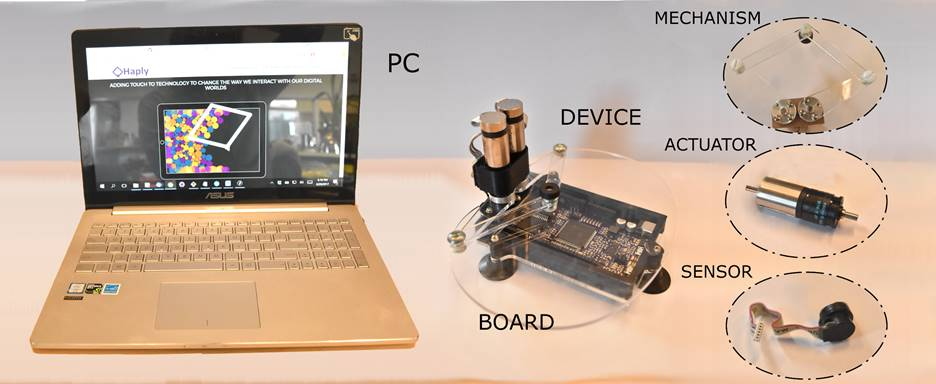 
 

To develop with the Haply Dev Board, users program all the details of
the simulation on the computer. The physics simulation, graphics, audio,
device kinematics, and force calculations are all performed on the
powerful computer processors. We only use the Haply API to read the device
states and send the values of the desired forces to the device to
command the actuators.

You can see in the figure below how the Haply haptic system is divided
between the Haply Dev board and the user\'s computer.

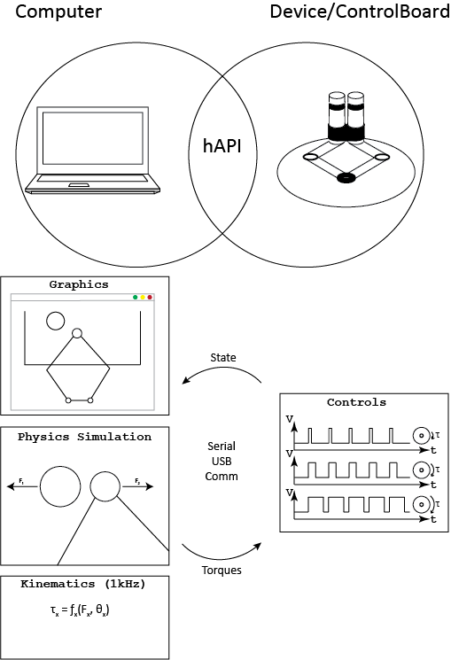 
 

The Haply Dev Board handles the simulation entirely on board the
computer. This means that instead of just handling the graphics we must
also handle the physics and kinematics within the computer environment.
We operate under the assumptions that we want the physics simulation and
kinematics to run much faster than the graphics simulation because we
want to ensure that all the states are updated fast enough that the
haptic feedback can be sent to the device and rendered in time to feel
smooth to the user. Additionally, have to update the graphics, albeit at
a much slower rate, in order for them to be viewed as a continuous
environment to the user. To accomplish this we time the program and call
the simulation function at a rate of 1kHz and the graphics function at a
rate of 40-60Hz.

Finally, it is important the we send the data from the computer to the
device.Since the speed of communication must be pretty fast to sense a
smooth and stable simulation, it's vital that the duration of time from
when we receive data from the control board, update our simulation
calculations, and send back the forces, is done in around a millisecond
(1kHz). This isn't a problem, however, since because the Haply Dev Board
only handles the device controls, we run the controls at a rate of
20kHz. This allows us to update the device controls, when set by the
computer, and then subsequently return back the necessary data all in
one time-step as seen by the physics simulation onboard the computer.

This means the Haply Dev Board is able to handle communication rates at
sufficiently high speeds for haptic simulation. However, rendering
really complex simulations that require a high number of calculations
and complex graphic rendering can lead to the simulation slowing down to
several milliseconds which can lead to unwanted effects like feeling
'choppy'.

1.3. Haply API ARCHITECTURE
----------------------

The previous section dealt with some of the intricacies of two
open-source haptic systems and the way in which the simulation
modalities are divided between the computer and the control board.
However, you may have noticed that what is common between the two haptic
systems was the use of the Haply API to handle the communication between our
computers and control boards. The Haply API has been developed to function as
a modular haptics API, allowing users to mix and match various types of
robotic mechanisms, sensors, and actuators to prototype different types
of haptic devices.

The Haply API design can be interpreted as a branching tree. At the
foundation of the tree is the ***Board*.** A **Board** functions as the
connection between the computer and the **Device.** The **Device** is
the physical interface that the user manipulates when interacting with a
virtual environment. Several **Devices** can be connected and controlled
by a single **Board.** A **Device** is composed of several crucial
components that are essential in a haptic system. The **Device** is
physically composed of several joints and links that make up the
physical **Mechanism** of the **Device.** These **Mechanisms** impact
the way forces and torques are transmitted to the user as well as what
positions can be reached. However, in order for a **Mechanism** to
function we must have **Sensors** and **Actuators** that detect how the
**Device** is positioned and can generate torques to move the
**Device.** The **Mechanism, Sensors, and Actuators** make up the key
components to any **Device.** We can combine them in a number of ways to
make many versatile devices.

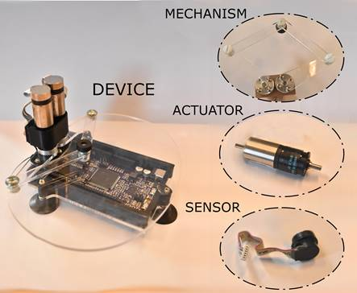 
 

The physical understanding of how we can compose **Devices** from
different **Mechanisms, Sensors,** and **Actuators** leads, naturally
,to the way the Haply API is partitioned using classes of the same name. In
the same way we have a physical **Board**, we have a class
representation of the **Board**. It can be populated by a number of
**Device** objects which are, themselves, comprised of a number of
**Sensor, Actuator,** and **Mechanism** objects.

At their most basic level, each class handles a different layer of the
haptic simulation. At the most granular level, **Sensors,** like
encoders, keep track of the angles through which a joint link rotates;
**Actuators**, such as motors, control the transmission of torques that
drive the robotic arms; **Mechanisms** contain kinematic parameters that
allow us to convert between angles to positions and torques to forces;
**Devices** conglomerate the subcomponents and connect them in
meaningful ways, passing information from the subcomponents to the board
to be used in simulation and receiving information about what forces to
render; and, finally, **Boards** control the data transmission between
the Computer and the device.

The following figures demonstrate the Haply API hierarchical structure for
the Haply Dev Board and Haply 2DoF device.

Haply Dev Board and Two DoF Device Haply API
Structure

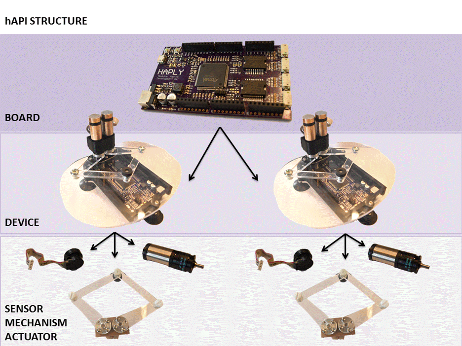 
 

The Haply API can be coupled to compatible devices and be used to set up
devices for a haptic simulation. The Haply 2DoF is, as the name implies,
a two degree-of-freedom device. It allows for users to achieve motion in
a plane as well as controlling the device in the plane. We use two
encoders and two actuators to achieve this control. Since the Haply Dev
Board can support up to four actuators, you're able to connect two 2DoF
devices to the Haply Dev Board.

### *1.3.1. SUMMARY*

 
	IN SUMMARY:                                                  
																			 
		1)  Haptic systems involve a virtual environment which simulates a   
			physical interaction. The virtual environment display can include 
			different sensory modalities like audial and visual displays     
			alongside some form of touch display (this is haptics after      
			all!)                                                         
																			 
		2)  Haptic systems are partitioned according to the functionality of
			the computer and control board that they are composed of.       
																			 
		3)  The components of the system run at rates that are determined,  
			in large part, by our sensory perception                      
																			 
		4)  The Haply API is the interface that connects the device to the       
			computer.                                                     
																			 
		5)  The architecture of the Haply API allows us to modularly construct   
			different haptic platforms from their underlying components    
 

2 GUIDED EXAMPLES
==================

The guided examples in the following sections will demonstrate some
basic examples of how to use the HDK (Haply Development Kit) to develop your own haptic
simulations. These demonstrations are built using Processing which is an
open source development environment initially developed at the MIT Media
Lab. We chose Processing as an initial platform to develop one because
of the huge volume of support and example materials. Processing is built
upon the Java programming language. We urge you to check out
[[Processing.org]](https://processing.org/) to view examples
and sample code. While we've developed the Haply API as an interface between
these low-cost haptic platforms, we're not experts in the Processing
framework. If you think you can do a better job in your example, you're
probably right! Good luck!

2.3. HAPLY SIMULATION WORKFLOW 
-------------------------------

 
 

Generating a haptic simulation using the Haply system can be divided
into three main sections: (1) system setup, (2) animation event, (3)
haptic simulation event. Before starting, please ensure the firmware
Haply\_Arduino\_Control.ino is loaded onto the haply control board. The
Haply system does not require any user code to be loaded on the Arduino
side and instead is programmed entirely within the Processing
environment.

All calculations needed to generate a haptic simulation is performed on
the PC side using the Haply system. The Haply board acts as a
communication link between the physical mechanical hardware and the
virtual simulation environment.

The virtual simulation environment generated on the PC side sends to the
Haply board torque forces that needs to be generated by the physical
mechanism, likewise, the Haply board provides feedback by gathering
angular information from the encoder sensors and passing this
information back to the virtual simulation environment. No physics
environment simulation calculations are performed directly on the Haply
board.

The virtual simulation environment is comprised of two timed events (1)
the animation event, (2) the haptic simulation event. These events are
analogous to threads but are much simpler in function within the
confines of the Processing development environment.

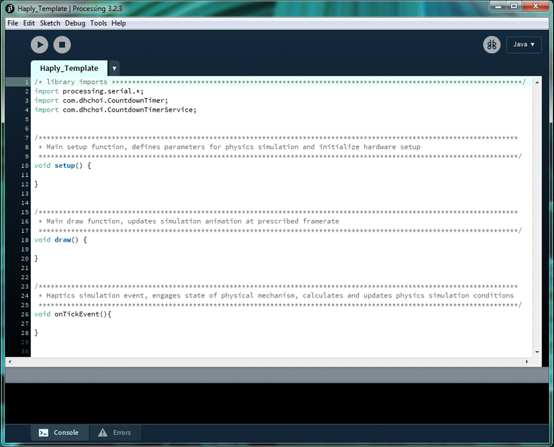   

The main timed event is the simulation event loop. The simulation event
loop runs at a frequency of 1kHz, and waits for new angle data from the
physical mechanism before performing new physics simulation
calculations. During the simulation calculations, all event and state
variables are updated and finally all torque calculations are
determined. After calculations are completed, the new torque data is
transmitted to the physical mechanism for rendering.

The other timed event is the animation event loop. The animation event
loop can run at a frequency of 40-60Hz . The function of the animation
event is to update the current animation display with the most recent
data produced by the simulation event loop.

Relating to Processing, the *setup*() and *draw*() functions are the
system setup and animation event sections of the haptic simulation in
terms of organisation. The *setup*() function only runs once while the
*draw*() function runs continuously at the established frame rate. To
implement another loop for the purposes of haptic simulation, a timer
was set up using the *CountdownTimer* library we imported during the
[[Getting Started]](#_c97vb5633bz5) section of this
documentation. The *onTickEvent*() is the timer's specific tick event
handler, meaning that the *onTickEvent*() function also runs
continuously at a rate dictated by the countdown timer's tick event
setup. In all Haply examples, this rate is set to 1kHz.

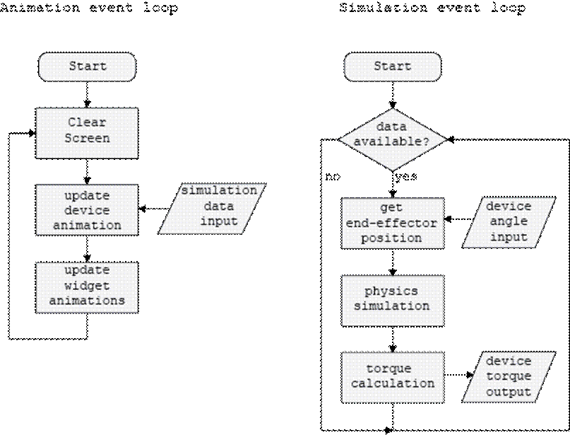 
 

The above figure demonstrates the structure of how we build our
simulation. The animation loop updates at around 40-60 Hz while the
simulation event loop updates at 1kHz. This allows us to save processing
power for the simulation as updating the animation faster than the 60Hz
will require the computer's resources while not having any noticeable
improvement to the user's visual perception.

2.4. Haply Dev Board
--------------------

[[Examples Location
]](https://github.com/HaplyHaptics/Past-Haptic-Demos/tree/master/High-Level-Demos-Firmwarev0/without%20hAPI%20Fisica)

### 2.4.1. Hello Wall

Now let's walk through a basic example of generating a virtual wall
using the Haply board and a pantograph mechanism. The user can interact
with the simulation environment using the pantograph mechanism and will
have free movement until interaction with the virtual wall. In this
example, we will show in detail the (1) system setup, (2) animation
event, and (3) haptic simulation event sections needed to generate a
haptic simulation.

Before starting, it needs to be noted that a scaling factor is needed to
translate the dimensions of the physical hardware measured in SI units
(meters) to the display screen dimensions (pixels). All simulation
parameters are calculated in terms of SI units and all animations use a
translation of the calculated parameters to display the animated
representations in pixels. Please refer to the appendix for a detailed
explanation of this scaling.

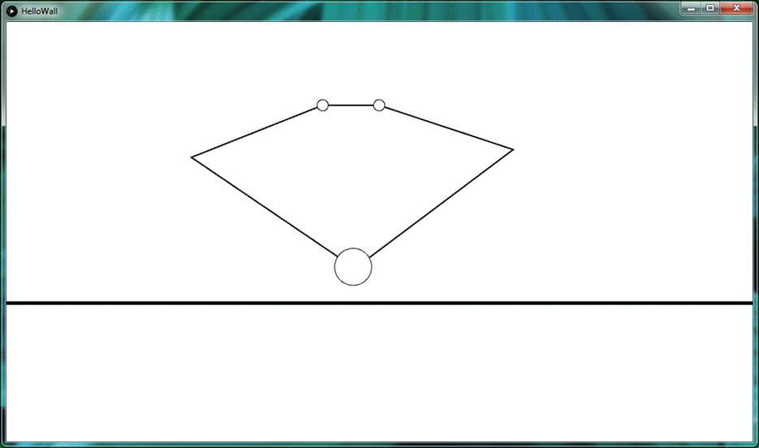 
 

### 2.4.2. System Setup

The system setup needs to define and initialize parameters so that they
can be used by both the animation event and the haptic simulation event
respectively. In addition to this, system setup also initializes the
hardware device (in this example the pantograph mechanism controlled by
the Haply control board) so that it can interact with the haptic
simulation event.

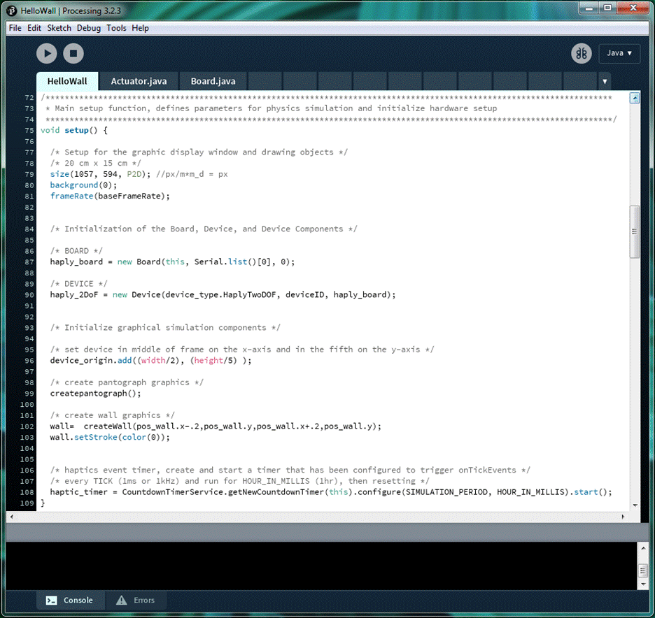 
 

Let us first start by setting up the display window to a desired size
and set the frame rate parameter of the animation event. Since we are
working in Processing, the animation event are all tasks carried out in
the draw() loop.

Next we will initialize the hardware components by creating both a new
*haply\_board* object and a *haply\_2DoF* device object. Within the
Haply API, the ***Board*** class creates a ***Board*** object that handles
the communication between the control board and the computer that is
running the simulation. The control board, in this case the Haply board,
is the physical piece of equipment that functions as the interface
between our haptic robot and the computer.

Controls for the haptic robot itself is handled by the ***Device***
class creating a ***Device*** object, a virtual representation of the
physical device and all the mechanical states. In the same way that a
physical device can be broken down into various subcomponents, the
physical mechanism of the device, the actuators that move the device,
and the sensor that detect changes in state of the device, a
***Device*** object is composed of the ***Mechanism***, ***Actuator***,
and ***Sensor*** objects.

Let's run through the setup in this example starting with the
***Board*** object. In reference to the Haply API documentation, a
***Board*** object has the following constructor prototype:

>  **Board**(PApplet app, **String** portName, **int** speed);

Where:

>app - the parent Applet this class runs inside (this is your Processing
>sketch)
>
>portName - serial port name that the Haply board is connected to (eg,
>"com10" for windows)
>
>speed - The baud rate of serial data transfer

Since the PApplet parameter is specific to Processing, the main
parameters that requires user input would be the portName string and the
baud rate state. Now let's take a look at the setup in this example.

> **haply\_board = new Board**(this, **Serial.list()\[0\]**, **0**);

The haply\_board object is created using a function from the Serial
library specifying the string name of the port connection. this
parameter can be replaced using the direct string name of the serial
port that the Haply board is connected to. An example of such string
names across different operating systems are:

>windows - "COM10"
>
>Linux - "/dev/ttyUSB0"
>
>Mac - "/dev/tty.usbserial-A6004byf"

In this example, you would note that a baud rate speed of zero was
specified, this is not a mistake. Since the Haply control board connects
to the computer using the Native Serial USB port, specifying a baud rate
speed of zero indicates an unlimited baud rate speed.

After the ***Board*** object has been set up we can now populate the
board with some ***Device***'s. We are able to populate the control
board with as many devices as we can drive with the actuator outputs. In
the case of the Haply Development Board, we can drive up to four
independent motors with the hardware that is built into the board, it is
possible to drive four 1-degree-of-freedom devices, and two
2-degree-of-freedom devices. In reference to the Haply API documentation, a
***Device*** object has the following constructor prototype:

 
>  **Device**(DeviceType device\_type, **byte deviceID**, **Board deviceLink**);

Where:

>device\_type - the degrees of freedom type to be implemented
>
>deviceID - ID to be associated with device
>
>deviceLink - Board device is linking to

Now let's take a look at the setup in this example:

  
>  **haply\_2DoF = new Device**(device\_type.HaplyTwoDOF, deviceID, haply\_board);

In creating the ***Device*** object, we first dictate the type of
device, specifically the degree-of-freedom of the device. In this case,
a two-degree-of-freedom is specified using parameters of the Haply
pantograph. The needed ***Mechanism***, and the number of
***Actuator***s and ***Sensor***s that compose the haptic robot, which
handle s things like the lengths of the links of the robot, the ports
that motors are being driven from, and the resolution that the sensors
can detect motion, are all automatically generated from this parameter.
All these details can be manipulated by the adventurous user, but for
most applications, users can stick with the standard mechanism,
actuation, and sensing systems. The number of ports that the user
defines must match the device type that the user passes to the function.

Next, we assign a unique ID to the device. This parameter lets us
differentiate between different multiple haptic robots assigned to the
same control board, allowing us to read sensors and control actuators
for a specific device.

Finally, we assign which control board the device is attached to. This
completes the connect between the haptic robot and the simulation
running on the computer by allowing communication over the ports set up
when we defined the ***Board*** object.

After setting up the graphic display and initializing the hardware, the
graphical simulation components can now be initialized. First we set the
device to be on the middle of the display frame and in the fifth portion
on the vertical axis by adjusting the coordinates of the device origin.

Next we create the graphical representations of the pantograph and the
wall object. Calculations within the simulation space are performed
using SI units, as we will see in the following section, representing
information from the simulation to animation requires a scaling factor
since a screen displays objects in terms of pixels. In this example, the
wall object is represented by a line drawn horizontally across the
display space.

Finally, we create and start a timer for the haptic simulation event.
The timer used is from the Countdown Timer library by Dong Hyun Choi
from the Processing reference libraries.

### 2.4.3. Animation Event

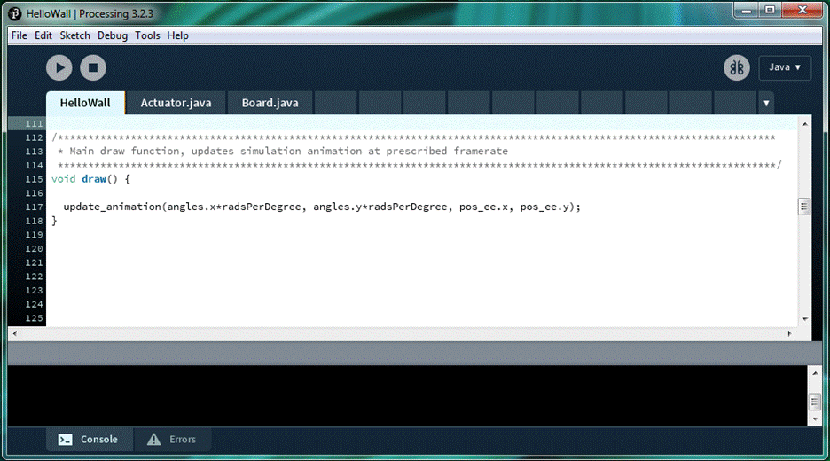 
 

The animation event updates the simulation animation using the most
recent position states calculated by the simulation event. All the
animations associated with each virtual simulation object needs to be
updated. In this example, this includes the dynamic pantograph, and the
static wall. Let us go into more detail as to what is happening during
an animation event.

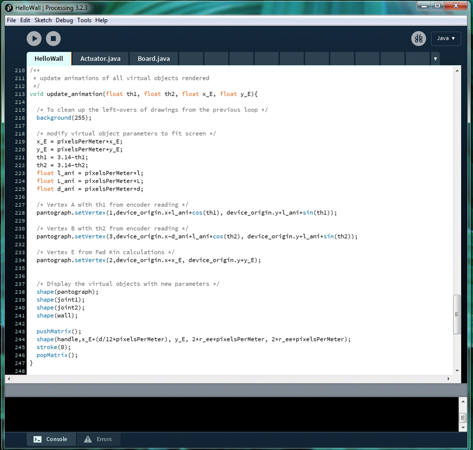 
 

Before determining the parameters of the new animation using the most
recent state updates from the simulation, we first need to scale the
parameters given to us in terms of SI units to pixels so that they look
proportionally appropriate in the display window that was set up. Please
refer to the appendix on how this is done.

Next we update the pantograph animation parameters by updating the
positions of the three vertices of the pantograph device, the
end-effector, and the two arm linkages. The two motor arm links are
updated using the angle data received from the encoders of the physical
hardware, and performing trigonometric calculations to determine their
final states. The end-effector position is representative of the
calculated end-effector position from the simulation event, scaled with
respect to the device origin.

### 2.4.4. Haptic Simulation Event

The haptic simulation event's main tasks are to take new information
from the hardware device as input for simulation update, perform physics
calculations based on the simulation parameters, and finally send
required torque rendering information to the hardware device so that the
appropriate forces can be generated based on simulation parameters.

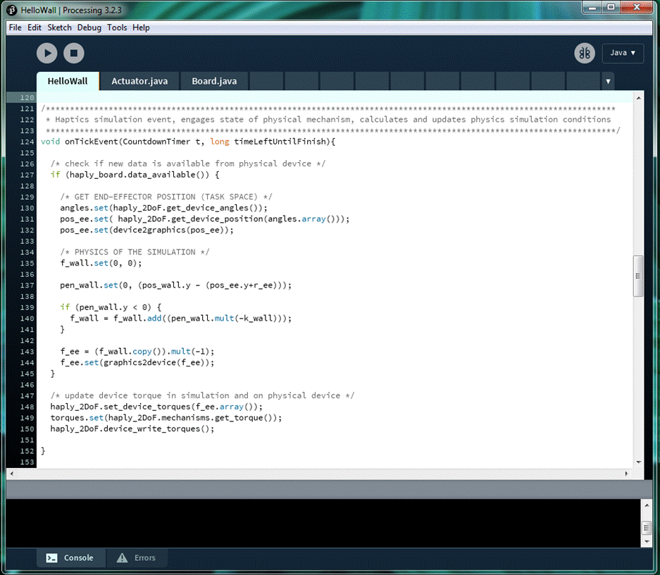 
 

To begin, we first check to see if new angular data is available from
the hardware device. If new angle data is available, the angle variables
of the device are updated, and the end-effector position is calculated
based on this new data input.

Next, physics calculations are performed based on the parameters of the
simulation. In this example case, we are focusing on the interaction
between the end-effector of the pantograph and the virtual wall. We
first calculate the distance between the pantograph and the virtual,
only the y-axis information is relevant since the virtual wall is
horizontal across the screen.

If the distance between the end-effector and the wall is less than zero,
this means that the end-effector of the device has come in contact with
the wall and has penetrated the wall, at this point, a force needs to be
calculated and generated on the physical device to simulate the
end-effector hitting the wall and to counter the end-effector from
moving any further into penetrating the wall.

After the force is determined, a mapping is made from this force to
torques that the motors need to generate to render this force. Finally,
the physical device is sent the torque parameters for rendering.

### 2.4.5. Hello Ball

Now let's walk through an example where two dynamic objects are
interacting with one another. In this case, the end-effector of the
pantograph, and a virtual ball. The user can interact with the
simulation environment using the pantograph mechanism and will have free
movement until interaction with the virtual ball. The virtual ball is
affected by a 'downward' force and is confined in a 2D cradle generated
by three walls. In this example, we will show in detail the (1) system
setup, (2) animation event, and (3) haptic simulation event sections
needed to generate a haptic simulation.

Before starting, it needs to be noted that a scaling factor is needed to
translate the dimensions of the physical hardware measured in SI units
(meters) to the display screen dimensions (pixels). All simulation
parameters are calculated in terms of SI units and all animations use a
translation of the calculated parameters to display the animated
representations in pixels. Please refer to the appendix for a detailed
explanation of this scaling.

 
 

### 2.4.6. System Setup

The system setup needs to define and initialize parameters so that they
can be used by both the animation event and the haptic simulation event
respectively. In addition to this, system setup also needs to initialize
the hardware device (in this example the pantograph mechanism controlled
by the Haply control board) so that it can interact with the haptic
simulation event.

 
 

Let us first start by setting up the display window to a desired size
and set the frame rate parameter of the animation event. Since we are
working in Processing, the animation event are all tasks carried out in
the draw() loop.

Next we will initialize the hardware components by creating both a new
*haply\_board* object and a *haply\_2DoF* device object. Within the
Haply API, the ***Board*** class creates a ***Board*** object that handles
the communication between the control board and the computer that is
running the simulation. The control board, in this case the Haply board,
is the physical piece of equipment that functions as the interface
between our haptic robot and the computer.

Controls for the haptic robot itself is handled by the ***Device***
class creating a ***Device*** object, a virtual representation of the
physical device and all the mechanical states. In the same way that a
physical device can be broken down into various subcomponents, the
physical mechanism of the device, the actuators that move the device,
and the sensor that detect changes in state of the device, a
***Device*** object is composed of the ***Mechanism***, ***Actuator***,
and ***Sensor*** objects.

Let's run through the setup in this example starting with the
***Board*** object. In reference to the Haply API documentation, a
***Board*** object has the following constructor prototype:

 
>   **Board**(PApplet app, **String** portName, **int** speed);
  

Where:

>app - the parent Applet this class runs inside (this is your Processing
>sketch)
>
>portName - serial port name that the Haply board is connected to (eg,
>"com10" for windows)
>
>speed - The baud rate of serial data transfer

Since the PApplet parameter is specific to Processing, the main
parameters that requires user input would be the portName string and the
baud rate state. Now let's take a look at the setup in this example.

>  **haply\_board = new Board**(this, **Serial.list()\[0\]**, **0**);

The haply\_board object is created using a function from the Serial
library specifying the string name of the port connection. this
parameter can be replaced using the direct string name of the serial
port that the Haply board is connected to. An example of such string
names across different operating systems are:

>windows - "COM10"
>
>Linux - "/dev/ttyUSB0"
>
>Mac - "/dev/tty.usbserial-A6004byf"

In this example, you would note that a baud rate speed of zero was
specified, this is not a mistake. Since the Haply control board connects
to the computer using the Native Serial USB port, specifying a baud rate
speed of zero indicates an unlimited baud rate speed.

After the ***Board*** object has been set up we can now populate the
board with some ***Device***'s. We are able to populate the control
board with as many devices as we can drive with the actuator outputs. In
the case of the Haply Development Board, we can drive up to four
independent motors with the hardware that is built into the board, it is
possible to drive four 1-degree-of-freedom devices, and two
2-degree-of-freedom devices. In reference to the Haply API documentation, a
***Device*** object has the following constructor prototype:

>  **Device**(DeviceType device\_type, **byte deviceID**, **Board deviceLink**);
  

Where:

>device\_type - the degrees of freedom type to be implemented
>
>deviceID - ID to be associated with device
>
>deviceLink - Board device is linking to

Now let's take a look at the setup in this example:

>  **haply\_2DoF = new Device**(device\_type.HaplyTwoDOF, deviceID, haply\_board);

In creating the ***Device*** object, we first dictate the type of
device, specifically the degree-of-freedom of the device. In this case,
a two-degree-of-freedom is specified using parameters of the Haply
pantograph. The needed ***Mechanism***, and the number of
***Actuator***s and ***Sensor***s that compose the haptic robot, which
handle s things like the lengths of the links of the robot, the ports
that motors are being driven from, and the resolution that the sensors
can detect motion, are all automatically generated from this parameter.
All these details can be manipulated by the adventurous user, but for
most applications, users can stick with the standard mechanism,
actuation, and sensing systems. The number of ports that the user
defines must match the device type that the user passes to the function.

Next, we assign a unique ID to the device. This parameter lets us
differentiate between different multiple haptic robots assigned to the
same control board, allowing us to read sensors and control actuators
for a specific device.

Finally, we assign which control board the device is attached to. This
completes the connect between the haptic robot and the simulation
running on the computer by allowing communication over the ports set up
when we defined the ***Board*** object.

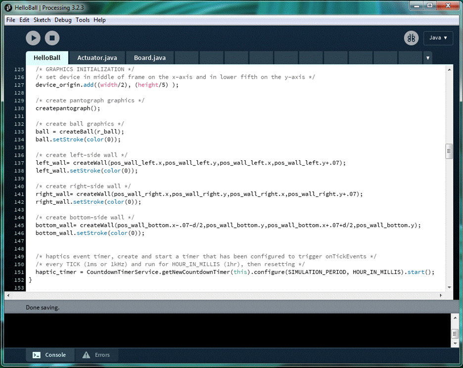 
 

After setting up the graphic display and initializing the hardware, the
graphical simulation components can now be initialized. First we set the
device to be on the middle of the display frame and in the fifth portion
on the vertical axis by adjusting the coordinates of the device origin.

Next we create the graphical representations of the pantograph, the
ball, and the wall objects. In this example three virtual wall objects
are created to interact with the ball object. A wall is created on left
side, right side, and bottom, forming a box with one open side. The ball
is bounded by this box, and also interacts with the end-effector of the
pantograph device.

Calculations within the simulation space are performed using SI units,
as we will see in the following section, representing information from
the simulation to animation requires a scaling factor since a screen
displays objects in terms of pixels. In this example, the wall object is
represented by a line drawn horizontally across the display space.

Finally, we create and start a timer for the haptic simulation event.
The timer used is from the Countdown Timer library by Dong Hyun Choi
from the Processing reference libraries.

### 2.4.7. Animation Event

As you may have noticed, the orientation of the virtual pantograph is
inverted compared to the example shown in Hello Wall. This inversion is
implemented by scaling before the animation is updated.

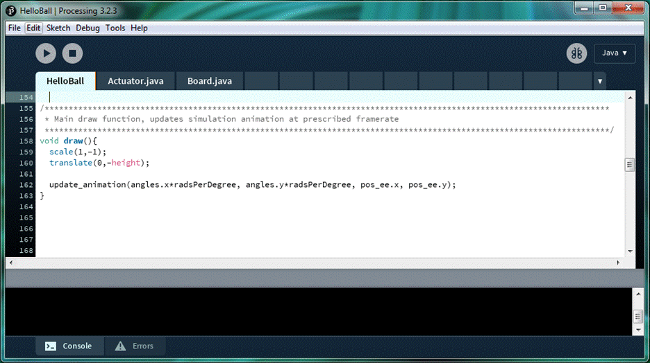 
 

The animation event updates the simulation animation using the most
recent position states calculated by the simulation event. All the
animations associated with each virtual simulation object needs to be
updated. In this example, this includes the pantograph, and the wall.
Let us go into more detail as to what is happening during an animation
event.

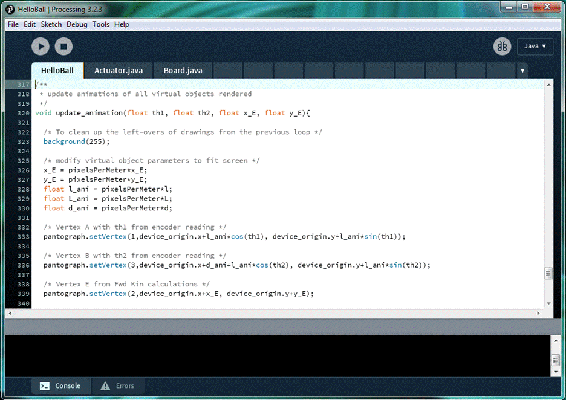 
 

Before determining the parameters of the new animation using the most
recent state updates from the simulation, we first need to translate or
scale the parameters given to us in terms of SI units to pixels so that
they look proportionally appropriate in the display window that was set
up. After this is done, all vertices of the graphics associated with the
pantograph is updated with the new information.

Next we update the pantograph animation parameters by updating the
positions of the three vertices of the pantograph device, the
end-effector, and the two arm linkages. The two motor arm links are
updated using the angle data received from the encoders of the physical
hardware, and performing trigonometric calculations to determine their
final states. The end-effector position is representative of the
calculated end-effector position from the simulation event, scaled with
respect to the device origin.

Please take note that since the device is in an inverted orientation in
comparison to the HelloWall example, the vertex updates use different
scaling to update the pantograph vertices.

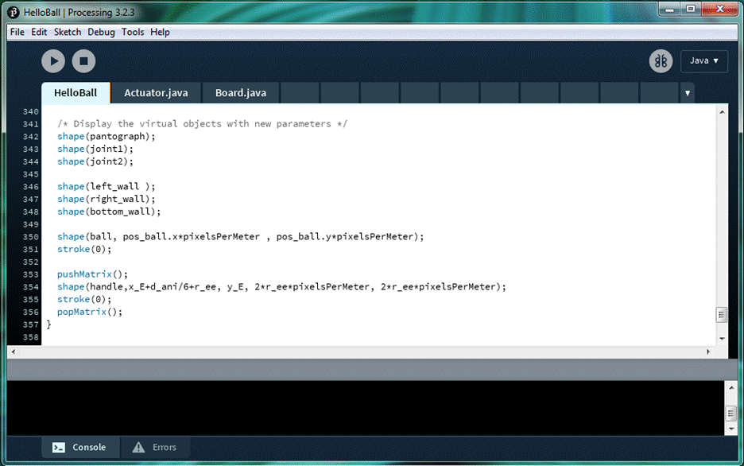 
 

The graphical animation is then updated for the rest of the graphical
objects. the position of the ball is updated using calculations
determined in the haptic simulation event.

### 2.4.8. Haptic Simulation Event

The haptic simulation events takes angle inputs received from the device
hardware and updates the virtual environment accordingly. This event
also performs the necessary physics calculations required and finally
sends torque renderings to the device hardware.

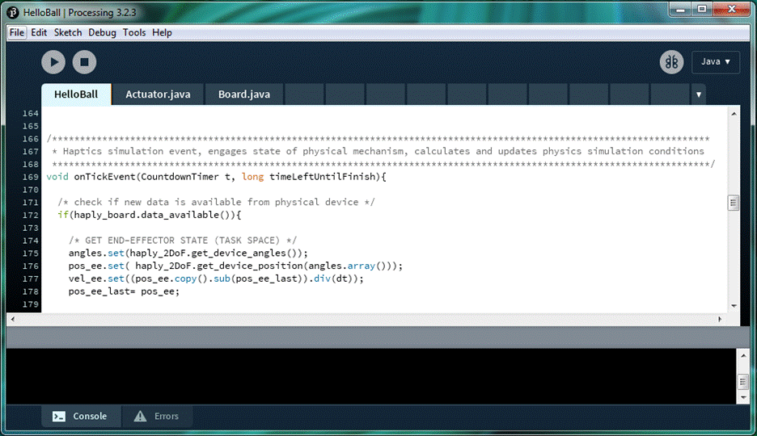 
 

To begin, we first check to see if new angular data is available from
the hardware device. If new angle data is available, the angle variables
of the device are updated, and the end-effector position is calculated
based on this new data input.

Next, physics calculations are performed based on the parameters of the
simulation. In this example case, we are focusing on the interaction
between the end-effector of the pantograph with the ball, the ball with
the three walls, and a 'gravitational' force that forces the ball in a
downward direction.

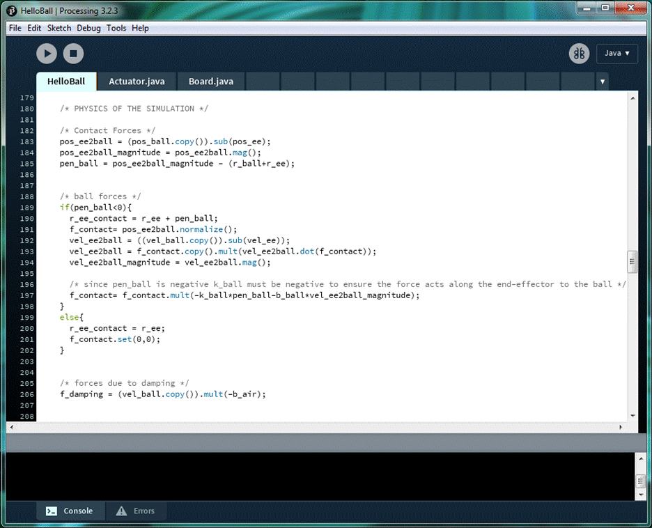 
 

We first determine the position of the ball and its position and
interact with the end-effector of the pantograph. If the end-effector
comes in contact with the ball, the relevant force effects for both the
ball and the end-effector are calculated. If there is no contact, the
end-effector has free movement.

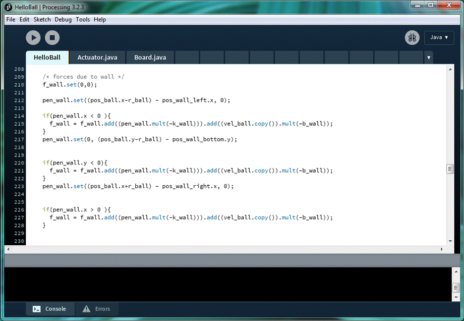 
 

After determining the interaction between the ball and the end-effector,
we now need to figure out the force interaction between the ball and
each of the three walls. Since each wall is located on either a
horizontal or vertical axis, you only need to look at the interaction on
the x-axis for the left and right wall, and the y-axis for the bottom
wall.

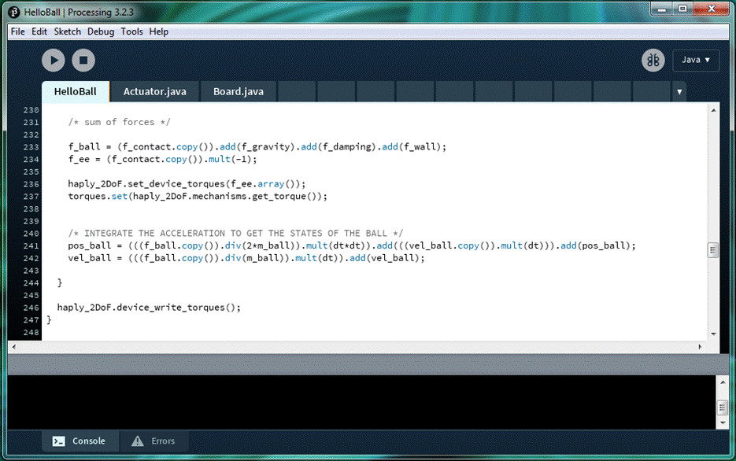 
 

Once all the forces have been determined, they can be summed. Since
there are two dynamic objects, the ball and the end-effector, the forces
for both device needs to be determined. The force acting on the ball
determines its movement in the virtual environment, and the force acting
on the end-effector is needed to determine the amount of force the
physical device needs to generate.

### 2.4.9. Gravity

So far in our examples we have only dealt with one active dynamic
object, the end-effector of the pantograph. Even in the HelloBall
example, the ball in question only reacted to the forces produced by the
end-effector. Although there are states where the ball can also actively
affect the end-effector, only only happens as a response to the effects
of the end-effector.

In this example, we will produce two actively dynamic objects
interacting with one another, a flying saucer controlled by the
end-effector of the pantograph, and an asteroid controlled by some
gravitational parameters set within the generated 2D virtual
environment. **\*\* note: the title gravity here is fake as it's just a
virtual spring connected to the center of the virtual environment but
it's just here to play on the theme. If you want try replacing the force
with the real law of attraction. Just be careful though as objects
approach zero distance the force will blow up! **

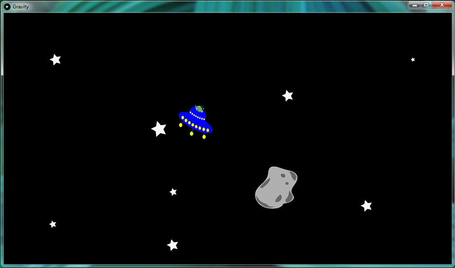 
 

### 2.4.10. System Setup

The system setup needs to define and initialize parameters so that they
can be used by both the animation event and the haptic simulation event
respectively. In addition to this, system setup also needs to initialize
the hardware device (in this example the pantograph mechanism controlled
by the Haply control board) so that it can interact with the haptic
simulation event.

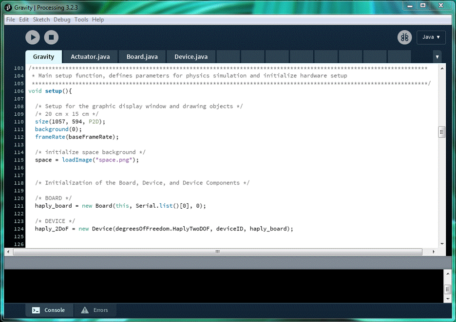 
 

Let us first start by setting up the display window to a desired size
and set the frame rate parameter of the animation event. Since we are
working in Processing, the animation event are all tasks carried out in
the draw() loop.

Next we will initialize the hardware components by creating both a new
*haply\_board* object and a *haply\_2DoF* device object. Within the
Haply API, the ***Board*** class creates a ***Board*** object that handles
the communication between the control board and the computer that is
running the simulation. The control board, in this case the Haply board,
is the physical piece of equipment that functions as the interface
between our haptic robot and the computer.

Controls for the haptic robot itself is handled by the ***Device***
class creating a ***Device*** object, a virtual representation of the
physical device and all the mechanical states. In the same way that a
physical device can be broken down into various subcomponents, the
physical mechanism of the device, the actuators that move the device,
and the sensor that detect changes in state of the device, a
***Device*** object is composed of the ***Mechanism***, ***Actuator***,
and ***Sensor*** objects.

Let's run through the setup in this example starting with the
***Board*** object. In reference to the Haply API documentation, a
***Board*** object has the following constructor prototype:

 > **Board**(PApplet app, **String** portName, **int** speed);

Where:

>app - the parent Applet this class runs inside (this is your Processing
>sketch)
>
>portName - serial port name that the Haply board is connected to (eg,
>"com10" for windows)
>
>speed - The baud rate of serial data transfer

Since the PApplet parameter is specific to Processing, the main
parameters that requires user input would be the portName string and the
baud rate state. Now let's take a look at the setup in this example.

 
>  **haply\_board = new Board**(this, **Serial.list()\[0\]**, **0**);

The haply\_board object is created using a function from the Serial
library specifying the string name of the port connection. this
parameter can be replaced using the direct string name of the serial
port that the Haply board is connected to. An example of such string
names across different operating systems are:

>windows - "COM10"
>
>Linux - "/dev/ttyUSB0"
>
>Mac - "/dev/tty.usbserial-A6004byf"

In this example, you would note that a baud rate speed of zero was
specified, this is not a mistake. Since the Haply control board connects
to the computer using the Native Serial USB port, specifying a baud rate
speed of zero indicates an unlimited baud rate speed.

After the ***Board*** object has been set up we can now populate the
board with some ***Device***'s. We are able to populate the control
board with as many devices as we can drive with the actuator outputs. In
the case of the Haply Development Board, we can drive up to four
independent motors with the hardware that is built into the board, it is
possible to drive four 1-degree-of-freedom devices, and two
2-degree-of-freedom devices. In reference to the Haply API documentation, a
***Device*** object has the following constructor prototype:

  
>  **Device**(DeviceType device\_type, **byte deviceID**, **Board deviceLink**);

Where:

>device\_type - the degrees of freedom type to be implemented
>
>deviceID - ID to be associated with device
>
>deviceLink - Board device is linking to

Now let's take a look at the setup in this example:

>  **haply\_2DoF = new Device**(device\_type.HaplyTwoDOF, deviceID, haply\_board);

In creating the ***Device*** object, we first dictate the type of
device, specifically the degree-of-freedom of the device. In this case,
a two-degree-of-freedom is specified using parameters of the Haply
pantograph. The needed ***Mechanism***, and the number of
***Actuator***s and ***Sensor***s that compose the haptic robot, which
handle s things like the lengths of the links of the robot, the ports
that motors are being driven from, and the resolution that the sensors
can detect motion, are all automatically generated from this parameter.
All these details can be manipulated by the adventurous user, but for
most applications, users can stick with the standard mechanism,
actuation, and sensing systems. The number of ports that the user
defines must match the device type that the user passes to the function.

Next, we assign a unique ID to the device. This parameter lets us
differentiate between different multiple haptic robots assigned to the
same control board, allowing us to read sensors and control actuators
for a specific device.

Finally, we assign which control board the device is attached to. This
completes the connect between the haptic robot and the simulation
running on the computer by allowing communication over the ports set up
when we defined the ***Board*** object.

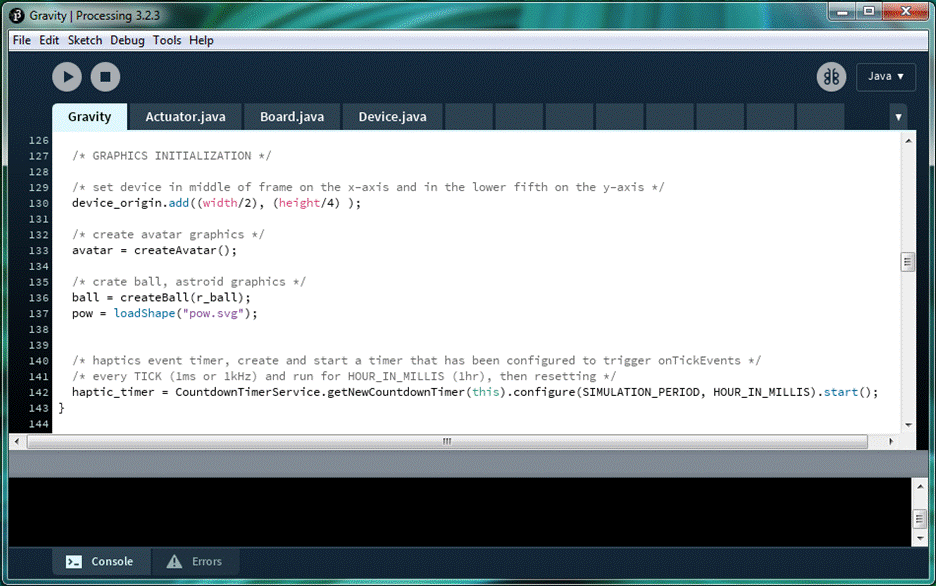 
 

After setting up the graphic display and initializing the hardware, the
graphical simulation components can now be initialized. First we set the
device to be on the middle of the display frame and in the fifth portion
on the vertical axis by adjusting the coordinates of the device origin.

Next we create the graphical representations of each element. In this
example, we only need to create the avatar (UFO) controlled by the
pantograph device, and the ball (asteroid). A graphic is also
initialized here showing a small comic "pow" whenever the UFO and the
asteroid collides with one another. Although we use the pantograph
mechanism to control the 2D movement of the UFO, only the end-effector
position is required, and the pantograph animation does not need to be
rendered unlike in previous examples.

### 2.4.11. Animation Event

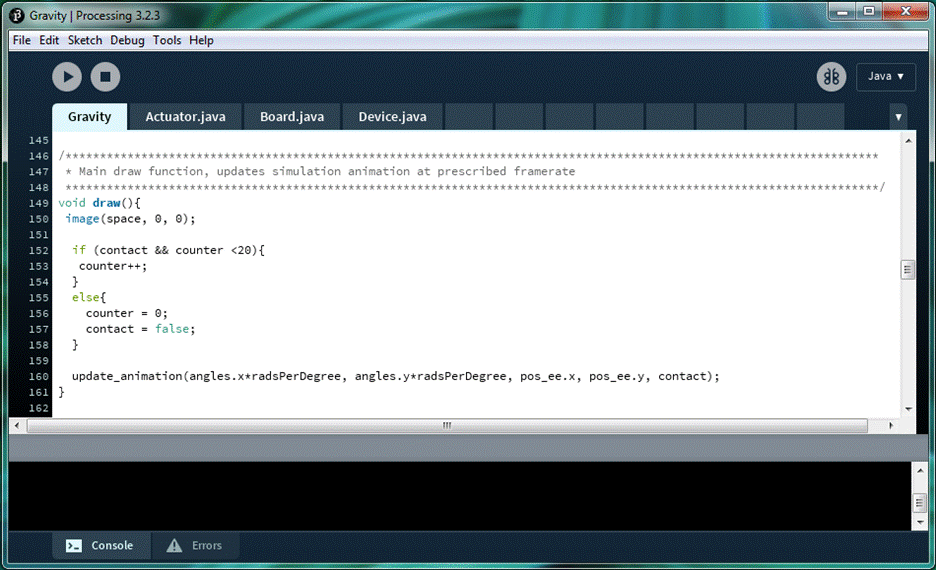 
 

We first refresh the the display with an image rather than a coloured
background. Since we are displaying a graphic if the two dynamic
animations makes contact within the scene, the logic parameters for
determining the event is performed here.

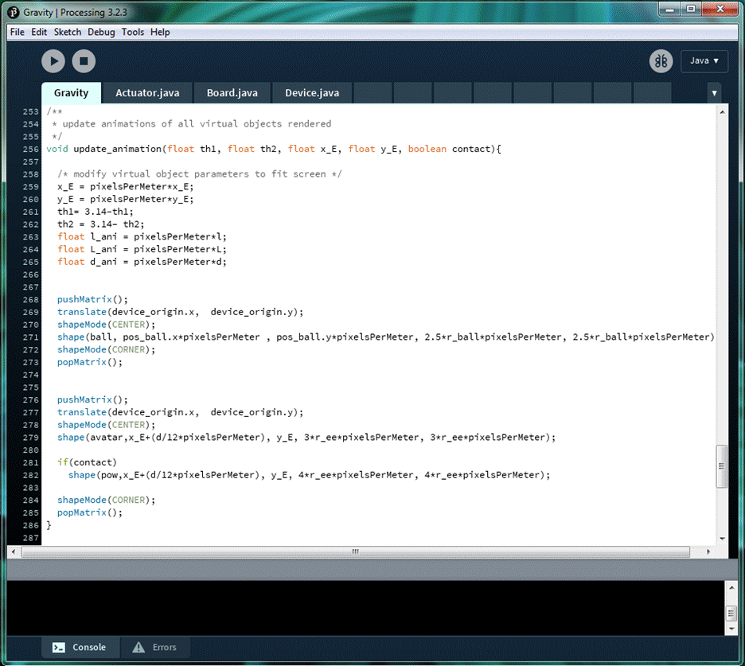 
 

Before determining the parameters of the new animation using the most
recent state updates from the simulation, we first need to translate or
scale the parameters given to us in terms of SI units to pixels so that
they look proportionally appropriate in the display window that was set
up. After this is done, all vertices of the graphics associated with the
pantograph is updated with the new information.

Next, we update the animation of the ball (astroid) based on positions
calculated in the simulations event. the animation for the avatar (UFO)
is also updated using the calculated end-effector positions from the
simulations event. Based on the interactions between these two active
dynamic objects, a "pow" graphic is displayed if the collision
conditions are met.

### 2.4.12. Haptic Simulation Event

The haptic simulation events takes angle inputs received from the device
hardware and updates the virtual environment accordingly. This event
also performs the necessary physics calculations required and finally
sends torque renderings to the device hardware.

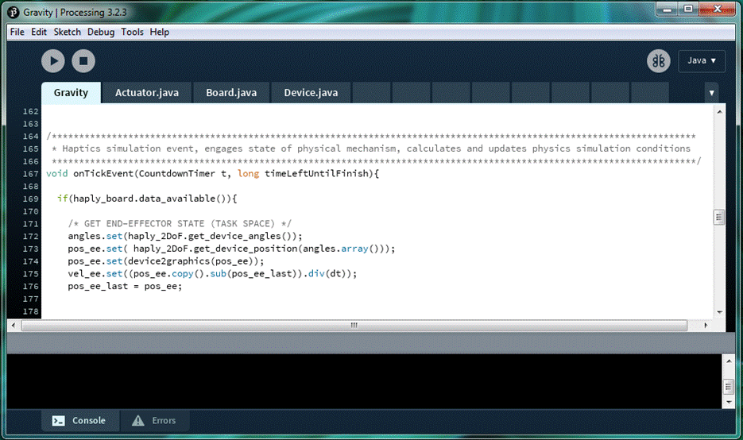 
 

To begin, we first check to see if new angular data is available from
the hardware device. If new angle data is available, the angle variables
of the device are updated, and the end-effector position and velocity is
calculated based on this new data input.

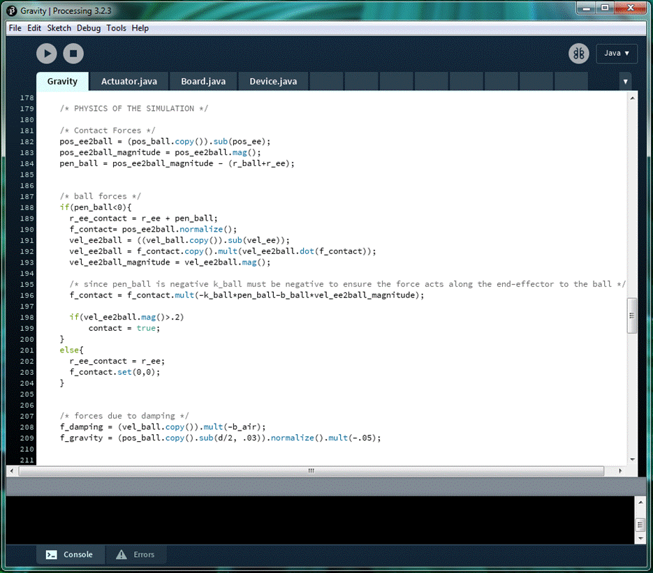 
 

Now we determine the contact force positions by calculating the relative
positions of the end-effector (UFO) to the ball (asteroid) and the
contact between the ball. If contact was made and there is interaction
between the end-effector (UFO) and the ball (asteroid), the contact
forces between the two objects are calculated.

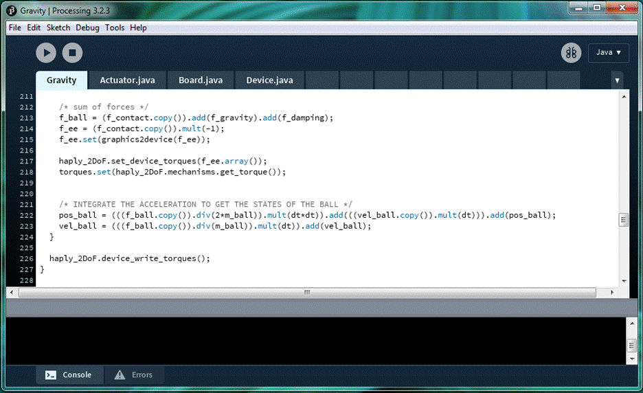 
 

The forces affecting both virtual objects are summed, with an simulated
"gravity" force acting on the ball (asteroid) along with any contact
force from the end-effector (UFO). The end-effector (UFO) would only
experience contact force with the ball (asteroid). Once all the forces
have been summed, the calculated torque renderings are sent to the Haply
pantograph device.

3 Haply API DOCUMENTATION
=====================

### 3.0.1. Haply API UML 

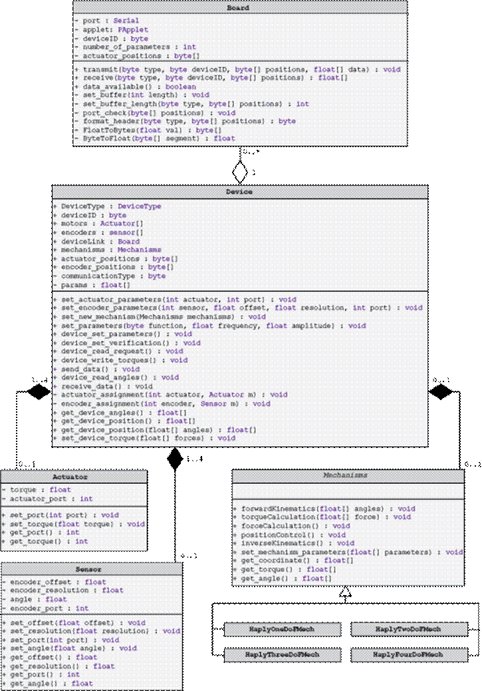 
 

3.1. BOARD CLASS
----------------

### 3.1.1. Constructor Detail

**Board**

>public **Board**([PApplet] app, [String]
>portName, [int] speed)

Constructs a Board linking to the specified port at the given serial
data speed (baud rate)

**Parameters:**

>app - the parent Applet this class runs inside (this is your Processing
>sketch)
>
>portname - serial port name that the Haply board is connected to (eg,
>"com10" for windows)
>
>speed - The baud rate of serial data transfer

### 3.1.2. Method Detail

**transmit**

>public void **transmit**(byte type, byte deviceID, byte\[\] positions,
>float\[\] data)
>
>Formats and transmits the float data array over the serial port

**Parameters**:

>type - type of communication taking place
>
>deviceID - ID of the device transmitting the information
>
>positions - the motor positions the data is meant for
>
>data - main data payload to be transmitted

**receive**

>public float\[\] **receive**(byte type, byte deviceID, byte\[\]
>positions)
>
>Receives data from the serial port and formats said data to return a
>float data array
>
**Parameters**:
>
>type - type of communication taking place
>
>deviceID - ID of the device receiving the information
>
>positions - the motor positions the data is meant for
>
**Returns**:
>
>formatted float data array from the received data
>
**data\_available**
>
>public boolean **data\_available**()
>
**Returns**:

a boolean indicating if data is available from the serial port

3.2. DEVICE CLASS
-----------------

### 3.2.1. Constructor Detail

**Device**

>public **Device**([DeviceType] device\_type,
>[byte] deviceID, [Board] deviceLink)
>
>Constructs a Device of the specified DeviceType, with the defined
>deviceID, connected on specified Board
>
**Parameters:**
>
>device\_type - the degrees of freedom type to be implemented
>
>deviceID - ID to be associated with device
>
>deviceLink - Board device is linking to

### 3.2.2. Method Detail

**set\_actuator\_parameter**

>public void **set\_actuator\_parameters**(int actuator, int port)
>
>Set the indicated actuator to use the specified motor port

**Parameters**:

>actuator - index of actuator that needs parameter to be set or updated
>
>port - specific motor port to be used (motor ports 1-4 on the Haply
>board)

**set\_encoder\_parameters**

>public void **set\_encoder\_parameters**(int sensor, float offset, float
>resolution, int port)
>
>Set the indicated sensor to use the initial offset, resolution, on the
>specified motor port

**Parameters**:

>sensor - index of sensor that needs parameters to be set or updated
>
>offset - initial offset in degrees that the encoder sensor should be
>initialized at
>
>resolution - step resolution of the encoder sensor
>
>port - specific motor port the encoder sensor is using
>
**set\_new\_mechanisms**

>public void **set\_new\_mechanism**(Mechanisms mechanisms)
>
>Replaces the current Mechanisms that is being used with the specified
>Mechanisms

**Parameters**:

>mechanisms - new Mechanisms to replace initialized or old Mechanisms
>currently in use
>
>**set\_parameters**
>
>public void **set\_parameters**(byte function, float frequency, float
>amplitude)
>
>Sets or updates device function parameter and loads frequency and
>amplitude values into params\[\] (note\* Hapkit specific function)

**Parameters**:

>function - device function to be carried out
>
>frequency - frequency variable to be updated
>
>amplitude - amplitude variable to be updated

**device\_set\_parameter**

>public void **device\_set\_parameters**()
>
>Gathers all encoder sensor setup information of all encoder sensors that
>are initialized and sequentially formats the data based on specified
>positions to send over the serial port interface for hardware
>initialization

**device\_read\_request**

>public void **device\_read\_request**()
>
>Requests encoder angle data from the hardware based on the initialized
>setup. device\_read\_request also sends a torque output command of zero
>torque for each actuator initialized
>
**device\_write\_torque**
>
>public void **device\_write\_torques**()
>
>Transmits specific torques that has been calculated and stored for each
>actuator over the serial port interface
>
**send\_data**

>public void **send\_data**()
>
>Transmits the contents of the params\[\] array over the serial port
>interface

**device\_read\_angles**

>public void **device\_read\_angles**()
>
>receives angle position information from the serial port interface and
>updates each indexed encoder sensor to their respective received angle

**receive\_data**

>public void **receive\_data**()
>
>receives data from the serial port interface and updates parameters in
>mechanisms
>
>**get\_device\_angles**
>
>public float\[\] **get\_device\_angles**()
>
>Reads and update angles information from device hardware to encoders
>
**Returns**:

>angles information received from device hardware
>
**get\_device\_position**

>public float\[\] **get\_device\_position**()
>
>Reads and update angles information from device hardware to encoders and
>performs physics calculations

**Returns**:

>end-effector coordinate position

**get\_device\_position**

>public float\[\] **get\_device\_position**(float\[\] angles)
>
>performs physics calculations based on the given angles values
>
**Parameters**:

>angles - angles to be used for physics position calculation
>
**Returns**:

>end-effector coordinate position
>
**set\_device\_torque**

>public void **set\_device\_torque**(float\[\] forces)
>
>Calculates needed output torques based on forces input and updates each
>initialized actuators respectively

**Parameters**:

>forces - forces needed for torque calculations

3.3. SENSOR CLASS
-----------------

### 3.3.1. Constructor Detail

**Sensor**

>public **Sensor**()
>
>Constructs a Sensor with motor port position 1

**Sensor**

>public **Sensor**([float] offset, [float]
>resolution, [int] port)
>
>Constructs a Sensor with the given motor port position, to be
>initialized with the given angular offset, at the specified step
>resolution

**Parameters:**

>offset - initial angular offset in degrees
>
>resolution - step resolution of encoder sensor
>
>port - motor port position to be used by sensor

### 3.3.2. Method Detail

**set\_offset**

>public void **set\_offset**(float offset)
>
>Sets offset parameter of sensor

**Parameters**:

>offset - initial angular offset in degrees

**set\_resolution**

>public void **set\_resolution**(float resolution)
>
>Sets resolution parameter of sensor

**Parameters**:

>resolution - step resolution of encoder sensor

**set\_port**

>public void **set\_port**(int port)
>
>Sets motor port position to be used by sensor

**Parameter**:

>port - motor port position (motor port connection on Haply board)

**set\_angle**

>public void **set\_angle**(float angle)
>
>Set angle variable to the specified angle

**Parameter**:

>angle - angle value

**get\_offset**

>public float **get\_offset**()

**Returns**:

>current offset parameter

**get\_resoluiton**

>public float **get\_resolution**()

**Returns**:

>current resolution parameter

**get\_port**

>public int **get\_port**()

**Returns**:

>current motor port position

>**get\_angle**
>
>public float **get\_angle**()

**Returns**:

>current angle information

3.4. ACTUATOR CLASS
-------------------

### 3.4.1. Constructor Detail

**Actuator**

>public **Actuator**()
>
>Creates an Actuator with motor port position 1
>
**Actuator**

>public **Actuator**([int] port)
>
>Creates an Actuator with the given motor port position

**Parameters:**

>port - motor port position for actuator

### 3.4.2. Method Detail

**set\_port**

>public void **set\_port**(int port)
>
>Sets motor port position to be used by Actuator

**Parameter**:

>port - motor port position (motor port connection on Haply board)

**set\_torque**

>public void **set\_torque**(float torque)
>
>Sets torque variable to the given torque value

**Parameter**:

>torque - new torque value

**get\_port**

>public int **get\_port**()

**Returns**:

>current motor port position

**get\_torque**

>public float **get\_torque**()

**Returns**:

>current torque information

3.5. MECHANISMS CLASS
---------------------

### 3.5.1. Constructor Detail

**Mechanisms**

>Mechanisms is an abstract class designed for use as a template. Current
>classes which extends the Mechanisms class include:
>
>
>-   HaplyOneDoFMech
>
>-   HaplyTwoDoFMech
>
>-   HaplyThreeDoFMech
>
>Each class which extends the Mechanisms class will need to follow the
>abstract methods detailed

### 3.5.2. Method Detail

**forwardKinematics**

>public abstract void **forwardKinematics**(float\[\] angles)
>
>Performs the forward kinematics physics calculation of a specific
>physical mechanism

**Parameters**:

>angles - angle inputs of physical mechanism (length based on degree of
>freedom)

**torqueCalculation**

>public abstract void **torqueCalculation**(float\[\] force)
>
>Performs torque calculations that actuators need to output

**Parameters**:

>force - force values calculated from physics simulation

**forceCalculation**

>public abstract void **forceCalculation**()
>
>Performs force calculations

**positionControl**

>public abstract void **positionControl**()
>
>Performs calculations for position control

**inverseKinematics**

>public abstract void **inverseKinematics**()
>
>performs inverse kinematics calculations

**set\_mechanism\_parameters**

>public abstract void **set\_mechanism\_parameters**(float\[\]
>parameters)
>
>initializes or changes mechanisms parameters

**Parameters**:

>parameters - parameter in mechanisms

**get\_coordinate**

>public abstract float\[\] **get\_coordinate**()

**Returns**:

>end-effector coordinate position

**get\_torque**

>public abstract float\[\] **get\_torque**()

**Returns**:

>torque values from physics calculations

**get\_angle**

>public abstract float\[\] **get\_angle**()

**Returns**:

>angle values from physics calculations

4. Appendix 
============

4.1. Converting between screen size and SI units 
-------------------------------------------------

In order to have accurate scaling between the forces we render and the
dimensions we see displayed on screen we can convert between the
graphical environment and SI physical world dimensions.

First we should find our screen resolution. In Windows you can right
click on the Desktop and get to the display settings and then navigate
to the Advanced display settings.

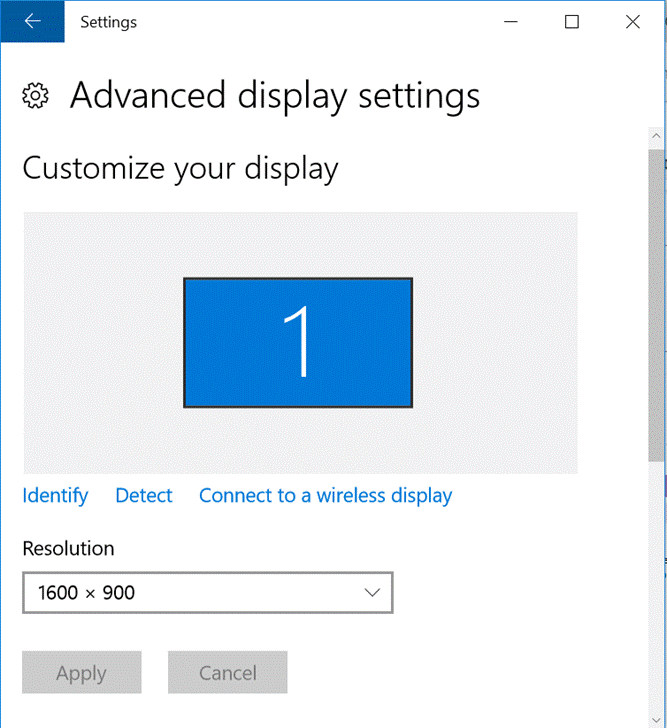 
 

Using the resolution we can determine the number of pixels per meter by
dividing the number of pixels by the size of the screen in that
dimension. I measured my screen and found that it is 40 cm wide, or 0.4
m. Processing draws the graphics according to the number of pixels on
screen so we want to convert the size of the objects we're rendering
into pixels. To do this we simply find the scaling factor of the number
of pixels per meter. This is simply the 1600 pixel width divided by the
0.4 m screen width, or 4000 pixels per meter.

When calculating the physical simulation I leave my units in SI units so
that the forces and torques calculated in our virtual environment, more
or less, map to the forces and torques we output to the device. When we
go to draw the virtual environment graphically we can convert the SI
units into their corresponding pixel lengths simply by multiplying them
by the pixels per meter ratio.

4.2. Basic Contact Rendering in 2D: To Come\...
-----------------------------------------------

** under constuction **

    The Haply project is intended to provide novice designers and developers 
	a platform from which to explore the field of haptics. The Haptics Application 
	Programming Interface (hAPI) is a modular tool that lets users quickly assemble 
	a variety of haptic robots, ranging from one to four degrees of freedom, using
	the same set of hardware and programming tools. We hope people will be inspired
	to build new tools to interface with the hAPI and share them with the community. 
	
	If you have any questions or concerns please contact us at haplyrobotics@gmail.com
	
	Enjoy! 
	
	
    Copyright (C) <2017>  <The Haply Project: Colin Gallacher & Steven Ding>

    This program is free software: you can redistribute it and/or modify
    it under the terms of the GNU General Public License as published by
    the Free Software Foundation, either version 3 of the License, or
    (at your option) any later version.

    This program is distributed in the hope that it will be useful,
    but WITHOUT ANY WARRANTY; without even the implied warranty of
    MERCHANTABILITY or FITNESS FOR A PARTICULAR PURPOSE.  See the
    GNU General Public License for more details.

    You should have received a copy of the GNU General Public License
    along with this program.  If not, see <http://www.gnu.org/licenses/>.
	
	

